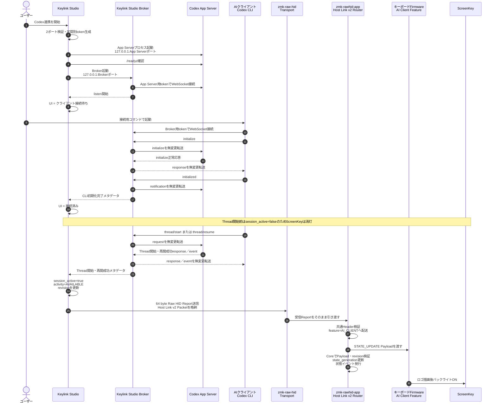
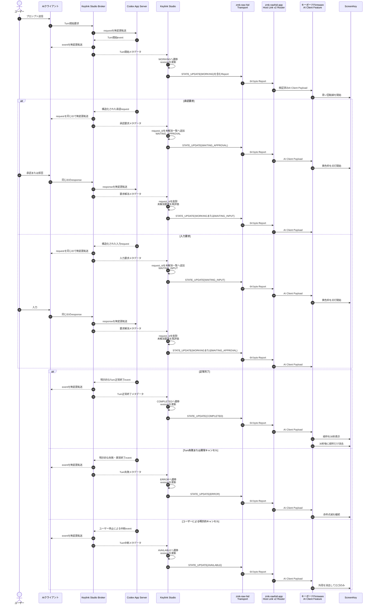
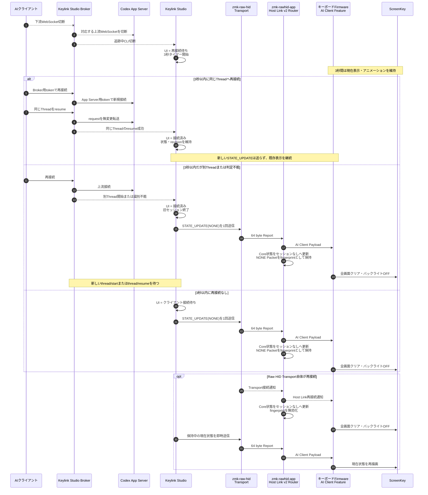
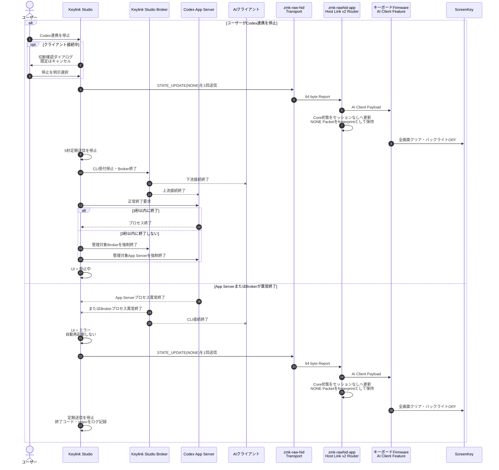
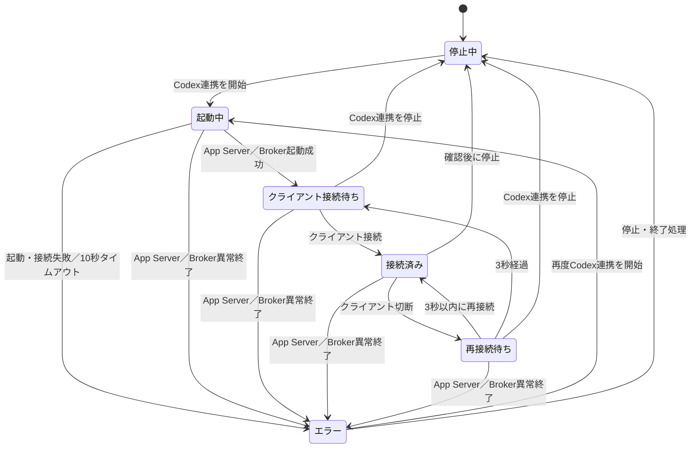
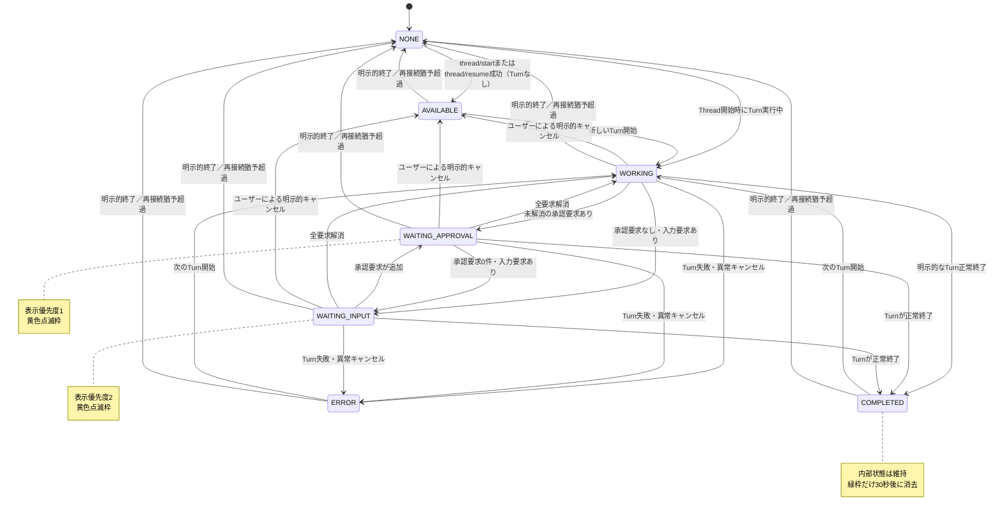
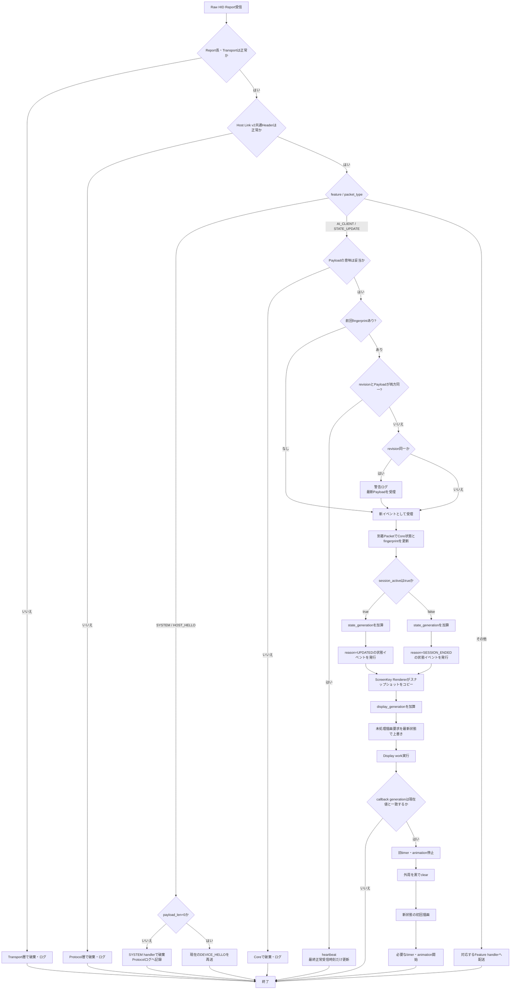
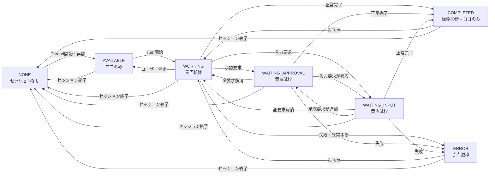

# Keylink Studio × Codex App Server × ScreenKey プロトタイプ仕様書

- 文書状態: レビュー反映版・Last-Write-Wins採用プロトタイプ実装仕様
- 対象: Keylink Studio / ZMK Firmware / Spotpear 0.85インチ LCD ScreenKey
- 対象AIクライアント: Codex CLI
- Host Link: v2 / 64 byte packet（全Target・全Featureで固定）
- 作成日: 2026-07-19

---

## 0. 実装着手条件（Milestone 0）

本仕様は、Keylink StudioがCodex App Serverへ「観測用の別クライアント」として接続し、
Codex CLIが生成したThread・Turn・server requestを取得できることを前提としている。
この前提はWebSocket transportがexperimentalであることも含め、実装前に実測で確定しなければならない。

### 0.1 Gate A: クロスクライアント可視性スパイク

次の構成を、Keylink Studio本実装より先に最小コードで検証する。

```text
Codex App Server
  ├─ Client A: Codex CLI
  └─ Client B: 素のWebSocket観測クライアント
```

確認項目:

1. Client Aが発行した`thread/start`または`thread/resume`をClient Bが認識できるか
2. Client Aが発行した`turn/start`に由来する通知をClient Bが受信できるか
3. Client Bが既存Threadを観測するために`thread/resume`等を自ら呼ぶ必要があるか
4. server-initiated requestがA/Bのどちらへ配送されるか
5. requestを受信しなかった接続が、その要求の発生・解消を通知として観測できるか
6. Client A切断中のpending approval/input requestが継続、解消、abortのどれになるか
7. Client BがClient Aの接続・切断を観測できるか。接続識別情報と自分自身を除外する手段があるか

接続・切断が観測できない場合、§6.2、§8.3、§8.5の要件をObserver方式では満たせないため、
Threadイベントだけへ縮退せずPlan BのBroker構成へ移行する。

**Gate Aを通過するまで、§8～§10の本実装へ着手しない。**

#### 0.1.1 Gate A実測結果（2026-07-20）

> 最終状態: Gate A完了。最終試行では同一ハーネス・同一Thread IDでResume成功後、CLI resume後の同一Thread／Turnに属する応答必須approval requestがObserverへ配送された。Observer方式不成立／Broker必須と確定する。

- 対象: Codex CLI `0.144.6` / Windows PowerShell / WebSocket / capability-token認証
- 生成Schema SHA-256: `85EA836927D6CFDD3C68A9BDA17DBA48D2573BBC282AB2D5775A5005E40BC9C3`
- Observerはresumeなしでは`thread/started`と`thread/status/changed`を受信したが、`turn/started`と`turn/completed`は受信しなかった
- Observerが対象Threadへ明示的に`thread/resume`すると、以降の`turn/started`と`turn/completed`を受信できた
- Observerが先に対象Threadをresumeし、CLIも同じThreadを再開した状態で、CLIのapproval要求`item/commandExecution/requestApproval`が応答必須JSON-RPC requestとしてObserverにも配送された
- Observerはserver requestへ応答していない
- 最終試行ハーネスSHA-256: `B925CB507B4E1A77AF5F8E293A4E01CF494F6035433061E5E26A26E361213EDC`
- 最終試行ではObserverの安全停止intentは`42`だったがOS実測exit codeは`0`であり、ハーネスの安全停止上の未解決事項として残す。この点は応答必須requestがObserverへ配送された事実を覆さない

以上により、§0.2の安全ルールとGate A成立条件を満たさないため、**Observer方式は不成立、Plan BのBroker方式を採用する。**
User input、MCP elicitation、pending request中の切断、CLI接続・切断、自己識別の残項目は、この停止条件へ到達したため未確認とする。
次工程では§0.3に従い、§4、§5、§7～§10、§18をBroker構成へ改訂してから本実装へ進む。Gate Bおよび本体実装は本実測では未着手である。

### 0.2 server request安全ルール

プロトタイプのKeylink Studioは承認・入力要求へ回答する権限を持たない観測クライアントである。
Keylink Studio自身の接続へserver requestが配送される構成では、要求を未応答のまま保持してはならない。

Gate Aの結果に応じて次のいずれかを採用する。

- **観測接続へserver requestが配送されない:** 現行の観測者構成を採用
- **購読操作により通知だけ観測できる:** 必要な購読／resume手順をAdapterへ実装
- **Keylink Studioへserver requestが配送される:** 観測者構成を不採用とし、Plan Bへ移行
- **安全にCLI側へ委譲できる公式手段が確認できた:** その公式手段のみ使用し、独自転送は行わない

未知のserver requestへ推測でJSON-RPC errorや承認結果を返してはならない。

### 0.3 Plan B: JSON-RPC broker構成

Gate Aが成立しない場合、Keylink StudioをCodex CLIとApp Serverの間のbrokerとして配置する。

```text
Codex CLI
    │ WebSocket
    ▼
Keylink Studio Broker
    │ WebSocket
    ▼
Codex App Server
```

BrokerはJSON-RPCのrequest / response / notificationを透過転送し、状態抽出だけを副作用なく行う。
server requestは元のCLI接続へ必ず転送し、そのresponseをApp Serverへ返す。

認証トポロジ:

- Broker → App Server:
  - App Serverのcapability tokenをBrokerが使用する
  - tokenはKeylink Studio内部で保持し、CLIへ公開しない
- CLI → Broker:
  - Broker専用の別tokenをKeylink Studioが生成する
  - CLIはBroker専用tokenで接続する
  - App Server用tokenをCLIへ渡さない
- 両区間とも`127.0.0.1`へbindし、無認証listenを既定にしない
- Brokerは受信tokenをApp Server側へそのまま転送せず、区間ごとに認証を終端する

故障影響:

- Brokerは通信経路上の単一障害点となる
- Keylink Studioのクラッシュ、更新、再起動は接続中CLIも切断する
- Broker方式ではKeylink Studio終了前の確認を常に表示し、CLI未接続時だけ確認を省略する
- 自動再起動でCLI接続を暗黙復元しない
- 更新や再起動前にユーザーへCLI切断を明示する

Plan B採用時は§4、§5、§7～§10および§18のシーケンス図をbroker構成へ改訂してから本実装へ進む。

> Broker Gate最終状態（2026-07-20）: Codex CLI 0.144.6を使用した実E2Eで、
> request／response／notification、応答必須`item/commandExecution/requestApproval`、
> 同一JSON-RPC IDのCLI responseの透過転送に成功した。CLI→Broker用tokenと
> Broker→App Server用tokenは分離され、Broker方式は成立と判定する。
> 詳細は`docs/codex-broker-gate-results.md`を参照する。

### 0.4 Gate B: Host再起動後の再握手スパイク

Keylink Studioだけを再起動した場合でも、USB再列挙やFirmware再起動に依存せず、
接続中デバイスのCapabilityを再取得できることを確認する。

```text
1. FirmwareとUSB接続を維持したままKeylink Studioを終了
2. Keylink Studioを再起動
3. 接続中Host Link v2デバイスへHOST_HELLOを送信
4. FirmwareがDEVICE_HELLOを再送
5. Keylink StudioがCAP_AI_CLIENT_STATEとdevice identityを再取得
6. 現在のSTATE_UPDATEを送信
7. Firmwareがrevisionの大小に関係なく到着順で受理
```

`DEVICE_HELLO`応答ロスト時の再送、重複HELLOの集約、未応答デバイスの巡回再試行まで確認する。
Gate BはCapability再取得経路を検証するものであり、前回Packet fingerprintリセットは扱わない。

> 2026-07-20（中間記録・最終結果により更新済み）: Host単体試験、Firmware実装および
> `screenkeytest`向けbuildまで完了。Host再起動を伴う実機試験と応答ロストfixtureは
> 未完了。Firmware状態モデルのrevision逆行LWW、heartbeat、同一revision変更、
> timeout単体試験は完了。
>
> 2026-07-20 Gate B最終結果: **完了（合格）**。USB接続を維持したHost再起動後に
> 同一device identityと`CAP_AI_CLIENT_STATE`を含むcapabilityを再取得した。
> FirmwareのUSB CDCログにより、revision `60000`の受理後に、Host再起動後の
> revision `1`も受理したことを確認し、revisionの大小に依存しない到着順LWWを実証した。
> 応答2回ロスト後の復旧、5秒巡回再試行、重複identityの集約とcapability更新は
> Host側fixtureで確認した。Gate B範囲内の未確認項目はない。
> 詳細な試験結果は`docs/host-link-rehandshake-gate-b.md`を参照する。

---

## 1. 目的

Keylink StudioがWindows上でCodex App Serverを起動・管理し、Codex CLIのThreadおよびTurn状態を取得する。
取得した状態をHost Link v2経由でZMK Firmwareへ送信し、Spotpear 0.85インチ LCD ScreenKeyにCodexの稼働状態を表示する。

このプロトタイプの主目的は次の3点である。

1. Codex App Serverの構造化イベントから状態を安定して取得できること
2. Keylink StudioからFirmwareへ状態を安定して通知できること
3. 128×128 LCD上で状態を直感的に識別できること

プロトタイプではScreenKeyの物理キー入力は使用しない。

---

## 2. 対象範囲

### 2.1 プロトタイプ対象

- Windows版Keylink Studio
- Windows上のCodex App Server
- Windows上のCodex CLI
- Milestone 0でのクロスクライアント可視性・server request配送の実測
- App ServerとのWebSocket通信
- 単一AIクライアント
- 単一Thread / 単一Turn追跡
- Host Link v2による状態送信
- `CAP_AI_CLIENT_STATE`対応デバイスへの一斉送信
- ScreenKey上のロゴ・外周表示
- 正常系および主要異常系テスト

### 2.2 プロトタイプ対象外

- Claude Code対応
- Codex VS Code拡張対応
- Codexデスクトップアプリ対応
- 複数クライアント・複数セッション選択
- ScreenKeyキーからの承認・入力応答
- エラー確認操作
- App Serverの自動再起動
- App Serverの自動ポート変更
- BLE 64 byte reportのchunking
- デバイスごとの表示先設定
- 専用のCodex診断画面
- WSL上のCodex CLIとの接続（既知ギャップとして記録し、後続フェーズで検証）

---

### 2.3 既知の環境ギャップ

プロトタイプはWindows内で完結させる。
WSL2のCodex CLIからWindows側Brokerへ接続する構成では、通常のNAT networking時に
WSL側の`127.0.0.1`がWindows Hostを指さない。将来対応時はmirrored networking、
Windows Host IP、認証、Firewallを含めて別途検証する。
Windows内プロトタイプの接続結果を、そのままWSL構成の成立根拠にはしない。

## 3. 将来拡張の優先順位

### 優先度: 高

1. ScreenKey長押しによる承認操作
2. ScreenKey操作によるエラー確認・赤枠解除
3. Host Linkパケットへの`client_instance_id`、`session_id`、`thread_id`、`turn_id`、`request_id`の導入
4. 複数クライアント・複数セッション対応
5. Claude Code対応
6. Codex VS Code拡張対応
7. Codexデスクトップアプリ対応

### 優先度: 中

- 状態変化時ACK
- セッション終了通知ACK
- デバイスごとの表示先設定
- App Serverの1回自動再起動
- ScreenKeyバックライトのフェードイン

### 優先度: 低

- セッション中の自動減光
- 自動ポート選択
- 表示色・アニメーション速度のUI設定

---

## 4. システム構成

```text
Codex CLI
    │ WebSocket / Broker専用token
    ⇅
Keylink Studio Broker ⇄ Codex App Server
    │ 状態メタデータ   WebSocket / App Server専用token
    ▼
Keylink Studio State Tracker
    │ Host Link v2 / Raw HID
    ▼
ZMK Firmware
    │ SPI
    ▼
Spotpear 0.85インチ LCD ScreenKey
```

### 4.1 管理責任

- Keylink StudioがCodex App Serverを起動・停止する。
- Keylink StudioがBrokerをApp Serverより後に起動し、CLI接続より前にlisten可能な状態にする。
- Keylink Studioが起動したApp Serverだけを管理対象とする。
- Keylink Studioが起動したBrokerだけを管理対象とする。
- Codex CLIはユーザーが手動で起動する。
- Keylink StudioはプロトタイプではCodex CLIプロセスを直接起動・終了しない。

### 4.2 コンポーネントごとの役割分担

本機能は、次の4層に分離して実装する。

```text
Codex App Server / AIクライアント
        │
        ▼
Keylink Studio
  AI状態の解釈・管理・Host Link送信
        │
        ▼
zmk-raw-hid
  Raw HIDの物理／転送層
        │
        ▼
zmk-rawhid-app
  Host Link v2のプロトコル／Feature配送層
        │
        ▼
キーボードFirmware
  AI状態Featureの受信・表示・ScreenKey制御
```

#### 4.2.1 Keylink Studio

**役割:** AIクライアント状態の正を持つHost側アプリケーション。

担当範囲:

- Codex App ServerとBrokerの起動、停止、異常終了監視
- CLI→BrokerとBroker→App Serverの区間別認証終端
- JSON-RPC request／response／notificationの双方向透過転送
- 転送中メッセージからの副作用のない状態メタデータ抽出
- Thread・Turn・未解消要求の追跡
- App Server固有イベントから共通`activity_state`への変換
- `session_active`、`activity_state`、`revision`の管理
- `AI_CLIENT / STATE_UPDATE` Payloadの生成
- `CAP_AI_CLIENT_STATE`対応デバイスの検出
- 対応デバイスすべてへの即時送信および5秒ごとの再送
- デバイス単位の送信失敗管理とログ
- Codex連携UI、ポート設定、エラー表示、停止確認

Keylink Studioが担当しないもの:

- Raw HID Report DescriptorやUSB/BLE転送の実装
- Host Link v2 HeaderのFirmware側解析
- LCD描画、アニメーション、バックライト制御
- ScreenKey固有のGPIO・SPI設定

#### 4.2.2 `zmk-raw-hid`

**役割:** HostとZMK間で固定長Raw HID Reportを運ぶ汎用Transport層。

担当範囲:

- 64 byte Reportを使用するTarget向けのUSB HID Report Descriptorと送受信バッファ対応
- USB Raw HIDの受信・送信
- 上位層へ1 Report単位の受信データを渡すインターフェース
- 上位層から渡された1 ReportをHostへ送信するインターフェース
- USB列挙・切断など、デバイス側から実際に観測可能なTransportイベントの通知

注意:

- HostアプリのHID open/closeやKeylink Studioプロセス再起動はUSBデバイス側から検知できるとはみなさない。
- Host再起動時のCapability再取得は`zmk-raw-hid`の責務ではなく、`SYSTEM / HOST_HELLO`で行う。
- BLE 64 byte Reportはプロトタイプの完了条件に含めない。BLE対応はATT MTU、HOG Report Map、
  Notificationサイズを実測してから別マイルストーンで有効化する。

`zmk-raw-hid`が担当しないもの:

- Host Link v2 Headerや`feature`、`packet_type`の解釈
- `AI_CLIENT_STATE` Payloadの意味解釈
- `revision`の新旧判定
- Capabilityの意味定義
- Codex、Claude Code、Thread、Turnの知識
- LCD描画やScreenKey制御

`zmk-raw-hid`は、内容を解釈せず64 byte Reportを安全に運ぶことだけを責務とする。

#### 4.2.3 `zmk-rawhid-app`

**役割:** `zmk-raw-hid`上でHost Link v2を提供し、共通Protocol Routerと
Feature固有ドメイン層を内包するZMK module。

`zmk-rawhid-app`内部を次の2層に分ける。

##### A. Host Link共通Protocol Router

AI状態などFeature固有の意味を持たない共通層。

担当範囲:

- Host Link v2共通Headerのencode・decode
- `magic`、`version`、`payload_len`、`reserved`など共通項目の検証
- `feature`と`packet_type`による受信Packetの配送
- Feature handlerを登録する共通インターフェース
- `HOST_HELLO`の処理と`DEVICE_HELLO`の生成・再送
- Capability bitの共通定義・集約方法
- 未知Feature、未知Packet type、不正Headerの共通処理
- 必要に応じた共通`seq`管理
- `zmk-raw-hid`が観測できるUSB列挙・物理切断イベントの通知

共通Protocol Routerは、`AVAILABLE`、`WORKING`、`COMPLETED`などの
AI状態の意味を解釈しない。

##### B. AI Client State Core

`AI_CLIENT` Feature固有のドメイン層。
Kconfigで個別に有効化できる構成とする。

担当範囲:

- `feature = AI_CLIENT`の定義
- `packet_type = STATE_UPDATE`の定義
- `STATE_UPDATE` Payloadの意味検証
- revision／Payload fingerprint比較によるheartbeat・新イベント識別
- 15秒Host受信タイムアウト
- 現在のAI Client Stateの保持
- `state_generation`管理
- Renderer向け状態イベントの発行
- `CAP_AI_CLIENT_STATE`の機能実装

Coreが保持する状態:

- `client_type`
- `client_variant`
- `session_active`
- `activity_state`
- `revision`
- `state_generation`
- 最終正常受信時刻

`AI Client State Core`は、ScreenKey、Prospector、OLED、RGB LED、
GPIO LEDなどの具体的な表示・通知方法を知らない。

`zmk-rawhid-app`全体が担当しないもの:

- Codex App Serverイベントの解釈
- Thread／Turn追跡
- 色、座標、文字、点滅周期などの表示表現
- ScreenKeyのSPI、LCD、バックライト制御
- キーボードごとのDevicetree
- Renderer固有のタイマーと描画処理

#### 4.2.4 キーボードFirmware

キーボードFirmwareは、1つ以上のRendererを組み込むための器である。
各Rendererは`AI Client State Core`が発行する状態イベントを購読し、
キーボード固有の方法で状態を表示または通知する。

今回のプロトタイプでは`ScreenKey Renderer`を実装する。

#### ScreenKey Rendererの責務

- `AI Client State Core`の状態変更イベントを購読
- ScreenKey向け表示状態への変換
- ST7735、4-wire SPI、128×128表示領域の制御
- ロゴ、外周、点滅、回転アニメーション
- PWMバックライト制御
- Renderer固有の`display_generation`
- Renderer固有の100ms、1秒、30秒タイマー
- ScreenKey固有のLatest-wins描画

キーボードFirmwareは次を担当しない。

- Host Link Header検証
- `STATE_UPDATE` Payloadの意味検証
- `revision`比較
- Host受信タイムアウト
- AI Client Stateそのものの保持

将来は、同じCoreイベントを購読するRendererを追加できる。

- Prospector Renderer
- OLED Renderer
- RGB LED Renderer
- GPIO LED Renderer
- 振動・音などの通知Renderer

複数Rendererを同時に有効化できる設計とする。

### 4.3 境界ルール

責務の混在を防ぐため、次を設計ルールとする。

1. **AI状態の正はKeylink Studioに置く。** Firmwareは受信状態を表示するが、Host状態を推測・補正しない。
2. **Host Link v2の共通処理は`zmk-rawhid-app`に置く。** キーボードFirmwareで共通Headerを独自再実装しない。
3. **Raw HIDの物理転送は`zmk-raw-hid`に限定する。** AI固有の列挙値や表示ロジックを追加しない。
4. **ScreenKey固有処理はキーボードFirmwareに置く。** 共通Transport／Protocol moduleへLCD依存を持ち込まない。
5. **App Server固有イベント名はKeylink Studio内のAdapter層に閉じ込める。** Host Link PayloadおよびFirmwareはApp Serverのイベント名を知らない。
6. **Capabilityの値定義と集約機構は`zmk-rawhid-app`、Targetでの有効化判断はビルド構成が担当する。**
   `CAP_AI_CLIENT_STATE`は、AI Client State Coreが有効で、かつ状態を利用するRenderer
   （表示・LED・振動・音など）が1つ以上組み込まれたTargetだけがbitを立てる。
   Coreだけを有効化し購読者が0件のTargetはbitを立てない。
7. **将来の承認操作は別Packetで追加する。** `STATE_UPDATE`へ`request_id`や応答内容を混在させない。

### 4.4 修正対象一覧

| コンポーネント | プロトタイプで必要な主な修正 | 本機能で変更しない領域 |
|---|---|---|
| Keylink Studio | App Server管理、イベントAdapter、状態機械、revision、Host Link送信、UI、ログ | LCD描画、USB/BLE descriptor |
| `zmk-raw-hid` | 64 byte Report対応、Transportの送受信・接続通知 | AI状態、Host Link Feature、ScreenKey |
| `zmk-rawhid-app` | Host Link v2共通Router、HOST_HELLO／DEVICE_HELLO、AI Client State Core、Payload意味検証、到着順LWW、revisionイベント識別、Host timeout、状態保持、状態イベント、Capability集約 | App Server、Turn追跡、LCD・LED等の具体的表現 |
| キーボードFirmware | 1つ以上のRenderer、ScreenKey描画、Renderer固有タイマー、ST7735／SPI／バックライト、Target・Devicetree・Kconfig設定 | Payload意味検証、revision、Host timeout、Core状態保持、App Server管理 |

### 4.5 64 byte Reportの前提

Host Link v2を使用する全Target・全Featureは、64 byte Raw HID Reportを前提とする。

- Reportサイズの実行時切替・ネゴシエーションは行わない
- Keylink Studio、`zmk-raw-hid`、`zmk-rawhid-app`、対象Firmwareはすべて64 byteとして実装する
- Keylink Studioは対象Raw HID interfaceの入出力Report長が64 byteであることを確認する
- 既存Featureも64 byte Report上で回帰テストする

BLEについて:

- Host Link v2の論理PacketサイズはUSB／BLEとも64 byte
- BLE HOGで64 byteを使用するには、実効ATT MTU、Report Map、Characteristicが
  64 byte Reportを収容できることを別途確認する
- BLE chunkingは本プロトタイプ対象外
- BLE経路の条件を満たさないTargetでは、Host Link v2自体を利用可能として扱わない

### 4.6 実行時データフローとビルド時依存

**実行時データフロー:**

```text
Keylink Studio
    │ HID Report
    ▼
zmk-raw-hid
    │ 受信callback
    ▼
zmk-rawhid-app
    ├─ Feature dispatch
    └─ AI Client State Core
          │ state change event
          ▼
Keyboard Firmware
    └─ ScreenKey Renderer
          │ display work
          ▼
       ScreenKey
```

**ビルド時／コード依存:**

```text
ScreenKey Renderer
        depends on
AI Client State Core in zmk-rawhid-app
        depends on
    zmk-rawhid-app common layer
        depends on
      zmk-raw-hid
```
---

## 5. Codex App Server接続

### 5.1 Transport

- WebSocketを使用する。
- App ServerとBrokerのListen addressは`127.0.0.1`固定とする。
- Keylink StudioのApp Server初期設定ポートは`4500`、Broker初期設定ポートは`4501`とする。
- これらはCodex側の暗黙の既定ポートではなく、Keylink Studio側の初期値である。
- WebSocket transportは実装時点のCodex公式仕様・生成Schemaを確認して実装する。
- Brokerはtext message単位でJSON-RPC本文を変更せず双方向へ転送する。
- Brokerはserver requestへ代理応答せず、元のCLIへ転送したresponseだけをApp Serverへ返す。

起動例:

```powershell
codex app-server --listen ws://127.0.0.1:4500 --ws-auth capability-token --ws-token-file <app-server-token-file>
```

CLI接続例:

```powershell
$env:KEYLINK_CODEX_BROKER_TOKEN = Get-Content <broker-token-file> -Raw
codex --remote ws://127.0.0.1:4501 --remote-auth-token-env KEYLINK_CODEX_BROKER_TOKEN
```

### 5.2 ポート設定

- 両ポートの許可範囲: `1024～65535`
- App ServerポートとBrokerポートは異なる値にする
- Codex連携停止中のみ編集可能
- 連携中は編集不可
- 値はKeylink Studio設定として保存
- どちらかのポート競合時も自動で別ポートへ変更しない
- 起動エラーを表示し、ユーザーが手動で変更する

### 5.3 起動待ち

- App Server起動待ちとBroker起動待ちはそれぞれ10秒
- App Serverの`/readyz`成功後にBrokerを起動する
- BrokerがApp Server用tokenで上流接続でき、Broker側listenを開始した時点でCLI接続待ちとする
- CLIの`initialize` request、App Serverのresponse、CLIの`initialized` notificationはBrokerが透過転送する
- Broker自身は独立した`initialize`を送信しない
- いずれかが10秒以内に完了しない場合は起動失敗とし、管理対象BrokerとApp Serverを停止する

### 5.4 WebSocket認証

プロトタイプでもcapability token認証を有効にする。

- App Server起動時に`--ws-auth capability-token --ws-token-file <absolute-path>`を使用
- CLI→Broker用tokenとBroker→App Server用tokenを必ず異なる値にする
- Keylink Studioが起動ごとに各区間の高エントロピーtokenを生成
- 両tokenファイルはユーザー専用権限の一時ファイルとし、停止時に削除
- BrokerはCLI handshakeのBroker用tokenを検証し、App Server handshakeにはApp Server用tokenを送る
- 受信したAuthorization headerを反対側へ転送しない
- CLI接続コマンドではtoken値を直接表示せず、環境変数名を使う
- listen addressは引き続き`127.0.0.1`固定
- 認証なしモードはデバッグ時の明示的オプションに限定し、既定にしない

### 5.5 Codex実行ファイルの解決

- 初期値は`PATH`上の`codex`を検索する
- 検出できない場合、Keylink Studio設定で実行ファイルの絶対パスを指定できる
- 設定画面で`codex --version`による検証を行う
- App Server起動とCLI接続コマンド生成は、同じ解決済み実行ファイルを基準にする
- パスが無効な場合は連携開始を行わず、概要と詳細を表示する

### 5.6 クライアント接続待ち

- Broker listen開始後、CLI接続にはタイムアウトを設けない
- ユーザーが停止するまで待機する
- 同時に受け入れるCLIは1本だけとし、2本目はApp Serverへ接続せず拒否する

---

## 6. Keylink Studio UI

### 6.1 最小UI

- `Codex連携を開始`ボタン
- `Codex連携を停止`ボタン
- 連携状態
- 使用ポート
- CLI接続用コマンド
- CLI接続用コマンドのコピーボタン
- `CAP_AI_CLIENT_STATE`対応表示デバイス数
- Codex実行ファイルの検出結果／パス設定
- 対応デバイスが0台の場合の注意表示

### 6.2 UI状態

```text
停止中
起動中
クライアント接続待ち
接続済み
再接続待ち
エラー
```

#### 状態の意味

- `停止中`: App Server／Brokerを管理していない
- `起動中`: App Server／Broker起動中
- `クライアント接続待ち`: App Server／Broker起動済み、AIクライアント未接続
- `接続済み`: AIクライアントがBroker経由でApp Serverへ接続・初期化済み
- `再接続待ち`: クライアント切断後の3秒猶予中
- `エラー`: App Server／Brokerの起動失敗または異常終了

UIはクライアントとの通信接続状態を表す。
ScreenKeyはThreadセッション状態を表す。

### 6.3 エラー表示

画面には概要を表示し、詳細を展開可能にする。

例:

```text
状態: エラー
概要: Codex App Serverを起動できませんでした
詳細: Address already in use ...
```

App Server異常終了時:

```text
概要: Codex App Serverが予期せず終了しました
詳細: 終了コード、標準エラー出力
```

Broker異常終了時も同じ形式で、Brokerであること、終了コード、標準エラー出力を表示する。

---

### 6.4 二重起動ガード

- Keylink Studioは単一インスタンスを原則とする
- 2つ目の起動は既存ウィンドウを前面化して終了する
- 少なくともCodex App Server管理機能とAI状態送信機能は同時に2インスタンスから実行させない
- 既存インスタンスを検出できない異常時は、ポート競合として安全に失敗する

## 7. 開始・停止・終了シーケンス

### 7.1 Codex連携開始

1. App ServerポートとBrokerポートを確定
2. 区間ごとに異なるtokenを生成
3. App Serverを起動し`/readyz`を確認
4. Brokerを起動し、Broker→App Server接続を確立
5. Brokerのlisten開始を確認
6. UIを`クライアント接続待ち`へ変更
7. CLIがBrokerへ接続
8. CLIの`initialize`／`initialized`を透過転送
9. 初期化完了後、UIを`接続済み`へ変更

### 7.2 ユーザーによるCodex連携停止

CLI接続中の場合のみ確認ダイアログを表示する。

```text
Codex CLIが接続中です。
Codex連携を停止すると、CLIとの接続が切断されます。
停止しますか？
```

- 既定ボタン: `キャンセル`
- Enter: キャンセル
- Esc: キャンセル
- ダイアログを閉じる: キャンセル

停止処理:

1. `AI_CLIENT_STATE`の`NONE`を1回送信
2. 5秒ごとの定期送信を停止
3. BrokerのCLI受付を停止して接続中CLIを切断
4. Brokerを停止
5. App Serverへ正常終了を要求
6. 最大3秒待機
7. 終了しなければ管理対象Broker／App Serverだけを強制終了
8. tokenファイルを削除し、UIを`停止中`へ変更

### 7.3 Keylink Studio終了

ユーザーによる連携停止と同じ停止処理を実行する。
Keylink Studioが起動していない外部App Serverには触れない。
Keylink Studioが起動していない外部Brokerにも触れない。

### 7.4 App Server異常終了

1. UIを`エラー`へ変更
2. `NONE`を1回送信
3. 定期送信を停止
4. ScreenKeyを消灯
5. 自動再起動しない
6. ユーザーが再度`Codex連携を開始`を押して復旧

Brokerが異常終了した場合も同じ扱いとし、App ServerとCLI接続を停止して自動再起動しない。
### 7.5 PCスリープ・復帰

- スリープ開始を検出できる場合、状態送信を停止し、接続を休止扱いにする
- 復帰後はApp Server／Brokerプロセス、両WebSocket区間、Raw HIDデバイス一覧を再確認する
- App ServerとBrokerが生存し両区間を再確立できた場合は、DEVICE_HELLO再取得後に現在状態を再送する
- App Server／Brokerが終了している、または10秒以内に再確立できない場合はUIを`エラー`へ移し、自動再起動しない
- Firmware側は15秒タイムアウトで古い表示を消す
- スリープ復帰は通常の3秒クライアント再接続猶予とは別経路として扱う

---

## 8. セッションとTurnの定義

### 8.1 Thread

App Server上のThreadをScreenKey表示におけるセッションの基準とする。

### 8.2 セッション開始

Codex CLIがBrokerを介してApp Serverへ接続しただけでは開始しない。

次の成功時に開始する。

- `thread/start`
- `thread/resume`

開始時点でTurnが動いていなければ:

```text
session_active = true
activity_state = AVAILABLE
```

すでにTurnが動作中なら`AVAILABLE`を挟まず`WORKING`としてよい。

### 8.3 セッション終了

- Brokerが追跡中CLI WebSocketのcloseを直接観測した時点で3秒の再接続猶予へ移る
- `/exit`文字列やCLI画面出力から終了を推測しない
- 通常はクライアント切断として3秒の再接続猶予
- 3秒以内に同じThreadへ再接続: 継続
- 3秒以内に再接続しない: 終了
- 同一Threadと確認できない: 旧セッションを終了

終了時:

```text
session_active = false
activity_state = NONE
```

終了通知は1回だけ送信する。ロスト時はFirmwareの15秒受信タイムアウトが最終フォールバックになる。
ロストが問題になった場合はACKを検討する。

### 8.4 再接続猶予中

- ScreenKey表示を維持
- アニメーション・点滅・完了タイマーを継続
- UIは`再接続待ち`
- 同じThreadへ再接続後はUIを`接続済み`へ戻す
- 表示、`revision`、`display_generation`をリセットしない

別Threadまたは判定不能の場合:

1. UIは接続済みへ戻す
2. 旧ScreenKeyセッションを終了
3. 新しい`thread/start`または`thread/resume`を待つ


### 8.5 単一クライアント・単一Threadのガード

プロトタイプでは追跡対象を厳密に1クライアント・1トップレベルThreadへ限定する。

- Brokerの最初の下流WebSocketで接続・初期化が完了したCLIを追跡対象とする
- Broker自身はApp ServerへJSON-RPCクライアントとして`initialize`しないため、自己識別・除外は不要
- 追跡中CLIが接続している間、2本目のCLIはApp Serverへ上流接続を作らずWebSocket handshakeで拒否し、UIとログへ「追加クライアント未対応」を記録する
- 追跡中クライアントが同一接続のまま新しい`thread/start`または`thread/resume`を行った場合:
  1. 旧Threadの未解消要求とactive turnを破棄
  2. 旧セッションへ`NONE`を送信
  3. 新Threadを追跡対象へ切り替える
  4. 新Threadの状態を新しい`revision`で送信
- `tracked_thread_id`と一致しないThreadイベントは表示reducerへ渡さず、debugログだけ残す
- `tracked_turn_id`と一致しないTurn・item・server requestは無視する
- サブエージェントやネストした処理が別Thread/Turn IDで通知されても、トップレベルの追跡対象と一致しない限り表示状態を変更しない
- Turn切替時は古いTurnに属する未解消要求を必ず破棄する

### 8.6 3秒猶予の目的

3秒はWebSocketの短時間切断・プロセス間の瞬断による表示ちらつきを抑えるための猶予である。
CLIクラッシュ後にユーザーが手動で`codex resume`する時間を保証するものではない。
手動再開が3秒を超えた場合は旧セッションを終了し、新しい`thread/resume`成功時に新規セッションとして表示する。


---

## 9. Activity State

本節の状態は、Brokerが透過転送する追跡対象CLIのJSON-RPCメタデータだけから算出する。
Brokerは状態算出のためにmessage本文を書き換えたり、requestへ代理応答したりしない。

### 9.1 列挙値

```text
0x00 NONE
0x01 AVAILABLE
0x02 WORKING
0x03 WAITING_APPROVAL
0x04 WAITING_INPUT
0x05 COMPLETED
0x06 ERROR
```

### 9.2 組み合わせ検証

```text
session_active = false
activity_state = NONE
```

```text
session_active = true
activity_state = AVAILABLE～ERROR
```

上記以外は不正パケットとする。

### 9.3 状態の意味

#### NONE

- セッションなし
- ロゴなし
- 外周なし
- バックライトOFF

#### AVAILABLE

- Threadは有効
- Turn・承認・入力要求は動作していない
- ロゴのみ表示

#### WORKING

- Turn処理中
- Turn開始時に即時遷移
- 青い回転線を表示

#### WAITING_APPROVAL

- 構造化された承認要求が未解消
- 黄色点滅枠

#### WAITING_INPUT

- 構造化されたユーザー入力要求が未解消
- 黄色点滅枠
- テキスト本文から質問を推測しない

#### COMPLETED

- 最後のTurnが正常完了
- Host内部では次のTurnまで保持
- 緑枠を30秒だけ表示
- 30秒後はロゴのみ

#### ERROR

- Turnが失敗
- 明示的な失敗status
- 次のTurn開始またはセッション終了まで保持
- 赤点滅枠

App Server・WebSocket・Raw HIDなど通信系の問題はScreenKeyの`ERROR`として表示しない。

---

## 10. App Serverイベント分類

実装では、使用するCodexバージョンから生成したTypeScriptまたはJSON Schemaを正とし、イベント名の差異をアダプター層に閉じ込める。

### 10.1 Turn開始

- 明示的なTurn開始通知で`WORKING`
- 新しい状態イベントとして新しい`revision`を発行

### 10.2 Turn完了

- 明示的なTurn終了通知だけで判定
- 最終statusが正常完了なら`COMPLETED`
- メッセージ生成終了、item完了、tool完了などの途中イベントから推測しない

### 10.3 Turn失敗

- 明示的なTurn終了通知の失敗statusで`ERROR`

### 10.4 Turnキャンセル／中断

既定規則:

- 最終statusが`completed`: `COMPLETED`
- 最終statusが`failed`または明示的errorを含む: `ERROR`
- 最終statusが`interrupted`で、失敗理由が明示されない: `AVAILABLE`
- ユーザー操作による中断と確認できる: `AVAILABLE`
- App Server異常終了やprotocol errorはScreenKeyの`ERROR`にはせず、セッションを終了してKeylink Studio UIの`エラー`へ移す

`interrupted`を既定で`ERROR`にしない。ユーザーのEsc等が赤点滅になることを避ける。
実装時Schemaに中断理由の詳細がある場合のみ、明示的なfailureを`ERROR`へ分類する。

### 10.5 承認要求

`WAITING_APPROVAL`として扱う構造化要求:

- コマンド実行承認
- ファイル変更承認
- 権限要求

実装時点のSchemaに存在する該当server request methodを対応表へ登録する。
server requestは単なる通知ではなく応答必須のJSON-RPC requestとして扱う。
Brokerは要求を未解消一覧へ記録した後も元のJSON-RPC requestをCLIへ転送し、同じIDのCLI responseをApp Serverへ転送する。Keylink Studioが代理応答してはならない。

### 10.6 入力要求

`WAITING_INPUT`として扱う構造化要求:

- tool user input request
- MCP elicitation request

### 10.7 要求解消

- App Server上の`request_id`をKeylink Studio内部でプロトタイプから管理する
- `request_id`をHost Linkパケットへ載せるのは将来拡張
- 明示的な解消通知で個別削除
- 同じ`request_id`のCLI responseをBrokerがApp Serverへ転送した場合も個別削除
- Turn完了・失敗・中断時は、そのTurnに属する要求をすべて破棄
- テキスト出力や後続処理から暗黙に解消を推測しない

### 10.8 複数未解消要求の優先順位

```text
WAITING_APPROVAL
    > WAITING_INPUT
    > WORKING
```

- 承認要求が1件以上あれば`WAITING_APPROVAL`
- 承認要求がなく、入力要求が1件以上あれば`WAITING_INPUT`
- どちらも0件なら`WORKING`
- 承認要求解消後に入力要求が残る場合、`WORKING`を挟まず`WAITING_INPUT`へ遷移

### 10.9 待機状態の解除

- 明示的な要求解消イベントのみを使用
- 要求がすべて解消されたら同じTurnの`WORKING`へ戻る
- 復帰時は新しい`revision`
- Turn終了が先なら直接`COMPLETED`または`ERROR`

---

## 11. RevisionとLast-Write-Wins

### 11.1 型

- `uint16_t`
- little-endian
- Keylink Studioはプロセス起動ごとにランダムな`uint16_t`初期値を選ぶ
- 最初の状態通知にはその初期値を使用する
- 以後、新しい状態イベントごとに1加算する
- wrap後の`0`も有効
- 暗号学的乱数は不要だが、同じ値への固定初期化は行わない
- Firmwareは大小関係や連続性を検証しない

### 11.2 目的

`revision`はAI状態イベントの識別子として使用する。

- 新しい状態イベント: Keylink Studioが値を変更
- 5秒ごとの同内容再送: 同じ値
- 同じ状態でも別Turnまたは別イベント: 新しい値
- wrapは許容し、単純な一致／不一致だけを見る

`revision`はPacket順序保証や古いPacket拒否には使用しない。

### 11.3 Last-Write-Wins受理規則

意味検証を通過した`STATE_UPDATE`は、revisionの大小に関係なく到着順に常に受理する。
最後に受理したPacketが現在状態となる。

この方針の前提:

- USB Raw HIDは同一endpoint上の転送順を保持する
- Keylink Studioは単一インスタンスとし、同一デバイスへ複数Hostが競合送信しない
- CoreのPacket処理は受信順を維持する単一経路で実行する
- RendererはCoreが確定した最新状態だけを利用する

### 11.4 同一Packetと新イベントの判定

最後に受理したPacketとの比較:

| revision | Payload | 処理 |
|---|---|---|
| 同一 | 同一 | heartbeat。最終正常受信時刻だけ更新し、状態イベントを発行しない |
| 異なる | 同一 | 新しい状態イベント。演出・通知を再開できる |
| 同一 | 異なる | 到着したPayloadを受理して新イベントとする。Host実装上の異常として警告ログ |
| 異なる | 異なる | 通常の新しい状態イベント |

同じrevisionに異なるPayloadが来ても、表示を停止させるより到着順の最新状態を優先する。
ただしKeylink Studioは同じrevisionで異なるPayloadを送信してはならない。

### 11.5 Host再起動時の再握手

USB HIDではKeylink StudioのHID open/closeやプロセス再起動をFirmwareが検知できない。
Capability再取得のため、Host発の`HOST_HELLO`を使用する。

```text
feature     = SYSTEM
packet_type = HOST_HELLO
payload_len = 0
```

送信対象となる候補デバイス:

- Host Link用Usage Page／Usage、VID/PID等の既定識別条件を満たす
- 入出力Report長が64 byte
- Keylink StudioがRaw HID interfaceをopenできる

再握手手順:

1. Keylink Studioが64 byte input readを開始
2. `HOST_HELLO`を送信
3. Firmwareが現在の`DEVICE_HELLO`を即時再送
4. Keylink StudioがCapabilityとdevice identityを登録
5. `CAP_AI_CLIENT_STATE`対応デバイスへ現在の`STATE_UPDATE`を送信
6. Firmwareはrevisionの大小に関係なく到着順で受理

`HOST_HELLO`はCapability照会専用であり、Core状態、revision、Renderer表示を変更しない。
request/response相関が必要な場合はHost Link共通Headerの`seq`を使用し、専用のHost instance IDを追加しない。

タイムアウトとリトライ:

- `DEVICE_HELLO`待ち時間: 500ms
- 初回送信を含む最大送信回数: 3回
- 再送間隔: 500ms
- 3回とも応答がないデバイスは「未応答」とし、非対応とは断定しない
- 未応答はデバイス単位で最初の1回だけログへ記録
- 未応答デバイスには5秒ごとのデバイス巡回で`HOST_HELLO`を1回再送
- USB再列挙、HID再open、PCスリープ復帰時は即時に3回方式を再実行
- `DEVICE_HELLO`受信時に巡回再試行を停止

重複HELLO:

- 起動時の自発`DEVICE_HELLO`と`HOST_HELLO`応答が重複しても、device identityで同一登録へ集約
- 二重登録・対応台数の二重加算を行わない
- 恒久identityが存在しない場合は、重複集約方式を実装前に再設計する
- USB path、列挙順、VID/PIDだけを恒久identityとして扱わない
- capabilityが同じ重複HELLOは冪等更新
- capabilityが変化した場合だけ登録情報を更新してログへ記録

握手中のUI:

- 応答待ち中は対応デバイス数へ加算しない
- 全候補が未応答でもCodex連携全体をエラーにしない
- 応答したデバイスだけで状態送信を開始
- 後から応答したデバイスには現在の`STATE_UPDATE`を即時送信する

### 11.6 LWW比較状態のリセット

Coreは「最後に受理したrevisionとPayload」のfingerprintを保持する。
次の場合はfingerprintを無効化し、次の正常`STATE_UPDATE`を必ず新イベントとして扱う。

- Core初期化
- USB再列挙またはTransport reset
- 15秒Host受信タイムアウト
- 明示的なCore停止

正常な`session_active = false`ではfingerprintを維持する。
次のセッション開始Packetは`session_active = true`となりPayloadが変化するため、
維持しても新イベント判定を妨げない。不要なリセット条件を増やさないため、維持を採用する。

Keylink Studio再起動だけではfingerprintをリセットしない。
新Hostから届くPacketも通常のLWW規則で受理する。

---

## 12. Host Link v2

### 12.1 識別

```text
feature     = AI_CLIENT
packet_type = STATE_UPDATE
```

Host再握手用:

```text
feature     = SYSTEM
packet_type = HOST_HELLO
payload_len = 0
```

Firmwareは`HOST_HELLO`受信時に現在の`DEVICE_HELLO`を再送する。
FirmwareのAI状態、revision、Renderer表示は変更しない。

Gate Bの既存割り当て調査により、次の値へ固定する。

```text
feature SYSTEM          = 0x00
feature AI_CLIENT       = 0x0A
packet HOST_HELLO       = 0x01
packet DEVICE_HELLO     = 0x02
packet STATE_UPDATE     = 0xA0
STATE_UPDATE op         = 0x00
STATE_UPDATE flags      = 0x00
```

### 12.2 Capability

```text
CAP_AI_CLIENT_STATE = 1 << 10
```

- Firmware対応時に`DEVICE_HELLO.capabilities`へbitを設定
- Capabilityは静的なビルド時登録テーブルへ集約する
- Firmware起動時の初回`DEVICE_HELLO`はFeature登録完了後のApp初期化段階で実行する
- それとは別に、`HOST_HELLO`受信時は初期化済みcapability値を用いて`DEVICE_HELLO`を再送する
- Zephyrの初期化順序に依存した動的bit追加は行わない
- 具体的には、AI Display FeatureのKconfig有効化がcapability定数へコンパイル時反映される構成を優先する
- Keylink Studioは対応デバイスにだけ送信
- 非対応デバイスには送信しない

将来:

```text
CAP_AI_INTERACTION
```

`CAP_AI_CLIENT_STATE`は、次の両方を満たすことを示す。

1. `AI Client State Core`が有効
2. Core状態を利用するRendererが1つ以上有効

Rendererには、画面表示だけでなくLED、振動、音などの通知実装も含む。
Capabilityは具体的な表示方式やRenderer種類を示さない。

ScreenKeyを搭載していなくても、LED等のRendererがAI状態を利用するデバイスは
`CAP_AI_CLIENT_STATE`を広告できる。
Coreだけを有効化し、購読Rendererが1つもない単体テスト構成では広告しない。

Capability bitはKconfig／Devicetreeのビルド時構成から静的に集約し、
実行時のlistener登録順によって変化させない。


### 12.3 AI_CLIENT_STATE Payload

プロトタイプでは6バイト。

| Offset | Size | Field | Type |
|---:|---:|---|---|
| 0 | 1 | `client_type` | `u8` |
| 1 | 1 | `client_variant` | `u8` |
| 2 | 1 | `session_active` | `u8` |
| 3 | 1 | `activity_state` | `u8` |
| 4 | 2 | `revision` | `u16 LE` |

```text
payload_len = 6
```

### 12.4 client_type

```text
0x01 CODEX
```

- プロトタイプでは`CODEX`のみ対応
- 未知の`client_type`は拒否
- 表示・revision・正常受信時刻を更新しない

将来:

```text
0x02 CLAUDE_CODE  // 値は実装時に確定
```

### 12.5 client_variant

```text
0x01 CLI
0x02 VSCODE_EXTENSION
0x03 DESKTOP_APP
```

- プロトタイプ送信値: `CODEX + CLI`
- `client_type = CODEX`なら未知variantも受理
- 未知variantはログへ記録
- CLI以外はプロトタイプ動作保証対象外

### 12.6 session_active

```text
0x00 false
0x01 true
```

- `0x02`以上は不正
- 将来flagsが必要な場合はPayload末尾へ追加する

### 12.7 将来拡張

先頭6バイトを維持してPayload末尾へ追加する候補:

- `session_slot`
- `flags`
- `client_instance_id`
- `session_id_hash`

承認・入力操作は状態通知へ詰め込まず、別パケットを使う。

```text
AI_CLIENT / INTERACTION_REQUEST
AI_CLIENT / INTERACTION_RESPONSE
AI_CLIENT / SESSION_LIST
```

---

## 13. 状態通知の送信

### 13.1 通知頻度

- 状態変化時: 即時
- 状態維持中: 5秒ごとに再送
- Firmwareタイムアウト: 15秒

### 13.2 ACK

- プロトタイプではACKなし
- パケットロストが目立つ場合、状態変化時のみACKを追加検討
- 終了通知もプロトタイプでは1回のみ
- 終了通知ロスト時は15秒受信タイムアウトで消灯する

### 13.3 対応デバイス

- 接続中の`CAP_AI_CLIENT_STATE`対応デバイスすべてへ送信
- デバイス選択UIなし
- 対応デバイスが0台でもCodex連携を開始可能
- 後から接続されたデバイスへ現在状態を即時送信

### 13.4 デバイス単位の送信失敗

- 1台の失敗で他デバイスを止めない
- Codex連携全体をエラーにしない
- 次回5秒再送で再試行
- 接続断が確認された場合だけ対象から外す

ログ:

- 正常→失敗の最初の1回だけ記録
- 失敗継続中は同一ログを抑制
- 失敗→成功時に復旧ログ

---

## 14. Firmware受信処理

### 14.1 基本方針と層別検証

Raw HID受信コールバック内でLCD描画を行わない。

```text
zmk-raw-hid
  固定長Report受信・Transportエラー
    ↓
zmk-rawhid-app
  Host Link共通Header検証・Feature routing
    ↓
AI Client State Core
  AI Payload・revision検証・Core状態更新
    ↓
Renderer向け状態変更イベント
    ↓
ScreenKey Renderer
  Latest-wins display work
```

### 14.2 不正パケットの担当層

#### `zmk-raw-hid`

- 実Report長がTargetのReport Descriptorと不一致
- Transport受信エラー

処理: 上位へ渡さず、Transportログへ記録する。

#### `zmk-rawhid-app`

- `magic`不一致
- Host Link `version`不一致
- Header上の`payload_len`がReport境界を超える
- 共通`reserved`不正
- 未知Feature
- AI_CLIENT配下の未知Packet type
- `HOST_HELLO`の`payload_len != 0`

処理: Feature handlerへ配送せず、Protocolログへ記録する。

#### `zmk-rawhid-app`配下のSYSTEM Host Handshake handler

- `HOST_HELLO`のPayloadが空でない

処理:

- `DEVICE_HELLO`を再送しない
- Core状態とRenderer表示を変更しない
- Protocolログへ記録する


#### `zmk-rawhid-app`内のAI Client State Core

- `STATE_UPDATE`の期待`payload_len != 6`
- 未知`client_type`
- `session_active`が0/1以外
- `session_active`と`activity_state`の不正組み合わせ
- 未定義`activity_state`

処理:

- Packetを破棄
- Coreの現在状態を維持
- revisionを更新しない
- 最終正常受信時刻を更新しない
- Rendererへ状態変更イベントを発行しない
- ScreenKey等のRenderer固有`ERROR`へ変換しない
- Featureログへ記録

同一revision・異なるPayloadは不正Packetとして破棄しない。
LWWで受理して新イベントを発行し、Host実装規約違反として警告ログを残す。

`client_variant`の未知値は、`client_type = CODEX`なら不正とせず受理する。


### 14.3 Latest-wins

CoreとRendererで役割を分ける。

- Coreは、受信順にPacketを検証し、最新の有効なAI Client Stateだけを保持する
- Coreの状態イベントは、各Rendererへ最新の状態スナップショットを通知する
- ScreenKey Rendererは、未処理の描画要求を最新1件で上書きする
- ScreenKeyはイベント履歴ではなく最新のCore状態を表示する
- 実行中の古い描画処理はRenderer固有の`display_generation`で無効化する

### 14.4 AI Client Stateイベント契約

CoreからRendererへ渡すイベントは、最低限次を含む。

```c
enum keylink_ai_state_event_reason {
    KEYLINK_AI_STATE_UPDATED,
    KEYLINK_AI_STATE_SESSION_ENDED,
    KEYLINK_AI_STATE_HOST_TIMEOUT,
};

struct keylink_ai_state_event {
    struct keylink_ai_client_state state;
    uint32_t state_generation;
    enum keylink_ai_state_event_reason reason;
};
```

`state`はイベント発行時点の完全なスナップショットとし、Rendererが後からCoreの
可変内部領域を直接参照しない構造にする。

理由の扱い:

- `UPDATED`: heartbeat以外の正常な状態更新。revision変更またはPayload変更で発生
- `SESSION_ENDED`: 正常な`session_active = false`
- `HOST_TIMEOUT`: 15秒間正常Packetを受信しなかった

`HOST_TIMEOUT`では、イベントの`state`をセッションなしの正規状態にする。

実行コンテキスト契約:

- CoreはRaw HID受信経路またはdelayable workからイベントを発行できる
- Rendererのイベントcallbackで許可する処理は、スナップショットのコピー、
  Renderer世代更新、work投入だけ
- callback内でSPI、LCD描画、LEDの長時間パターン実行、sleep、blocking I/Oを行わない
- 実際の表示・通知処理は各Rendererのwork queue／work itemで実行する
- あるRendererのcallbackエラーはログへ記録するが、後続Rendererへの通知を中止しない
- RendererはCore状態、revision、Host timeoutを変更できない
- Rendererが無効または失敗してもCoreの受信・状態管理は継続する

通知方式は実装時にZMK event、callback registry、または既存module event機構から選定するが、
上記のスナップショット、非blocking、失敗分離の契約は共通とする。

### 14.5 Core世代とRenderer世代

世代番号は2層に分ける。

#### `state_generation`

- `AI Client State Core`が管理
- `uint32_t`
- 通信には含めない
- heartbeat以外の新しい状態イベントを発行するときに増加
- 正常なセッション終了で増加
- Host timeoutで増加
- 同一revision・同一Payloadのheartbeatでは増加しない

#### `display_generation`

- ScreenKey Rendererが管理
- `uint32_t`
- 通信には含めない
- Core状態イベントを受信し、新しい描画要求を登録するときに増加
- ScreenKey Renderer初期化・停止時にも増加
- 同一revision heartbeatではイベントが発行されないため増加しない
- 古い描画callbackやtimerを無効化するために使用

Coreは`display_generation`を管理せず、Rendererは`revision`比較を行わない。

### 14.6 ScreenKey Rendererの状態適用順序

ScreenKey Rendererのイベントcallback:

```text
状態スナップショットをRenderer領域へコピー
→ display_generationを増加
→ Latest-wins描画workを投入
→ callbackを直ちに終了
```

ScreenKey描画work:

```text
generation確認
→ 旧タイマー停止
→ 外周を黒でクリア
→ 新状態設定
→ 初回描画
→ 必要な新タイマー開始
```

各タイマー・アニメーションは開始時の`display_generation`を保持し、
callback時に現在値と一致しなければ描画せず終了する。

### 14.7 受信タイムアウト

15秒間、正常な状態Packetが届かない場合、AI Client State Coreが次を行う。

1. Host timeoutを確定
2. Core状態をセッションなしの正規状態へ更新
3. 最後に受理したrevision／Payload fingerprintを無効化する
4. `state_generation`を増加
5. `reason = HOST_TIMEOUT`の状態イベントを発行

各Rendererはイベントを受信後、それぞれの表現を終了する。

ScreenKey Rendererの場合:

1. 状態スナップショットをコピー
2. `display_generation`を増加
3. 描画workを投入
4. 描画workで旧タイマー停止
5. ロゴと外周を消去
6. バックライトをOFF

Coreはロゴ、外周、バックライト、`display_generation`を直接操作しない。
タイムアウト時はfingerprintを無効化するため、再接続後の最初の正常`STATE_UPDATE`は
revisionやPayloadが以前と同じでも新イベントとして受理される。

不正Packetは最終正常受信時刻を更新せず、タイムアウトを延長しない。


## 15. ScreenKeyハードウェア・表示

### 15.1 対象

- Spotpear 0.85インチ LCD ScreenKey
- 128×128 pixel
- ST7735系Display Controller
- SPI
- 物理キーはプロトタイプ未使用

### 15.2 ST7735パネル初期化・表示領域

ST7735系の内部GRAMサイズと128×128の可視領域にはパネル個体・driver設定によるoffset差がある。
対象実機で次を確認してDevicetreeまたはdisplay driver設定へ固定する。

- column offset
- row offset
- MADCTL（回転・RGB/BGR順）
- display inversion
- 物理128×128可視領域の四辺が欠けないこと
- 画面端から2px内側の外周がガラス縁の屈折を含めて視認できること

offsetを未確認のまま外周座標を確定しない。
外周が欠ける場合は、実機確認結果に基づきinsetを2pxから増やすことを許可する。

### 15.3 背景

- 黒

### 15.4 Codexロゴ

- ユーザー提供の透過PNGを使用
- ビルド時に黒背景へ事前合成し、透過を持たないRGB565 Assetとして組み込む
- サイズ: 64×64 pixel
- 位置: 画面中央
- セッション開始時に1回描画
- 状態変化時は再描画しない
- セッション終了時に全画面クリア

### 15.5 バックライト

- セッション中: 常時点灯
- セッション終了: OFF
- 次回セッション開始:
  1. ロゴ描画
  2. バックライト即時ON
- 将来、300～500ms程度のフェードインを検討

### 15.6 外周形状

- 画面端から2px内側
- 太さ4px
- 角は直角
- 外周のみ更新
- ロゴ領域を変更しない

### 15.7 色

| State | Color | RGB |
|---|---|---|
| WORKING | 青 | `#3B82F6` |
| WAITING_APPROVAL | 黄 | `#FACC15` |
| WAITING_INPUT | 黄 | `#FACC15` |
| COMPLETED | 緑 | `#22C55E` |
| ERROR | 赤 | `#EF4444` |

FirmwareではRGB565へ変換する。

---

## 16. 状態別描画仕様

### 16.1 セッションなし

```text
session_active = false
activity_state = NONE
```

- 全画面黒クリア
- バックライトOFF

### 16.2 AVAILABLE

- Codexロゴのみ
- 外周なし
- バックライトON

### 16.3 WORKING

- Codexロゴ
- 青い回転線

回転線:

- 回転方向: 時計回り
- 1周: 2,000ms
- 更新周期: 100ms
- 1周の論理frame数: `N = 20`
- 外周経路を時計回りの1次元正規化座標`0～N-1`として扱う
- 線長は外周の25%とし、論理長`M = 5 frame分`
- frame `k`では、線を構成する論理frameを`k-2, k-1, k, k+1, k+2`の5個とする
- indexは`mod N`で正規化し、負値も`0～N-1`へ折り返す
- 角を跨ぐ場合は最大3個の矩形segmentへ分割して描画する
- 開始時は線の中心を上辺中央へ合わせる
- 新しい状態イベントで`k = 0`から再開始
- 同じrevision再送では`k`を維持

プロトタイプ描画方法:

1. 毎frame、4本の外周帯だけを黒で消去
2. 現frameの青segmentを描画
3. 全画面更新はしない

この方式で実機上のちらつきが確認された場合は、完了条件を満たす前に
「前frameとの差分（尾側消去＋先頭追加）」へ変更する。
見た目を実装者判断で変更せず、同じ2秒周期・25%長を維持する。

### 16.4 WAITING_APPROVAL

- Codexロゴ
- 黄色の全周枠
- 1秒点灯 / 1秒消灯
- 点灯状態から開始
- 外周描画と黒消去のみ
- バックライトとロゴは点滅させない

### 16.5 WAITING_INPUT

表示は`WAITING_APPROVAL`と同じ。
内部状態と将来のキー操作では区別する。

### 16.6 COMPLETED

- Codexロゴ
- 緑の全周固定枠
- 30秒表示
- 同じrevision再送では30秒タイマーをリセットしない
- `AI Client State Core`は`activity_state = COMPLETED`を保持し続ける
- ScreenKey Rendererだけが30秒後に緑枠を消去する
- 30秒経過後もCore状態は`COMPLETED`のままで、ロゴ表示だけへ変わる
- この30秒処理はScreenKey固有の表示ポリシーであり、他Rendererへ強制しない
- これはプロトタイプの簡略化であり、「未読完了を確実に残す」要件は満たさない
- 本実装では次のTurn開始またはユーザー確認操作まで完了表示を保持する方式を優先度高で再検討する
- 内部activity stateは`COMPLETED`のまま
- `completed_indicator_visible = false`
- 新しい状態イベントで再びCOMPLETEDなら緑枠と30秒タイマーを再開始

### 16.7 ERROR

- Codexロゴ
- 赤の全周枠
- 1秒点灯 / 1秒消灯
- 点灯状態から開始
- 次のTurn開始またはセッション終了まで継続
- 自動解除しない

### 16.8 状態切り替え

1. 旧タイマー・アニメーション停止
2. 外周全体を黒で消去
3. 新しい状態を初回描画
4. 新タイマー開始

Codexロゴは再描画しない。

### 16.9 同じstate・新しいrevision

新しい状態イベントとして演出を再開始する。

- WORKING: 初期位置へ戻す
- WAITING_APPROVAL / WAITING_INPUT: 点灯から再開始
- COMPLETED: 緑枠再表示、30秒再開始
- ERROR: 点灯から再開始

---

## 17. ログ

Codex連携ログはKeylink Studioの通常ログへ統合する。

### 17.1 記録対象

- App Server起動・終了
- WebSocket接続・切断
- 初期化成功・失敗
- Thread開始・再開・終了
- Turn開始・完了・失敗・キャンセル
- Activity state遷移
- 構造化要求の追加・解消
- `AI_CLIENT_STATE`送信
- Raw HID送信障害開始・復旧
- 不正パケット
- App Server終了コード
- App Server標準エラー出力

### 17.2 記録しないもの

- プロンプト本文
- Codex回答本文
- ファイル内容
- コマンド出力本文
- 承認要求の詳細本文
- ユーザー入力内容

識別子と状態遷移だけを記録する。

---


## 18. 処理シーケンス・データフロー・状態遷移図

本節の図は、プロトタイプ実装時の責務分担と状態変化を俯瞰するためのものである。図中のApp Serverイベント名は概念名を含み、実装時には使用するCodexバージョンの生成Schemaへ対応付ける。

### 18.1 Codex連携開始シーケンス



### 18.2 Turn・要求処理シーケンス



### 18.3 切断・再接続・終了シーケンス



### 18.4 Keylink Studio停止・App Server／Broker異常終了シーケンス



### 18.5 データフロー

```mermaid
flowchart LR
    subgraph AI[AIクライアント層]
        CLI[Codex CLI<br/>プロトタイプ対象]
        FUTURE[VS Code拡張・Desktop App<br/>将来対象]
    end

    subgraph SERVER[App Server層]
        AS[Codex App Server<br/>WebSocket / JSON-RPC]
    end

    subgraph HOST[Keylink Studio]
        BROKER[WebSocket Broker<br/>区間別認証・双方向透過転送]
        ADAPTER[App Server Adapter<br/>Schema差異を吸収]
        TRACKER[Thread / Turn / Request Tracker]
        REDUCER[Activity State Reducer<br/>優先度・revision管理]
        TX[Host Link Sender<br/>即時送信＋5秒再送]
        UI[連携状態UI・ログ]
    end

    subgraph DEVICE[対応デバイスごと]
        RH[zmk-raw-hid<br/>64 byte Raw HID Transport]
        APP[zmk-rawhid-app<br/>Host Link v2 Header検証・Feature配送]
        HANDLER[キーボードFirmware<br/>AI Client Feature Handler]
        MODEL[AI表示状態モデル<br/>revision・timeout管理]
        QUEUE[Latest-wins描画要求]
        RENDER[Display Worker<br/>display_generation管理]
        LCD[ScreenKey<br/>ST7735 / SPI]
    end

    CLI -->|Broker専用token・JSON-RPC| BROKER
    BROKER -->|App Server専用token・JSON-RPC| AS
    AS -->|response・notification・server request| BROKER
    BROKER -->|response・notification・server request| CLI
    FUTURE -. 将来 .-> BROKER
    BROKER -->|本文を保持しない状態メタデータ| ADAPTER
    ADAPTER --> TRACKER
    TRACKER --> REDUCER
    REDUCER -->|UI接続状態とは別管理| UI
    REDUCER -->|AI_CLIENT / STATE_UPDATE| TX
    TX -->|64 byte Raw HID Report| RH
    RH -->|1 Reportを無加工で引渡し| APP
    APP -->|AI_CLIENT Payloadを配送| HANDLER
    HANDLER --> MODEL
    MODEL --> QUEUE
    QUEUE --> RENDER
    RENDER -->|外周差分描画・ロゴ・BL制御| LCD
    APP -->|Header・Featureエラー| UI
    HANDLER -->|Payload・revisionエラー| UI
    TX -->|送信障害開始・復旧| UI
```



#### データの責務境界

| データ | 管理主体 | Deviceへ送るか |
|---|---|---|
| App Serverプロセス状態 | Keylink Studio | 送らない |
| クライアント接続状態 | Keylink Studio UI | 送らない |
| `thread_id` / `turn_id` / `request_id` | Keylink Studio内部 | プロトタイプでは送らない |
| `client_type` / `client_variant` | Keylink Studio → Firmware | 送る |
| `session_active` / `activity_state` | Keylink Studio → Firmware | 送る |
| `revision` | Keylink Studio → Firmware | 送る |
| `state_generation` | AI Client State Core内部 | 送らない |
| `display_generation` | ScreenKey Renderer内部 | 送らない |
| ロゴ画像・色・アニメーション位置 | Firmware | Hostへ送らない |

### 18.6 Keylink Studio UI状態遷移



### 18.7 AI Activity State遷移



### 18.8 Firmware受信・描画処理フロー



`STATE_UPDATE`の順序はTransportからCoreまで維持し、意味検証を通った最後のPacketを現在状態とする。
revisionの大小やwrap差分による拒否は行わない。
同一revision・異なるPayloadも最新状態として受理するが、Host側の規約違反として警告する。
Coreは状態イベントを発行するだけで、ScreenKey描画を直接行わない。

### 18.9 表示状態対応図



---

## 19. テスト仕様

### 19.0 Milestone 0必須スパイク

#### A. クロスクライアント可視性

- CLIと観測WebSocketクライアントを同一App Serverへ接続
- Thread/Turn通知の配信先を記録
- 各server requestの配送先を記録
- request解消通知の可視性を記録
- pending request中にCLIを切断した際の状態を記録
- 他クライアントの接続・切断イベントを観測できるか確認
- `clientInfo`等でKeylink Studio自身を除外できるか確認
- 接続・切断が観測不能、または自己識別不能ならBroker必須と判定
- 結果を「Observer成立 / 購読手順必要 / Broker必須」のいずれかで確定

#### B. Host再起動後の再握手

- FirmwareとUSB接続を維持したままKeylink Studioを再起動
- USB再列挙なしで`HOST_HELLO`を送信
- Firmwareが`DEVICE_HELLO`を再送
- capabilityとdevice identityを再取得
- 現在の`STATE_UPDATE`を送信
- Firmwareがrevisionの大小に関係なく到着順で受理
- 応答ロスト時の再送、5秒巡回、重複HELLO集約を確認


これら2件を通過しない限り、プロトタイプ本体を完了扱いにしない。


### 19.1 正常起動

1. Keylink Studioで連携開始
2. App Server起動
3. 初期化成功
4. UIが`クライアント接続待ち`
5. CLI接続
6. UIが`接続済み`
7. Thread開始前はScreenKey消灯

期待結果: すべて仕様どおり。

### 19.2 Thread開始・再開

- `thread/start`成功
- `thread/resume`成功

期待結果:

- `session_active = true`
- Turnなしなら`AVAILABLE`
- ロゴ表示、外周なし、バックライトON

### 19.3 Turn正常系

```text
AVAILABLE
→ WORKING
→ COMPLETED
→ 30秒後ロゴのみ
```

確認:

- WORKING回転周期
- 初期位置
- COMPLETED枠30秒
- 5秒再送でタイマーがリセットされない

### 19.4 承認要求

```text
WORKING
→ WAITING_APPROVAL
→ request resolved
→ WORKING
→ COMPLETED
```

確認:

- 黄色点滅
- 点灯開始
- 1秒/1秒周期
- 解消後に青回転へ戻る

### 19.5 入力要求

```text
WORKING
→ WAITING_INPUT
→ request resolved
→ WORKING
```

確認:

- 表示は黄色点滅
- 内部stateはapprovalと区別

### 19.6 複数要求

1. 入力要求を追加
2. 承認要求を追加
3. 承認要求を解消
4. 入力要求を解消

期待結果:

```text
WAITING_INPUT
→ WAITING_APPROVAL
→ WAITING_INPUT
→ WORKING
```

### 19.7 Turn失敗

```text
WORKING
→ ERROR
```

期待結果:

- 赤点滅を維持
- 5秒再送で周期をリセットしない
- 次Turn開始でWORKING

### 19.8 ユーザーキャンセル

期待結果:

```text
WORKING
→ AVAILABLE
```

### 19.9 異常・理由不明キャンセル

期待結果:

```text
WORKING
→ ERROR
```

### 19.10 CLI一時切断

1. WORKING中に切断
2. 3秒以内に同じThreadへ再接続

期待結果:

- UI: `再接続待ち` → `接続済み`
- ScreenKey表示継続
- revision維持
- animation維持

### 19.11 CLI切断超過

1. 切断
2. 3秒を超える

期待結果:

- `NONE`を1回送信
- ScreenKey消灯
- UIは`クライアント接続待ち`

### 19.12 別Thread再接続

期待結果:

- UIは`接続済み`
- 旧ScreenKeyセッション終了
- 新Thread開始まで消灯

### 19.13 App Server起動失敗

- ポート競合
- 実行ファイル未検出
- 初期化エラー
- 10秒タイムアウト

期待結果:

- UIは`エラー`
- 概要と詳細表示
- 管理対象プロセス停止

### 19.14 App Server／Broker異常終了

期待結果:

- 自動再起動しない
- 片方の異常終了時は他方とCLI接続も停止
- `NONE`送信
- ScreenKey消灯
- UIは`エラー`

### 19.15 USB再列挙

期待結果:

- `zmk-raw-hid`がUSB列挙イベントを上位へ通知
- Firmware側表示と前回Packet fingerprintをリセット
- Keylink StudioがDEVICE_HELLO後に現在状態を即時送信
- Coreのfingerprintリセットにより最初の正常`STATE_UPDATE`を新イベントとして受理

補足: Keylink Studioの再起動やHID open/closeはこのテストに含めず、19.0 Gate Bで検証する。

### 19.16 受信タイムアウト

1. 正常状態を表示
2. Hostからの送信を停止
3. 15秒待機

期待結果:

- 消灯
- 前回Packet fingerprintリセット

### 19.17 同じrevision・同じPayload

期待結果:

- 正常再送
- 受信時刻更新
- animation/timer維持

### 19.18 同じrevision・異なるPayload

期待結果:

- 到着したPayloadを最新状態として受理
- `state_generation`を増加
- Rendererを更新
- 最終正常受信時刻を更新
- Host実装規約違反として警告ログを1回記録

### 19.19 Revision逆行のLWW受理

- 現在revisionより小さい値を持つ正常`STATE_UPDATE`を送信
- Packetを拒否せず最新状態として受理
- `state_generation`を増加
- Rendererが最新状態へ更新


### 19.20 Revision wrap

- revision `65535`の後に`0`を送信
- 単純な値変更として新イベント受理
- wrap専用の大小比較を行わない


### 19.21 不正Payload

- payload_len不一致
- session_active = 2
- session inactive + WORKING
- session active + NONE
- 未知client type
- 未知activity state

期待結果:

- 破棄
- タイムアウト延長なし
- ScreenKey ERRORへ変更しない

### 19.22 未知client variant

`client_type = CODEX`で未知variantを送信。

期待結果:

- 正常受理
- ログのみ記録

### 19.23 複数デバイス

- 対応デバイス2台以上
- 1台の送信だけ失敗

期待結果:

- 全台へ同revision
- 正常デバイスは継続
- 失敗デバイスのみ障害ログ
- 復旧時に復旧ログ

### 19.24 対応デバイス0台

期待結果:

- Codex連携を開始可能
- UIに0台注意表示
- 後から接続時に現在状態を即時送信

### 19.25 停止確認

- CLI未接続: 確認なし
- CLI接続中: 確認あり
- Enter / Esc / close: キャンセル
- 明示的な停止選択: App Server停止

### 19.26 30分連続動作

次のケースを個別に30分実行する。

1. `WORKING`の回転アニメーション継続
2. `WAITING_APPROVAL`または`WAITING_INPUT`の黄色点滅継続
3. `ERROR`の赤点滅を解除せず30分放置
4. `COMPLETED`状態の定期再送と、緑枠30秒消去後のロゴ維持
5. 状態遷移の反復

確認:

- 描画停止、加速、周期ずれなし
- `ERROR`赤点滅が30分後も1秒点灯・1秒消灯を維持
- タイマー競合なし
- ロゴ破損なし
- Raw HIDキュー詰まりなし
- メモリリークなし
- CPU負荷が許容範囲

---

### 19.27 同一接続での新Thread開始

- 追跡中Threadがある状態で同じクライアントが新しいThreadを開始
- 旧Threadの要求とTurnを破棄
- `NONE`送信後、新Threadへ切替
- 旧Threadの遅延イベントが表示を変更しない

### 19.28 2本目のクライアント

- 2本目のCodexクライアントを接続
- プロトタイプでは追跡対象にしない
- 追加クライアント未対応のログ／UI表示を確認
- 追跡中クライアントの表示が混ざらない

### 19.29 サブエージェント・非対象Threadイベント

- `tracked_thread_id`または`tracked_turn_id`と異なるイベントを投入
- reducerとScreenKey表示が変化しない

### 19.30 server request配送

- approval、user input、MCP elicitationの各要求で配送先を確認
- Keylink Studioへ応答必須requestが届く構成ではObserver方式を不採用とする
- Broker構成ではrequest／response／notificationの本文とJSON-RPC IDが変更されず透過転送されることを確認
- server requestに対する元CLIのresponseが同じIDでApp Serverへ戻ることを確認
- CLI→Broker用tokenとBroker→App Server用tokenが別値で、反対区間へ転送されないことを確認
- CLI側・App Server側のどちらから切断しても反対区間へ切断が伝播することを確認

### 19.31 interrupted既定動作

- 理由なし`interrupted`で`AVAILABLE`
- 明示的failureで`ERROR`
- ユーザーEsc相当操作で赤枠にならない

### 19.32 ST7735表示端

- 四辺1px単位のtest patternを表示
- column/row offset、MADCTL、inversionを確定
- inset 2pxの外周が四辺すべて視認可能
- ガラス縁で見えにくい場合はinsetを調整し、仕様値を更新

### 19.33 Codex実行ファイル解決

- PATH検出成功
- PATH未検出
- 手動絶対パス指定
- 無効パス
- `codex --version`失敗

### 19.34 WebSocket認証

- tokenありでKeylink StudioとCLIが接続成功
- tokenなし／不一致でinitialize前に拒否
- token値がログ・UI・コマンド履歴へ平文出力されない
- 停止後に一時tokenファイルが削除される

### 19.35 PCスリープ・復帰

- 稼働中にPCをスリープ
- 復帰後にApp Server/WebSocket/Raw HIDを再評価
- 生存時はDEVICE_HELLO再取得後に現在状態を再送して復旧
- App Server消失時はUIエラー、ScreenKeyは15秒以内に消灯

### 19.36 64 byte Report統一

- 接続対象のHost Link v2デバイスがすべて64 byte Reportとして列挙される
- Keylink Studioが入出力Reportを64 byteとしてopen・送受信する
- `HOST_HELLO`、`DEVICE_HELLO`、`STATE_UPDATE`がすべて64 byte Reportで動作する
- Report長が64 byteでないinterfaceをHost Link v2候補から除外する
- Report長不一致によるブロック、部分送信、ログ汚染が発生しない

### 19.37 既存Feature回帰

- AI使用量表示
- 時刻同期
- 既存Host Action／Host Link Feature
- DEVICE_HELLO
- 複数既存Target

共有3モジュール変更前後で同等動作することを確認する。

### 19.38 Capability初期化順

- 起動直後の最初の`DEVICE_HELLO`から`CAP_AI_CLIENT_STATE`が正しく立つ
- 再送HELLOでbitがフラップしない
- Core無効Targetではbitが立たない
- Core有効・Renderer 0件のTargetではbitが立たない
- Core有効・Renderer 1件以上のTargetではbitが立つ

### 19.39 回転線描画

- 20 frameで2秒周期
- 線長が全周25%
- 全てのcorner跨ぎで欠け・重複・ゴミがない
- 外周全消去方式でちらつく場合、差分方式へ切替後に再確認


### 19.40 HOST_HELLO再握手

- Keylink Studioだけを再起動し、USB再列挙を発生させない
- Host Link用識別条件を満たし、Report長64 byteを確認した候補デバイスだけへ`HOST_HELLO`を送信
- Report長が64 byteでないinterfaceへ`HOST_HELLO`を送信しない
- 対応Firmwareが`DEVICE_HELLO`を再送
- Keylink Studioがcapabilityとdevice identityを再取得
- 初回の`DEVICE_HELLO`応答を意図的に破棄し、500ms間隔・最大3回の`HOST_HELLO`再送で復旧
- 3回失敗したデバイスを未応答として一度だけログ記録
- 5秒後の巡回再試行で応答した場合に対応デバイスへ昇格
- 起動時の自発HELLOと応答HELLOを重複受信しても二重登録・台数加算しない
- 非対応・不正応答デバイスへ`STATE_UPDATE`を送らない


### 19.41 AI Client State Core単体

- すべてのRendererを無効にしたCore単体テスト構成では`CAP_AI_CLIENT_STATE`を広告しない
- ScreenKey Rendererを無効にした構成でもCore単体テストとして`STATE_UPDATE`を受理し、Core状態を保持する
- 同一revision・同一Payloadのheartbeatで`state_generation`を増加させない
- revisionまたはPayloadが変化した正常Packetで`state_generation`を増加させる
- Host timeoutでCore状態を`NONE`相当へ更新する
- Core単体でST7735、SPI、バックライトAPIへ依存しない

### 19.42 複数Renderer購読とイベント契約

- ScreenKey Rendererとテスト用LED Rendererを同時に有効化
- イベントに完全な状態スナップショット、`state_generation`、`reason`が含まれる
- Renderer callbackでは状態コピーとwork投入だけを行う
- SPI・描画処理がRaw HID受信callback文脈で実行されない
- 同一Coreイベントを両Rendererが受信
- 一方のRenderer失敗がCore状態と他Rendererを壊さない
- Renderer実行順に依存せず同じCore状態を参照する

### 19.43 COMPLETED表示ポリシー分離

- Coreは30秒経過後も`COMPLETED`を保持
- ScreenKey Rendererだけが緑枠を消去
- ScreenKeyの30秒timerがCore状態を変更しない
- 別Rendererは独自の完了表示時間を選択できる

### 19.44 表示方式非依存Capability

- ScreenKeyなし・LED Rendererのみの構成で`CAP_AI_CLIENT_STATE`を広告
- ScreenKey Renderer有無でHost Link PayloadとCapabilityの意味が変化しない
- 表示装置の種類をKeylink Studioが判定・指定しない

### 19.45 session_active=false受理経路

- `session_active = false`の正常Packetを送信
- Coreが到着順で受理
- Core状態をセッションなしへ更新
- 受信Packetを最新fingerprintとして保持
- `state_generation`を増加
- `reason = SESSION_ENDED`イベントを発行
- Rendererが表示を終了
- 同一revision・同一Payloadの再送をheartbeatとして扱う
- 次の有効なセッション状態PacketをLWWで受理

### 19.46 Host timeout後の再受理

- 15秒timeoutを発生
- Core状態をセッションなしへ更新
- 最後のrevision／Payload fingerprintを無効化
- timeout前と同じrevision・同じPayloadを再送
- heartbeatではなく新イベントとして受理
- Rendererが現在状態へ復帰

### 19.47 Host再起動時のRevision逆行

- Firmwareが大きなrevisionを保持したままKeylink Studioだけを再起動
- `HOST_HELLO`でCapabilityを再取得
- Hostが起動時に選んだランダムな初期revisionから状態送信を再開
- Firmwareが小さい値として拒否せず、到着順の最新状態として即時受理
- 専用reset Packetなしで15秒待たず表示を更新


### 19.48 Revision初期値のランダム化

- Keylink Studioを複数回再起動
- 各起動で固定値ではない`uint16_t`初期revisionを選ぶ
- 前回終了時と同じPayloadでも、初期revisionが異なるため新イベントとして扱う
- wrap後の`0`も有効値として扱う
- 同一プロセス内では新イベントごとに1加算し、heartbeatでは増加させない


## 20. 完了条件

次をすべて満たした時点でプロトタイプ完了とする。

### 20.1 アーキテクチャ成立条件

- Milestone 0 Gate A/Bが完了
- Observer方式またはBroker方式のどちらを採用するか確定
- Observer方式の場合、クロスクライアント通知とserver request安全性を実証
- Broker方式の場合、request/response/notificationの透過転送テストを完了
- Keylink Studio再起動後、`HOST_HELLO`から始まる自動握手によりcapabilityを再取得
- revisionが逆行してもLWWで15秒待たず現在状態を受理

### 20.2 基本機能

- Keylink StudioからApp Server／Brokerを開始・停止可能
- capability-token認証を使用してCodex CLIが接続可能
- Thread開始・再開でロゴ表示
- 全activity stateを仕様どおり表示
- セッション終了で消灯
- App Server／Broker起動失敗を表示
- App Server／Broker異常終了を処理
- CLI切断と3秒再接続が動作
- 3秒超過後にセッション終了
- USB再列挙で再同期
- 15秒受信タイムアウトで消灯
- 不正Packetを層別に拒否し、正常Packetはrevisionの大小に関係なくLWW受理
- 同じrevision再送を正しく処理
- COMPLETEDを30秒表示
- 30分以上の連続動作を完了

### 20.3 Core／Renderer分離条件

- `AI Client State Core`が`zmk-rawhid-app`内に配置されている
- CoreがScreenKey、ST7735、SPI、バックライトへ依存しない
- ScreenKey Rendererを無効にしてもCore単体テストが通る
- Core単体・Renderer 0件では`CAP_AI_CLIENT_STATE`を広告しない
- Core＋Renderer 1件以上で`CAP_AI_CLIENT_STATE`を広告する
- 同一Core状態を複数Rendererが購読できる
- Renderer callbackが非blockingで、表示処理をworkへ委譲する
- ScreenKey固有の30秒表示ポリシーがCore状態を変更しない
- `CAP_AI_CLIENT_STATE`が表示装置の種類を意味しない

### 20.4 共有基盤の回帰条件

- Host Link v2の全対象デバイス・全Featureが64 byte Reportで動作
- 既存Host Link Featureが変更前と同等に動作
- `DEVICE_HELLO` capabilityが初回から正しく安定
- BLE経路で64 byte条件を満たさないTargetはHost Link v2を利用可能として扱わない
- PCスリープ・復帰テストを完了
- ST7735の表示offsetと四辺の外周視認性を実機で確定

---

## 21. 実装前に確定・確認する項目

1. Milestone 0 Gate Aの結果と、Observer/Brokerの最終選択
2. 使用Codexバージョンで生成したJSON Schema
3. クロスクライアントのThread/Turn通知配信規則
4. server requestの配送先、解消通知、pending request中の切断挙動
5. `thread/start`、`thread/resume`、`turn/started`、`turn/completed`の実method・field
6. approval、input、MCP elicitationの実server request method
7. `interrupted`に付随する理由fieldの有無
8. `SYSTEM / HOST_HELLO`、`AI_CLIENT / STATE_UPDATE`の数値（Gate Bで確定済み）
9. `CAP_AI_CLIENT_STATE`のbit位置（Gate Bでbit 10へ確定済み）
10. USB 64 byte Reportの既存Feature回帰
11. BLEで64 byte Reportを成立させるATT MTU、Report Map、Characteristic条件
12. ST7735のcolumn/row offset、MADCTL、inversion
13. 外周inset 2pxの実機視認性
14. Codex実行ファイルの探索・設定UI
15. capability-token認証のtoken生成・保管・CLI受渡し
16. ZephyrのCapability静的集約方法
17. Keylink Studio単一インスタンス方式
18. `DEVICE_HELLO`に恒久的なdevice identityフィールドが存在するか、そのfield名・サイズ・安定性。
    存在しない場合の重複HELLO集約方式
19. `AI Client State Core`の配置先を`zmk-rawhid-app`内とし、状態変更通知にZMK event、
    callback registry、または既存module event機構のどれを使用するか
20. イベントのスナップショット所有権・コピー方法、callback実行文脈、work queue、
    複数Rendererのlistener登録順・失敗分離方式
21. Kconfig／Devicetreeから「Core有効かつRenderer 1件以上」を静的判定して
    `CAP_AI_CLIENT_STATE`へ反映する具体的方法

未確定項目は推測で固定せず、生成Schema、実機、スパイク結果を仕様書へ反映してから実装する。

---

## 22. レビュー指摘への対応一覧

| 指摘 | 仕様上の対応 |
|---|---|
| クロスクライアント可視性 | Milestone 0 Gate Aを実装着手条件に追加 |
| server requestの配送先・永久停止 | 安全ルールを追加。Keylink Studio宛に届く場合はObserver方式を不採用 |
| Host再起動とrevision逆行 | 後続レビューでLWWへ変更し、専用reset Packetを廃止 |
| 複数Thread／複数CLI／サブエージェント | `tracked_client/thread/turn`ガードと切替規則を追加 |
| `interrupted`のUX | 明示failureがなければ`AVAILABLE`を既定に変更 |
| 未読完了要件 | 30秒はプロトタイプ上の後退と明記し、本実装で再検討 |
| request_idの矛盾 | 内部管理はプロトタイプ、Host Link掲載は将来と分離 |
| WSLギャップ | 対象外・既知ギャップとして明記 |
| `/exit`検出 | テキスト推測を廃止。通常は切断＋3秒猶予 |
| ST7735 offset | column/row offset、MADCTL、inversion、端表示テストを追加 |
| Codex実行ファイル | PATH検索＋絶対パス設定＋version検証を追加 |
| WebSocket認証 | capability tokenを既定で有効化 |
| PCスリープ | 復帰シーケンスとテストを追加 |
| 回転線離散化 | 20 frame、線長5 frame分、corner分割を定義 |
| 64 byte Report | Host Link v2全体を64 byte固定として統一 |
| 共有基盤回帰 | 既存Feature回帰テストを完了条件へ追加 |
| Transport接続責務 | USB列挙とHostアプリ再起動を分離 |
| Capability初期化順 | 静的ビルド時集約を優先する規則を追加 |
| 層別不正Packet処理 | raw-hid / rawhid-app / Featureで担当を分離 |
| 依存方向の二義性 | 実行時データフローとビルド時依存を別図に分離 |
| 見出し重複・透過画像・二重起動 | 番号修正、黒背景合成、単一インスタンス規則を追加 |
| R1: Host再起動時にHELLOが来ない | `HOST_HELLO`要求と`DEVICE_HELLO`再送を正式経路として追加 |
| R2: 他クライアント接続断の可視性 | Gate Aへ追加し、観測不能ならBroker必須と定義 |
| R3: Broker認証・単一障害点 | 区間別token終端とCLI切断リスクを明記 |
| R5: フローチャート未反映 | §18.8を更新。最終版ではHOST_HELLO／STATE_UPDATEのLWW経路へ簡素化 |
| V2: HOST_HELLO失敗系 | 500ms、最大3回、5秒巡回再試行と未応答ログを追加 |
| V3: 候補デバイス未定義 | Host Link識別条件を満たし、64 byte Reportを確認したinterfaceを候補と定義 |
| V5: 重複DEVICE_HELLO | device identityで冪等登録し、二重加算しない規則を追加 |
| V6: ERROR長期試験 | 赤点滅30分放置を19.26へ追加 |
| W1: device identity未定義 | `DEVICE_HELLO`の恒久identity確認を§21-19へ追加し、未存在時は再設計と明記 |
| W2: 層ラベル不一致 | §18.8をSYSTEM handler破棄へ修正し、§14.2も`zmk-rawhid-app`配下と明記 |
| 汎用表示方式への拡張 | `zmk-rawhid-app`内にAI Client State Coreを配置し、Keyboard FirmwareのRendererと分離 |
| 世代管理の分離 | Coreの`state_generation`とScreenKeyの`display_generation`を分離 |
| COMPLETED表示 | 30秒処理をScreenKey Renderer固有ポリシーへ移動 |
| Revision順序設計 | USBの到着順を正とするLast-Write-Winsへ変更し、専用reset Packetと単調比較を削除 |
| Capability意味 | `CAP_AI_CLIENT_STATE`を表示装置非依存として明記 |
| X1: rawhid-app内の自己矛盾 | 共通Protocol RouterとKconfig選択可能なAI Client State Coreの2層へ§4.2.3を全面改訂 |
| X2: Capability条件 | Core有効かつRenderer 1件以上の場合だけ広告する規則へ統一 |
| X3: 修正対象一覧 | 検証・revision・timeout・状態保持をrawhid-appへ、表示処理をFirmwareへ移動 |
| X4: timeout責務 | Coreのtimeout状態更新とRendererの消灯処理へ分離 |
| X6: 状態イベント未定義 | スナップショット、reason、generation、非blocking callback契約を追加 |
| Y1: session_active=false図欠落 | §18.8へSESSION_ENDED分岐を追加。最終版では受信NONE Packetをfingerprintとして保持 |

---

## 23. 設計上の重要原則


- Keylink Studioを「観測者」とみなすのはMilestone 0で成立が証明された場合だけ
- server requestは応答必須のJSON-RPC requestであり、通知として傍受するだけの実装をしない
- Host再起動時はHOST_HELLOでCapabilityだけを再取得し、状態Packetは通常のLWW規則で受理する
- Host Link v2のRaw HID Reportサイズは64 byte固定とする
- 既存Featureの回帰テストを新機能テストと同じ完了条件に含める
- 意味検証を通った状態Packetは到着順のLast-Write-Winsで扱い、revisionの大小では拒否しない
- revisionは起動ごとにランダム初期化し、heartbeatと新イベントの識別にだけ使う
- AI状態の意味管理と表示方法を分離する
- `zmk-rawhid-app`のCoreは表示装置を知らず、キーボードFirmwareのRendererが表現方法を決める
- CapabilityはCoreだけではなく、状態を利用するRendererが1件以上あるTargetだけが広告する
- Host Linkへ色、座標、点滅周期、表示装置種別を追加しない

- ScreenKeyはApp Server状態ではなく、AIクライアントのThread/Turn状態を表示する。
- 通信系障害をCodexの赤枠エラーと混同しない。
- テキスト内容から承認・質問状態を推測しない。
- Hostが状態の正、Firmwareは表示の正とする。
- `revision`はAI状態イベント世代、`display_generation`はFirmware描画世代とする。
- ScreenKeyはイベント履歴ではなく現在状態を表示する。
- 将来の承認操作では、表示中要求と応答対象の識別を必須とする。
- プロトタイプで未確定な将来用IDを安易に予約実装しない。
