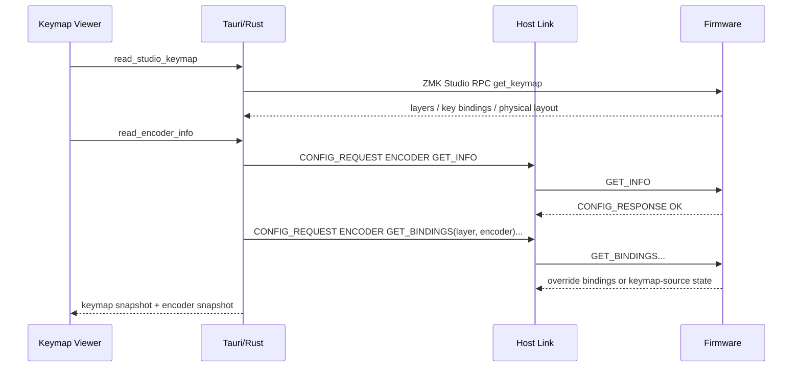
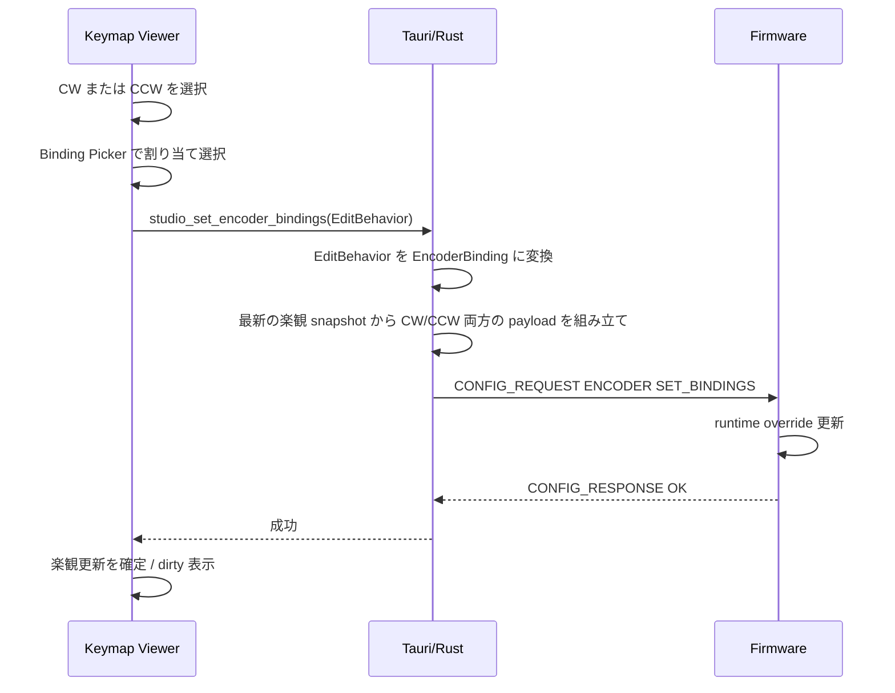
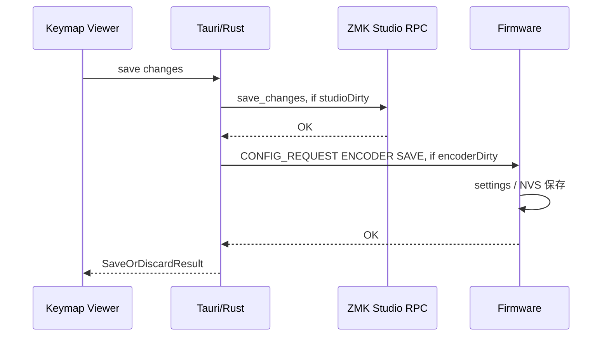

# キーマップエンコーダ編集機能 実装計画

このドキュメントは、Keylink Studio のキーマップ編集画面へエンコーダ編集機能を追加するための実装計画です。

2026-07 の安定化対応では PC 側 Keylink Studio のみを変更対象とし、`zmk-rawhid-app` と `zmk-raw-hid` は変更しない。Host は単一の常駐 Host Link worker から Config RPC を直列化し、Config応答待機中のuplinkを退避する。エンコーダdirtyはHost Link UID単位で保持し、一時切断や機器一覧更新だけでは解除しない。

対象は PC 側 Keylink Studio、ZMK 側 Host Link 受信実装、Raw HID/BLE HID transport です。通常キーの編集は既存の ZMK Studio RPC を使い、エンコーダ編集は Host Link Config RPC を追加して扱います。

## 目的

- キーマップ表示画面に通常キーと同じ文脈でエンコーダを表示する。
- 編集モードでは通常キーと同じ Binding Picker でエンコーダの CW / CCW を編集できるようにする。
- エンコーダ割り当ては変更時点で実機へ即時反映し、保存ボタンで永続化する。
- 通常キーの保存とエンコーダの保存は同じ保存バーから同時実行する。
- 初回 firmware 書き込み直後は `.keymap` に書いた通常 ZMK の `sensor-bindings` で動作し、Keylink Studio は未変更状態として扱う。
- 将来の combo / tap-dance 編集を見据え、Host Link packet は汎用 Config RPC として拡張できる形にする。

## 基本方針

通常キーとエンコーダで通信経路を分ける。

| 対象 | 表示 | 即時変更 | 保存 | 通信経路 |
| --- | --- | --- | --- | --- |
| 通常キー | ZMK Studio RPC | ZMK Studio RPC `set_key_at` | ZMK Studio RPC `save_changes` | Studio RPC |
| エンコーダ | Host Link Config RPC | Host Link Config RPC `SET_BINDINGS` | Host Link Config RPC `SAVE` | USB HID / BLE HOG |

UI 上は同じキーマップ編集機能として見せる。内部状態は `studioDirty` と `encoderDirty` を分け、画面上はまとめて未保存変更として扱う。保存 / 破棄の結果は、通常キーとエンコーダの両方が成功した場合だけ成功とする。どちらかが失敗した場合、UI は保存 / 破棄に失敗したことに加えて、通常キー側とエンコーダ側のどちらが失敗したかを表示する。

編集モードへ入るための主条件は、既存の通常キー編集と同じく ZMK Studio RPC の keymap editing が可能であることとする。エンコーダ編集は同じ編集モード内の追加機能として扱い、Studio device と Host Link device の UID 一致、Host Link v2、`CONFIG_RPC` capability、`ENCODER` feature の `GET_INFO` 成功が揃った場合だけ有効化する。Host は Host Link v2 handshake と `CONFIG_RPC` capability を確認した後、`CONFIG_REQUEST feature=ENCODER op=GET_INFO` を probing する。`GET_INFO` が `OK` の場合は `ENCODER` feature 対応、`UNSUPPORTED_FEATURE` または `UNSUPPORTED_OP` の場合は非対応として扱う。`GET_INFO.encoder_count == 0` の場合は、`ENCODER` feature には対応しているが表示対象エンコーダなしとして扱う。条件を満たさない場合でも通常キー編集は継続できるが、エンコーダ編集は表示専用または disabled 表示にし、Config RPC は送らない。

## ZMK 側の表現

`.keymap` は通常の ZMK エンコーダ設定を維持する。Keylink Studio 対応のために `&keylink_encoder` のような独自 syntax をユーザーへ要求しない。

```dts
sensor-bindings =
    <&inc_dec_kp C_VOL_UP C_VOL_DN>,
    <&inc_dec_kp C_BRI_UP C_BRI_DN>;
```

Host Link Config RPC の encoder binding は、ZMK の sensor-bindings に置く sensor behavior ではなく、encoder event の方向判定後に実行される CW / CCW 方向ごとの通常 behavior binding である。

そのため、Keylink Studio の override は `.keymap` の `sensor-bindings` 配列そのものを置き換えるのではなく、zmk-rawhid-app の sensor event listener が対象 encoder event を先取りした場合にだけ、方向ごとの通常 behavior binding を実行する。

この設定は通常の ZMK firmware と同じ意味を持つ。Keylink Studio は `.keymap` を直接書き換えず、Studio で変更されたエンコーダ割り当てを firmware 側の settings / NVS に override として保存する。

通常の `sensor-bindings` を firmware 外部モジュールから正確に読み、Keylink Studio の通常キー binding として復元する処理は MVP では行わない。

override が存在しない encoder は、実動作では通常 ZMK の `sensor-bindings` をそのまま使う。Keylink Studio は具体的な CW / CCW 割り当てを表示せず、「`.keymap` の設定を使用中」または「Studio 未設定」として表示する。

Studio で一度変更された encoder は settings / NVS の override を持つ。以後は Keylink Studio が override の CW / CCW を表示し、実動作も override を使う。

実行時の差し替えは、ZMK 本体の `zmk_sensor_keymap` を直接書き換えない。
zmk-rawhid-app が `zmk_sensor_event` listener を追加し、対象 layer / encoder に runtime override がある sensor event だけ先に処理して `ZMK_EV_EVENT_HANDLED` を返す。
runtime override がない場合は `ZMK_EV_EVENT_BUBBLE` を返し、通常の ZMK keymap listener へ流す。


```text
zmk_sensor_event
  -> zmk-rawhid-app keylink encoder listener
      override あり: 方向を判定し、CW/CCW に対応する通常 behavior binding を tap-like action として実行して HANDLED
      override なし: BUBBLE
  -> ZMK keymap listener
      通常の sensor-bindings を実行
```
### Encoder override の実行モデル

Keylink Studio の encoder override は、ZMK の `.keymap` に書かれた `sensor-bindings` の sensor behavior を置き換えるものではない。`.keymap` の `sensor-bindings` は firmware default として維持し、override が存在しない場合は通常の ZMK sensor keymap listener へ処理を流す。

Host Link Config RPC の `SET_BINDINGS` で送られる CW / CCW binding は、`&inc_dec_kp` のような ZMK sensor behavior ではなく、方向ごとに実行する通常の ZMK behavior binding である。Firmware は encoder event の方向を判定し、CW の場合は `cw_binding`、CCW の場合は `ccw_binding` を選択して実行する。

実行時の処理は以下の通りとする。

```text
zmk_sensor_event
  -> zmk-rawhid-app keylink encoder listener
      対象 layer / encoder に runtime override あり:
        event の方向を判定する
        CW  なら cw_binding を選択する
        CCW なら ccw_binding を選択する
        選択した通常 behavior binding を detent ごとの tap-like action として実行する
        ZMK_EV_EVENT_HANDLED を返す

      対象 layer / encoder に runtime override なし:
        ZMK_EV_EVENT_BUBBLE を返す

  -> ZMK keymap listener
      override なしの場合のみ、通常の `.keymap` sensor-bindings が実行される
```

`&none` 相当の binding は、明示的な Studio override として扱う。この場合、Firmware は何も実行せず `ZMK_EV_EVENT_HANDLED` を返し、通常 ZMK の `sensor-bindings` へ `BUBBLE` してはならない。

`&trans` 相当は MVP では encoder override として扱わない。`.keymap` の通常 `sensor-bindings` へ戻す操作は `&trans` ではなく `CLEAR_OVERRIDE` で表現する。

この実行モデルにより、Studio override が存在する encoder は Keylink 側の CW / CCW binding で動作し、override が存在しない encoder は従来通り `.keymap` の `sensor-bindings` で動作する。

ZMK Events の仕様では、外部 module targeting `app` は ZMK 本体より先に listener queue に入るため、zmk-rawhid-app で先取り listener を実装できる見込みがある。ただし、複数 module 間の順序は `west.yml` の module 順に依存するため、他 module との競合は実機検証する。

## Firmware の状態モデル

Firmware 側には、通常キーと同じ考え方で keymap / runtime override / saved override の状態を持たせる。

| 状態 | 内容 |
| --- | --- |
| keymap | `.keymap` に書かれた通常 ZMK の `sensor-bindings`。Keylink Studio は具体的な CW / CCW binding としては表示しない |
| runtime override | 現在 Keylink Studio から上書きされている CW / CCW |
| saved override | settings / NVS に保存済みの CW / CCW |

エンコーダ override の layer 識別子は ZMK Studio RPC の `Layer.id` に統一する。UI 上の配列 index やタブ順は使わない。

```text
layer_id:
  ZMK Studio RPC get_keymap の layers[].id
  レイヤー順に依存しない識別子

layer index:
  UI 表示やレイヤー並び替えで使う現在の位置
  Host Link Config RPC には送らない
```

Host 側は `get_keymap` で取得した `layers[]` の `Layer.id` をそのまま `GET_BINDINGS` / `SET_BINDINGS` / `CLEAR_OVERRIDE` に使う。Keylink Studio 側で 0, 1, 2... の独自 id を作らない。Firmware 側の override lookup key と settings / NVS 保存キーも `layer_id` ベースにする。Firmware 側の validation は ZMK keymap の有効な layer id かどうかで判定する。保存済み override の `layer_id` が現在の ZMK keymap に存在しない場合は実行対象外として無視し、可能なら削除対象にする。

`GET_INFO.encoder_count` は `zmk,keymap-sensors` に登録されたsensor 要素数から算出し、全 layer 共通とする。有効な `encoder_id` は `0..encoder_count-1` である。`encoder_id` は `zmk,keymap-sensors` の sensor 配列順 index とする。layer ごとの `sensor-bindings` 数や有無から `encoder_count` を算出してはならない。layer ごとに通常 ZMK の `sensor-bindings` が存在しない場合でも、その `encoder_id` は Host Link Config RPC 上は有効とする。対象 layer / encoder に Studio override が存在しない場合、`GET_BINDINGS` は `source = KEYMAP` を返す。layer ごとの `sensor-bindings` 欠落を `NOT_FOUND` / `INVALID_ARGUMENT` にはしない。

MVP では、`zmk,keymap-sensors` に登録された sensor はすべて Keylink Studio の encoder 編集対象として扱う。`encoder_count` は `zmk,keymap-sensors` の sensor 要素数とし、`encoder_id` は `zmk,keymap-sensors` の sensor 配列順 index とする。

対象 keyboard の `zmk,keymap-sensors` には rotary encoder のみを含める前提とする。rotary encoder 以外の sensor が `zmk,keymap-sensors` に含まれている場合でも、MVP の Host Link Config RPC 上は encoder として扱われる。Firmware は sensor 種別による filtering や `encoder_id -> sensor_index` の再マッピングを行わない。

保存済み override の lookup key は `layer_id` と `encoder_id` を使うため、Firmware 更新で `zmk,keymap-sensors` の順序を変えると override が別 sensor に対応する可能性がある。Firmware / keymap author は `zmk,keymap-sensors` の順序を安定させる必要がある。

将来 rotary encoder 以外の sensor を同じ `zmk,keymap-sensors` に含めて編集対象から除外したくなった場合は、MVP の仕様を拡張し、sensor 種別 filtering、`encoder_id -> sensor_index` mapping、保存済み override の migration / invalidation ルールを別途定義する。


起動時:

1. settings / NVS に保存済みの override を読み込む。
2. 保存済み record の length / magic / record_version / flags / hash_len / reserved / crc32 を検証する。
3. record 形式不正、CRC 不一致、unsupported record は invalid saved override として扱い、runtime override へ反映しない。
4. 保存済み override の CW / CCW それぞれについて、保存済み `behavior_id` が `0xFFFF` ではなく、現在の firmware 上で解決できるか確認する。
5. 現在の firmware がその `behavior_id` から算出した `behavior_identity_hash` と保存済み hash を比較する。
6. `param1` / `param2` が現在の behavior に対して妥当かを検証する。
Firmware が behavior 種別を判定できる場合は、transparent など
明らかに encoder override 非対応の binding を stale 扱いにしてよい。
Bluetooth command 種別や layer 系 behavior などの詳細分類は
Host 側を主責務とし、MVP firmware の必須実装とはしない。
7. CW / CCW の両方が検証に成功した override は runtime override として保持する。
8. 解決不能、identity 不一致、param 不正、または現在は encoder override 非対応になった binding を含む override は stale override として実行対象外にし、runtime override へ反映しない。該当 layer / encoder の実行時動作は通常 ZMK の `sensor-bindings` へ fallback する。
9. runtime override が存在しない場合、stale / invalid saved override は `GET_BINDINGS` では `OVERRIDE` として返さず、通常の binding 表示上は `source = KEYMAP` を返す。ただし Host / UI が診断できるよう、`GET_BINDINGS` response の `flags.stale_saved_exists` または `flags.invalid_saved_exists` を true にする。
10. `GET_BINDINGS` response の flags には、binding 単位の診断情報として `stale_saved_exists`、`invalid_saved_exists`、`saved_exists`、`runtime_dirty` を含める。`GET_BINDINGS` は runtime override を最優先して返す。対象 layer / encoder に runtime override が存在する場合は、settings / NVS 上に stale / invalid saved override が残っていても、通常表示用の response は `source = OVERRIDE` と現在の runtime override を返す。
MVP では、`source = OVERRIDE` を返している間は `stale_saved_exists` / `invalid_saved_exists` を true にしない。stale / invalid saved override は、次回 `SAVE` 成功時に新しい saved override で置換される cleanup 対象として内部的に保持する。
`DISCARD` により runtime override が破棄された場合は、SET_BINDINGS 前の saved / stale / invalid 状態へ戻す。元が stale / invalid saved override だった場合、`GET_BINDINGS` は再び `source = KEYMAP` と `stale_saved_exists` または `invalid_saved_exists` を返す。
`runtime_dirty` は対象 layer / encoder の runtime state が saved state と異なることを表す per-binding flag であり、`GET_DIRTY` は feature 全体の dirty を返す。
11. `stale_saved_exists` / `invalid_saved_exists` は dirty とは別概念とし、この flag が true であることだけでは `encoderDirty` を true にせず、保存バーも表示しない。
12. stale / invalid saved override は起動時に自動削除しない。同じ layer / encoder に対してユーザー操作により runtime state が dirty になり、`SAVE` が成功した場合にのみ整理する。
settings subsystem / NVS 全体の読み込み失敗と、個別 record の stale / invalid 判定は区別する。
settings subsystem / NVS 全体の読み込みに失敗した場合、Firmware は保存済み override の存在有無を安全に判断できないため、destructive な削除を伴う `SAVE` は `STORAGE_ERROR` として扱う。
一方、個別 record を読み込めており、その record が形式不正、CRC 不一致、unsupported record、identity 不一致、解決不能 behavior、param 不正などにより stale / invalid と判定できる場合、その entry は診断情報として保持してよい。この場合、同じ layer / encoder に対する `CLEAR_OVERRIDE` 後の `SAVE`、または新しい override の `SAVE` により、該当 stale / invalid saved override を削除または置換してよい。

13. MVP では `source = KEYMAP` の `cw_binding` / `ccw_binding` はゼロ埋めし、UI は「`.keymap` の設定を使用中」と表示する。
14. 保存済み override がない encoder は override なしとして扱い、通常 ZMK の `sensor-bindings` へ処理を流す。

Studio から変更された時:

1. `SET_BINDINGS` を受ける。
2. 指定 layer / encoder の CW / CCW を runtime table に反映する。
3. `encoderDirty = true` にする。
4. 応答成功後、UI も同じ値に更新する。

保存時:

1. `SAVE` を受ける。
2. Firmware が管理している dirty layer / encoder の現在の runtime state を settings / NVS の saved state へ同期する。
3. dirty layer / encoder の runtime state が `OVERRIDE` の場合、現在の CW / CCW override の `behavior_id` / `param1` / `param2` と、CW / CCW それぞれの現在の `behavior_identity_hash` を settings / NVS へ 64 byte record として保存する。同じ layer / encoder の既存 saved override がある場合は上書きし、stale / invalid saved override がある場合も新しい saved override で置換する。
4. dirty layer / encoder の runtime state が `KEYMAP` の場合、同じ layer / encoder の saved override を削除する。stale / invalid saved override がある場合も削除する。これは `CLEAR_OVERRIDE` 後の永続削除、または stale / invalid saved override の削除を表す。
5. settings subsystem / NVS 全体の読み込みに失敗しており、保存済み override の存在有無を安全に判断できない状態では、Firmware は destructive な削除を行わず、`STORAGE_ERROR` を返す。

   ただし、個別 record の形式不正、CRC 不一致、unsupported record、identity 不一致、解決不能 behavior、param 不正などにより stale / invalid saved override と判定できている場合は、この限りではない。これらは診断情報として保持し、同じ layer / encoder が dirty 対象になった `SAVE` 時に、runtime state に応じて置換または削除してよい。
6. dirty 対象の全 entry に対する保存、上書き、削除がすべて成功した場合のみ `OK` を返し、`encoderDirty = false` にする。
7. 1 つでも保存、上書き、削除に失敗した場合は `STORAGE_ERROR` を返す。この場合、一部 entry が保存、上書き、削除済みになっている可能性があるため、Firmware は `encoderDirty` を false にせず、dirty 対象と `delete_pending` を保持する。次回 `SAVE` では dirty 対象を再度保存または削除する。

破棄時:

1. `DISCARD` を受ける。
2. settings / NVS に保存済みの override を再読み込みする。
3. 保存済み override がない encoder は override なしへ戻す。
4. `encoderDirty = false` にする。

`CLEAR_OVERRIDE` は `SET_BINDINGS` と同じ保存モデルにする。対象 layer / encoder に runtime override、saved override、stale saved override、invalid saved override のいずれかが存在する場合だけ削除対象として dirty を立てる。runtime override が存在する場合は runtime override を削除し、saved override / stale saved override / invalid saved override は `CLEAR_OVERRIDE` 時点ではまだ削除しない。`SAVE` 時に runtime が override なしなら saved override / stale saved override / invalid saved override を削除する。`DISCARD` 時は saved override があれば runtime override に戻し、saved override がなければ override なしに戻す。runtime override、saved override、stale saved override、invalid saved override のいずれも存在しない場合、`CLEAR_OVERRIDE` は `OK` を返すが状態を変更せず、dirty は false のままとする。

## Host Link Config RPC

Host Link に Config RPC を追加する。詳細な byte 仕様は [Host Link Config RPC Packet Specification](hostlink-config-rpc-packet-spec.md) を参照。

主要方針:

- Host Link protocol version は `0x02` とする。
- MVP では Host Link v1 との後方互換は持たない。Host Link Config RPC とエンコーダ編集は Host Link protocol v2 対応 firmware を必須とする。
- Host は v2 handshake に成功しない device へ Config RPC を送らない。v1 firmware は Host Link unsupported として扱う。
- ZMK Studio RPC による通常キー編集は Host Link transport と独立しているため、Studio 接続が有効な場合は Host Link v2 非対応でも継続して利用できる。
- HID payload は 64 byte 固定とする。
- USB HID と BLE HOG で wire format は同一とする。
- 既存 packet も Config RPC と同じ Common Header を使い、v1 の意味を維持したまま payload 領域へ詰め直す。
- USB は 64 byte の Host Link packet を 1 HID report として送る。
- BLE は `ATT MTU >= 67`、Report Map / characteristic が 64 byte report を許容し、かつ実機で安定する場合、64 byte の Host Link packet を 1 回で送る。
- BLE で `ATT MTU < 67`、Report Map / characteristic が 64 byte report を許容しない、または 64 byte transfer が不安定な場合は BLE transport 層で chunking する。
- chunking は Host Link packet 仕様ではなく BLE transport 層で扱う。Host Link parser は復元後の 64 byte packet だけを見る。
- request / response 型にする。
- Host は同一 device に対して Config RPC request を同時に 1 件だけ送る。
- `seq` で request / response を対応付ける。
- reserved byte と未使用 payload byte は必ず `0` とし、受信側は non-zero を reject する。

## 通信シーケンス

### 初期表示



### エンコーダ変更



### 保存



片方だけ失敗した場合は、成功した側は保存済みとして扱い、失敗した側の dirty を残す。UI は保存失敗として扱い、通常キーとエンコーダのどちらが失敗したかを表示する。次回の保存では、内部状態に基づいて dirty が残っている側だけ再試行する。MVP では失敗箇所ごとの個別再試行 UI は作らないが、UI 表示、内部ログ、command response には `studio keymap save failed` / `encoder config save failed` のように失敗箇所を判別できる情報を残す。

### dirty / pending / save / discard の合成

内部状態は通常キーとエンコーダで分ける。

| 内部状態 | 意味 |
| --- | --- |
| `studioDirty` | 通常キーの未保存変更 |
| `encoderDirty` | エンコーダの未保存変更 |
| `pendingKeyWrites` | 通常キーの即時反映中件数 |
| `pendingEncoderWrites` | エンコーダの即時反映中件数 |
| `lastStudioSaveResult` | 直近の通常キー保存結果 |
| `lastEncoderSaveResult` | 直近のエンコーダ保存結果 |
| `lastStudioDiscardResult` | 直近の通常キー破棄結果 |
| `lastEncoderDiscardResult` | 直近のエンコーダ破棄結果 |
| `encoderStaleSavedExists` | 診断用。stale saved override が検出された encoder がある。dirty とは別概念 |
| `encoderInvalidSavedExists` | 診断用。invalid saved override が検出された encoder がある。dirty とは別概念 |
| `encoderBindingFlags` | 診断 / 表示用。`GET_BINDINGS` 由来の `staleSavedExists` / `invalidSavedExists` / `savedExists` / `runtimeDirty` を layer / encoder 単位で保持する |

UI 表示と操作可否は合成状態で判断する。

| 合成状態 | 条件 |
| --- | --- |
| `hasUnsaved` | `studioDirty || encoderDirty` |
| `hasPendingWrites` | `pendingKeyWrites > 0 || pendingEncoderWrites > 0` |
| `isSaving` | Studio save または Encoder save 実行中 |
| `isDiscarding` | Studio discard または Encoder discard 実行中 |

保存ボタンは `hasUnsaved` が true のとき表示 / 有効化する。ただし `hasPendingWrites` が true の間は、保存を待機または無効化する。保存成功は Studio save と Encoder save の両方が成功した場合だけ成立する。失敗判定はどちらか一方の失敗で成立する。

`encoderStaleSavedExists` / `encoderInvalidSavedExists` は診断表示やログに使ってよいが、単独では `hasUnsaved` に含めない。stale / invalid saved override は、ユーザーが同じ layer / encoder に対して Studio 設定をクリアするか新しい override を保存した場合に整理される。

`encoderBindingFlags.runtimeDirty` は layer / encoder 単位の表示・診断情報であり、保存バー表示の主判定は `encoderDirty` / `GET_DIRTY` に置く。通常は `runtimeDirty` がどれか 1 つでも true なら feature 全体の `encoderDirty` も true になるが、UI は `GET_DIRTY` または command 結果で feature dirty を管理する。

UI 表示は通常キー側とエンコーダ側のどちらが失敗したかを判別できる内容にする。Rust core / Tauri command / UI state は通常キーとエンコーダの詳細結果を保持する。保存 command は内部で扱える構造化結果を返し、成功側の dirty だけを false にする。失敗側の dirty は true のまま残し、次回保存時は dirty が残っている側だけ再試行する。ログには通常キー保存とエンコーダ保存のどちらで失敗したかを必ず残す。

Tauri command の保存 / 破棄 API は、成功または例外だけの戻り値にはしない。通常キー側と Host Link Config feature 側の結果を分離した構造化戻り値を返す。UI 表示上は単一の保存 / 破棄操作として扱うが、内部状態では各対象の結果を個別に反映する。

```ts
type SaveOrDiscardResult = {
  overallSuccess: boolean;

  studio: {
    attempted: boolean;
    skipped: boolean;
    success: boolean;
    error?: string;
  };

  config: {
    attempted: boolean;
    skipped: boolean;
    success: boolean;
    results: Array<{
      feature: "ENCODER" | "COMBO" | "TAP_DANCE";
      attempted: boolean;
      skipped: boolean;
      success: boolean;
      error?: string;
    }>;
  };
};
```

`attempted` はその対象への保存 / 破棄を実行したことを表す。dirty がない、feature が未接続、または対象外で実行しなかった場合は `skipped = true` とする。`success` は attempted 対象では実行結果、skipped 対象では dirty state を変更しない成功扱いを表す。`overallSuccess` は、attempted されたすべての対象が成功し、失敗が 1 つもない場合のみ true とする。

保存の場合:

- 通常キー側が成功した場合、`studioDirty` を false にする。
- Host Link Config feature 側が成功した場合、該当 feature の `configDirty` を false にする。MVP では `ENCODER` の `encoderDirty` が対象になる。
- 失敗した側の dirty は true のまま保持する。
- 次回保存時は dirty が残っている対象だけ再試行する。

破棄の場合:

- 通常キー側の破棄が成功した場合、`studioDirty` を false にする。
- Host Link Config feature 側の破棄が成功した場合、該当 feature の `configDirty` を false にする。MVP では `ENCODER` の `encoderDirty` が対象になる。
- 失敗した側の dirty は true のまま保持する。
- 破棄後は、成功した対象の snapshot を再取得して UI と実機状態を揃える。

`studio_save_changes` / `studio_discard_changes` 相当の Tauri command は、この構造化結果を返す。UI 側の `studioSaveChanges()` / `studioDiscardChanges()` wrapper も `void` や単一 snapshot ではなく、構造化結果を返す型へ変更する。通常キー、`ENCODER`、将来の `COMBO` / `TAP_DANCE` は同じ `config.results[]` の形で扱い、feature 追加時に API shape を変えない。

例:

```text
studioDirty=true, encoderDirty=true の状態で保存
  Studio save 成功    -> studioDirty=false
  Encoder save 失敗   -> encoderDirty=true のまま
  UI 表示             -> 保存失敗。エンコーダ設定の保存に失敗
次回保存
  encoderDirty=true のため Encoder save だけ再試行
```

破棄も同じ合成ルールで扱う。破棄成功は Studio discard と Encoder discard の両方が成功した場合だけ成立する。破棄結果も内部では通常キーとエンコーダに分けて保持し、片方だけ失敗した場合は失敗側だけ破棄対象として残し、UI には通常キー側とエンコーダ側のどちらが失敗したかを表示する。破棄後は通常キー snapshot と encoder snapshot を再取得し、UI と実機状態を揃える。

navigation guard は `hasUnsaved` または `hasPendingWrites` が true のとき遷移を止める。`保存して移動` は通常キーとエンコーダの両方が成功した場合だけ移動する。片方でも失敗した場合は移動しない。

### 将来の Config feature 追加時の状態拡張

MVP では Host Link Config RPC の編集対象が `ENCODER` のみであるため、UI / Host state は `encoderDirty`, `pendingEncoderWrites`, `lastEncoder*Result` として保持する。

将来 `COMBO` / `TAP_DANCE` などの Config feature を追加する場合は、`encoderDirty` を feature 別 dirty map に拡張する。

例:

```text
configDirty[ENCODER]
configDirty[COMBO]
configDirty[TAP_DANCE]
pendingConfigWrites[feature]
lastConfigSaveResult[feature]
lastConfigDiscardResult[feature]
```

その場合、合成状態は以下のように拡張する。

```text
hasUnsaved = studioDirty || any(configDirty.values())
hasPendingWrites = pendingKeyWrites > 0 || any(pendingConfigWrites.values() > 0)
```

この拡張は将来 feature 追加時に行い、MVP では `encoderDirty` ベースの実装に留める。

## UI / UX

### 表示

エンコーダはキーマップ左下に表示する。キーとは異なる円形のコントロールにし、通常キーと混同しないようにする。

```text
+------------------------------------------------+
| keymap keys                                    |
|                                                |
|  (Encoder 1)                                   |
|    CW  : &kp C_VOL_UP                          |
|    CCW : &kp C_VOL_DN                          |
+------------------------------------------------+
```

MVP では物理位置メタデータを持たず、encoder id 順に左下へ並べる。将来、キーボードごとの正確な物理位置が必要になった場合は firmware 側に表示 metadata を追加する。

override が存在しない encoder は、具体的な割り当て値の代わりに `.keymap` の設定を使用中であることを表示する。

```text
+------------------------------------------------+
| keymap keys                                    |
|                                                |
|  (Encoder 1)                                   |
|    .keymap の設定を使用中                       |
+------------------------------------------------+
```

この状態では実機は `.keymap` の `sensor-bindings` で動作するが、Keylink Studio はその具体値を表示しない。固定の `&none` などを表示すると実動作と誤認しやすいため使わない。この制約はマニュアルにも明記する。

### 編集

- 既存の編集ボタンは通常キー編集の可否を基準に表示 / 有効化する。
- 編集モードに入った後、エンコーダ編集は `encoderEditAvailable` が true の場合だけ有効にする。
- `encoderEditAvailable` は、Studio device と Host Link device の UID が一致し、Host Link v2 handshake 済み、`CONFIG_RPC` capability あり、`ENCODER` feature の `GET_INFO` 成功、`encoder_count > 0`、のすべてを満たす場合だけ true とする。`GET_INFO` が `UNSUPPORTED_FEATURE` または `UNSUPPORTED_OP` を返した場合は非対応として扱い、`encoder_count == 0` の場合は対応済みだが表示対象なしとして扱う。
- `encoderEditAvailable` が false の場合、エンコーダは表示専用または disabled 表示にし、Host は対象 device へ Config RPC を送らない。
- 編集モードで CW / CCW 行をクリック可能にする。
- 通常キーと同じ Binding Picker を開く。
- Binding Picker の候補表示は通常キーと共通化するが、エンコーダに適さない behavior は非活性にする。MVP の encoder override は detent ごとの tap-like action のみ許可し、hold/release、tap-hold 判定、sticky state、layer state mutation、永続破壊的・接続破壊的・再起動系のdevice control を伴う behavior は送信しない。
- MVP で許可する behavior は `KeyPress` のうち modifier-only ではない tap-like key、`None`、`Bluetooth` の select 系 command、`OutputSelection`、`MouseKeyPress`、`MouseMove`、`MouseScroll` とする。
- MVP で非対応とする behavior は `KeyPress` のうち modifier-only key、`Transparent`、`MomentaryLayer`、`ToggleLayer`、`ToLayer`、`ModTap`、`LayerTap`、`StickyKey`、`StickyLayer`、`Bluetooth` の clear 系 command、`Bluetooth` の disconnect 系 command、`CapsWord`、`KeyRepeat`、`Reset`、`Bootloader`、`StudioUnlock`、`GraveEscape` とする。
- modifier-only key は hold されていることに意味があるため、detentごとのtap-like actionでは期待通り動作しにくい。
- modifier-only key は Left/Right Ctrl、Shift、Alt、GUI など、単独では修飾状態だけを表す key を指す。通常キー、consumer key、media key などの tap-like usage は許可してよい。
- CW と CCW は同じ panel 内に並べ、現在値が常に見えるようにする。
- override がない encoder を初めて編集する場合は、現在の `.keymap` 値を引き継がず、ユーザーが CW / CCW を明示的に設定する。
- 初回編集時には「現在は `.keymap` の設定を使用中。Studio で変更すると以後は Studio の設定で上書きされる」ことが分かる UI にする。
- 初回 override 作成中は、CW / CCW の両方が明示設定されるまで `SET_BINDINGS` を送らない。未設定側を Host が暗黙に `&none` で補完してはならない。
- 初回 override 作成中にユーザーがキャンセルした場合、Host は何も送信せず、対象 encoder は `source = KEYMAP` のままにする。
- `.keymap` の通常 ZMK 設定へ戻す操作は `&trans` ではなく、明示的な「Studio 設定をクリア」操作として扱う。この操作は Host Link の `CLEAR_OVERRIDE` を呼び、指定 encoder の runtime override を削除する。
- pending 中は保存、破棄、編集終了、画面遷移を止める。

### 保存バー

既存の編集バーを拡張する。

| 表示状態 | 条件 |
| --- | --- |
| 未保存変更あり | `studioDirty || encoderDirty` |
| 書き込み中 N 件 | 通常キーまたはエンコーダの pending write がある |
| 保存中 | Studio save または Encoder save 実行中 |
| 破棄中 | Studio discard または Encoder discard 実行中 |
| 通常キー保存失敗 | Studio save が失敗した |
| エンコーダ保存失敗 | Encoder save が失敗した |
| 通常キー破棄失敗 | Studio discard が失敗した |
| エンコーダ破棄失敗 | Encoder discard が失敗した |

保存 / 破棄の失敗表示では、通常キー側とエンコーダ側のどちらが失敗したかを表示する。両方が失敗した場合は両方を表示する。

内部状態と command response も通常キーとエンコーダの詳細結果を保持する。これにより、片方だけ成功した場合でも成功側の dirty を落とし、失敗側だけを次回保存 / 破棄で再試行できるようにする。

## Host 側実装範囲

### Debug file logging

エンコーダ編集と Host Link Config RPC の実装では、デバッグ用のファイルログを追加する。Settings に debug logging の有効 / 無効トグルと出力先ファイル選択を追加する。既定は無効とする。有効時の既定出力先は実行中の `.exe` と同じディレクトリの `keylink-studio-debug.log` とする。ユーザーが任意の出力先を選択した場合は、その path を設定に保存して使う。

設定項目:

```toml
[debug_log]
enabled = false
path = "keylink-studio-debug.log"
```

`path` が相対 path の場合は `.exe` と同じディレクトリからの相対 path として解決する。`path` が絶対 path の場合はその path へ出力する。`path` が未設定または空の場合も、既定値として `.exe` と同じディレクトリの `keylink-studio-debug.log` を使う。出力先を開けない場合は UI にエラーを表示し、ファイルログは無効化する。既存の in-memory log / UI log はこの設定に関係なく従来どおり扱う。

ログには、Config RPC の request / response summary、`seq`、`feature`、`op`、status、timeout / retry / disconnect、`GET_INFO.encoder_count`、`GET_BINDINGS` の `layer_id` / `encoder_id` / `source` / `flags`、`SET_BINDINGS` の成功 / 失敗、`SAVE` / `DISCARD` / `CLEAR_OVERRIDE` の成功 / 失敗、通常キー保存とエンコーダ保存のどちらが失敗したかを出す。今後この機能を実装するときは、原因切り分けに必要な箇所へ適宜 debug log を追加する。

セキュリティ方針は既存ログと同じとする。access token、credentials JSON、Authorization header、HTTP request / response body、raw parse error、ユーザーが読み込んだ keymap backup JSON の本文は出力しない。Host Link Config RPC の raw packet 全体は既定では出力せず、packet type / feature / op / status / 対象 id などの summary に留める。

### `rawhid-host-core`

- Host Link packet codec を protocol v2 / 64 byte に更新する。
- Config RPC request / response の encode / decode を追加する。
- Config RPC retry / duplicate 判定は同一 pending / retry window 内だけ有効とし、seq wrap 後の正当な request を過去 request との `seq` 一致だけで reject しない。
- encoder feature の型を追加する。
- `EditBehavior -> EncoderBinding { behavior_id, param1, param2 }` の変換を追加する。
- `behavior_id` は ZMK の `zmk_behavior_local_id_t` に合わせ、Rust core が ZMK Studio RPC 由来の接続単位 resolver で解決する。UI 側では `behavior_id` を組み立てない。
- エンコーダ用 resolver / converter は encoder behavior eligibility を検証する。非対応 behavior は `EncoderBinding` に変換せず、Host Link `SET_BINDINGS` を送らない。Bluetooth behavior は command 種別まで確認し、select 系だけを許可する。
- `SET_BINDINGS` は MVP では `update_mask = 0x03` 固定とし、常に CW / CCW 両方の binding を送る。payload は最新の楽観 snapshot を基準に組み立てる。
- ただし `source = KEYMAP` の初回編集では最新 snapshot に具体的な CW / CCW が存在しないため、CW / CCW 両方がユーザーにより明示設定されるまで payload を組み立てない。キャンセル時は request を送らず `source = KEYMAP` を維持する。
- HID monitor loop に request / response 配送を追加する。
- 同一 device の Config RPC request は 1 件ずつ直列化する。
- timeout / retry / disconnect 時の error を定義する。
- debug logging が有効な場合、Config RPC の request / response summary、timeout / retry / disconnect、保存 / 破棄の失敗箇所をファイルへ出力する。
- ZMK Studio snapshot と encoder snapshot を UI 向けに合成する。

### Behavior Resolver

エンコーダ編集で使う `behavior_id` は Keylink Studio 側で固定値として持たない。接続中の firmware から ZMK Studio RPC の behavior catalog を取得し、Rust core が接続単位の resolver を作成する。

取得手順:

1. ZMK Studio RPC の `list_all_behaviors()` で behavior id 一覧を取得する。
2. 各 behavior id について `get_behavior_details(id)` を呼び、`id`, `display_name`, `metadata` を取得する。
3. Rust core は取得した catalog から、UI の `EditBehavior` を ZMK Studio の `BehaviorBinding { behavior_id, param1, param2 }` 相当へ変換できる resolver を作成する。

この方針は `zmk-studio-api 0.3.1` の API 上成立する。`StudioClient::list_all_behaviors()` は公開されており、内部では `RequestType::ListAllBehaviors` を呼んで behavior id 一覧を返す。`StudioClient::get_behavior_details(id)` も公開されており、`id` / `display_name` / `metadata`(param1・param2 の値種別)を返す。role/id map を構築する resolver 自体は現時点で未実装であり、`rawhid-host-core` に新規追加する。既存の `resolve_behavior_names()` は id → 表示名の逆引き専用で、role → id の解決には使えない。

#### role 判定ルール(2026-07-09 実機ダンプで確認)

Cornix 実機で `list_all_behaviors()` + `get_behavior_details(id)` を全 id に対して実行し、以下を確認した。

- `GetBehaviorDetailsResponse` には devicetree の `compatible` や明示的な role フィールドは含まれない。resolver が使える情報は `id` / `display_name` / `metadata`(param1・param2 の値種別)のみ。
- `display_name` の書式は behavior ごとに不統一。`&kp` は `"Key Press"` のような Title Case だが、`&mmv` / `&msc` は `"mouse_move"` / `"mouse_scroll"` という devicetree node label がそのまま返る。
- param 形状だけでは role を一意に判定できない。ユーザーが keymap で定義した独自 hold-tap(例: `hm_shift_l`)は `Mod-Tap`(MVP 非対応)と全く同じ `param1=HidUsage param2=HidUsage` 形状を持つ。
- `&bt` は command(select / clear / disconnect)ごとに behavior_id が分かれておらず、**単一の behavior_id が複数の param1 constant 群を持つ**(Cornix実機では id=22 に、`Next Profile`/`Previous Profile`/`Clear All Profiles`/`Clear Selected Profile` の組と、`Select Profile`/`Disconnect Profile`(+ `param2 = Profile:range`)の組が同居)。
- `&mmv` / `&msc` は `metadata` が空配列で返り、param のエンコード(方向・速度の bit-packing)を firmware から発見する手段がない。ただし ZMK 本体の `app/include/dt-bindings/zmk/pointing.h` は `MOVE_X(hor) = ((hor) & 0xFFFF) << 16`, `MOVE_Y(vert) = (vert) & 0xFFFF` という固定 wire format を定義しており、`&mmv` / `&msc` はこの単一 u32 値(上位16bit=X、下位16bit=Y、共に符号付き)を 1 個の binding cell として共有する。Keylink Studio は通常キー編集で既にこの値をそのまま扱っている(`EditBehavior::MouseMove(u32)` / `MouseScroll(u32)` 、`ui/src/pages/KeymapViewer.tsx` の `MOUSE_MOVE_COMMANDS` / `MOUSE_SCROLL_COMMANDS` が `0x0000_fda8` 等の実際の packed 値を持つ)ため、新たなエンコード仕様は不要。

このため resolver は以下の方針で実装する。

1. MVP で許可する role ごとに、`display_name` の**完全一致リスト**を持つ(例: `KeyPress → "Key Press"`, `None → "None"`, `OutputSelection → "Output Selection"`, `MouseKeyPress → "Mouse Key Press"`, `MouseMove → "mouse_move"`, `MouseScroll → "mouse_scroll"`, `Bluetooth → "Bluetooth"`)。正規化や部分一致・あいまいマッチは行わない。
2. リストに一致する `display_name` を持つ behavior が catalog に存在しない場合、その role は当該 firmware では resolve 不能として扱う。UI では該当 role を選択不可にする。
3. `Bluetooth` は 2 段階で解決する。まず `display_name == "Bluetooth"` の behavior を探し、次にその `metadata` 内の param1 候補から `name == "Select Profile"` の entry を探して `constant` 値を取得する。この entry が存在しない場合、当該 firmware では Bluetooth override は非対応として扱う。`Clear Profile` / `Clear All Profiles` / `Disconnect Profile` / `Next Profile` / `Previous Profile` に対応する entry は選ばない(select 系以外は catalog 上に存在しても使わない)。
4. `MouseMove` / `MouseScroll` は firmware の `metadata` が空でも resolve 対象とする。`behavior_id` は `display_name` 完全一致で解決し、`param1` には `EditBehavior::MouseMove(value)` / `MouseScroll(value)` の `value`(既存の ZMK `MOVE_X`/`MOVE_Y` packed u32)をそのまま渡し、`param2 = 0` とする。`MouseKeyPress` も同様に `EditBehavior::MouseKeyPress(value)` の `value` を `param1` にそのまま渡し `param2 = 0` とする。
5. 同一 `display_name` に一致する behavior が catalog に複数存在する場合(ユーザー定義 behavior が偶然同名になるケースなど)、resolver は一意に決定できないため resolve 不能として扱う。

Host は catalog fingerprint や behavior identity hash を生成・保存しない。Host 側 resolver は、接続中の ZMK Studio RPC behavior catalog から `EditBehavior` を `behavior_id` / `param1` / `param2` へ変換するためだけに使う一時状態とする。

`display_name` は UI 表示や role 判定に使うが、wire に送る `behavior_id` は `list_all_behaviors()` で取得した id を正とする。Keylink Studio は `&kp`, `&mo`, `&bt` などの `behavior_id` を固定値として定義してはならない。

`&none` / `&trans` も固定の数値として定義してはならない。`&none` は behavior catalog から `None` role として解決できた local id を使い、有効な Studio override として送る。`&trans` は MVP のエンコーダ override では非対応とし、Host は送信しない。firmware default へ戻す操作は `&trans` ではなく `CLEAR_OVERRIDE` を使う。

Firmware は catalog 全体の hash ではなく、保存する binding ごとの `behavior_identity_hash` を扱う。`behavior_identity_hash` は `behavior_id` そのものではなく、現在の firmware 上でその `behavior_id` が指している behavior の identity を表す hash とする。hash 入力は firmware が安定して取得できる情報に限定し、identity schema version、behavior device name / label、compatible または kind、binding cell count、取得できる場合は behavior role / Keylink 側 eligibility class などを含める。最低限は `behavior_device_name + compatible_or_kind + binding_cell_count` 相当を含める。

settings / NVS に保存する encoder override は、CW / CCW それぞれに `behavior_id` / `param1` / `param2` / `behavior_identity_hash` を持つ。CW と CCW で別 behavior を使えるため、identity hash も方向ごとに別々に保存する。起動時に saved override の `behavior_id` が解決不能、現在算出した identity hash と保存済み hash が不一致、parameter が不正、または現在の firmware では encoder override 非対応になっている場合、その override は stale とみなし、実行せず `source = KEYMAP` として扱う。`GET_BINDINGS` response では診断用に `flags.stale_saved_exists` を true にする。有効な saved override がある場合は `flags.saved_exists` を true にし、runtime state が saved state と異なる場合は `flags.runtime_dirty` を true にする。

エンコーダ編集時、UI は既存の `EditBehavior` だけを Rust core に渡す。Rust core は resolver を使って `EditBehavior` を Host Link の `EncoderBinding { behavior_id, param1, param2 }` に変換する。例えば `CW = &kp C_VOL_UP` は、`BehaviorRole::KeyPress` に対応する behavior id と、`C_VOL_UP` の HID usage 値、`param2 = 0` に変換する。

resolver は接続ごとに作成し、メモリ上にのみ保持する。永続キャッシュは行わない。切断、接続先変更、アプリ終了時に破棄し、再接続時は ZMK Studio RPC から再取得する。

resolver が作成できない場合、または選択された `EditBehavior` を `behavior_id` へ解決できない場合、Keylink Studio はエンコーダの編集を実行してはならない。UI ではエンコーダ編集を無効化するか、SET 前にエラーとして扱う。

MVP では encoder behavior eligibility の詳細判定は Host 側を主責務とする。Host は非対応 behavior を Binding Picker 上で選択不可にし、`EncoderBinding` へ変換せず、`SET_BINDINGS` を送信しない。

Firmware は `SET_BINDINGS` 受信時に最低限の安全検証を行う。Firmware は `layer_id` / `encoder_id` / `update_mask` / `reserved` / `behavior_id` / binding parameter を検証し、壊れた値、解決不能な `behavior_id`、invalid sentinel、不正な parameter を拒否する。Firmware は behavior 種別を判定できる場合に限り、transparent など明らかに非対応の binding を `INVALID_ARGUMENT` として拒否してよい。ただし MVP では Bluetooth command 種別や layer 系 behavior などの詳細分類を Firmware 側の必須実装とはしない。検証に成功した場合だけ runtime override に反映し、`encoderDirty = true` にする。`behavior_identity_hash` の永続保存は `SAVE` 時に行う。

特殊値の扱い:

- `0xFFFF` は invalid / not found 専用。Host は送信禁止、Firmware は `SET_BINDINGS` で受け取ったら `INVALID_ARGUMENT`。settings / NVS への新規保存と実行は禁止。保存済み override から `0xFFFF` または解決不能な behavior id が見つかった場合は stale saved override として扱い、runtime override へ反映しない。以後の `GET_BINDINGS` は `source = KEYMAP` と `flags.stale_saved_exists = true` を返す。起動時には自動削除しない。
- `&none` 相当は許可する。「何もしない」という明示的な override であり、通常 ZMK の `sensor-bindings` へは `BUBBLE` しない。ただし `&none` の `behavior_id` は固定値ではなく、behavior catalog から解決した local id を使う。
- `&trans` 相当は MVP では非対応。Host は送信禁止、Firmware は `SET_BINDINGS` で受け取ったら `INVALID_ARGUMENT`。`&trans` の `behavior_id` も固定値として扱わない。
- firmware default へ戻す操作は `&trans` で表現しない。`CLEAR_OVERRIDE` で Keylink Studio の runtime override を削除し、override なしとして通常 ZMK の `sensor-bindings` へ `BUBBLE` する。削除の永続化は `SAVE` で行う。

### `rawhid-host-tauri`

追加予定 command:

- `read_encoder_bindings`
- `studio_set_encoder_bindings`
- `studio_encoder_has_unsaved`

保存 / 破棄は通常キー側と Host Link Config feature 側を 1 つの UI 操作として扱うため、Tauri command は通常キー専用の単純な `void` / snapshot 戻り値ではなく、`SaveOrDiscardResult` のような構造化結果を返す。既存の `studio_save_changes` / `studio_discard_changes` を拡張するか、新しい合成 command を追加するかは実装時に決めるが、UI API は以下を満たす。

- 通常キー側と Config feature 側の `attempted` / `skipped` / `success` / `error` を分けて返す。
- 通常キー側が成功した場合だけ `studioDirty` を false にする。
- Config feature 側が成功した場合だけ該当 feature の `configDirty` を false にする。
- 失敗した側の dirty は保持し、次回保存 / 破棄で dirty が残っている対象だけ再試行する。
- 破棄で成功した対象は snapshot を再取得し、UI と実機状態を揃える。
- 将来の `COMBO` / `TAP_DANCE` 追加時も `config.results[]` に feature 単位の結果を追加し、戻り値 shape を変更しない。

実装時は通常キー編集の command 名との整合を見て、最終的な名前を決める。

### `ui`

- `StudioKeymapSnapshot` に encoder 情報を追加する。
- `KeymapCanvas` に encoder item を描画する。
- selected target を `key` / `encoder_cw` / `encoder_ccw` に拡張する。
- Binding Picker は通常キーと共通化し、UI は既存の `EditBehavior` を Rust command へ渡す。
- Host Link packet 用の `behavior_id`, `param1`, `param2` は UI ではなく Rust core 側で生成する。
- pending queue を key 専用から edit target 汎用へ拡張する。
- encoder pending queue は同一 layer / encoder に対して順序を保証する。CW だけ、または CCW だけを編集した場合でも、送信時は最新の楽観 snapshot から CW / CCW 両方を組み立てる。
- dirty / save / discard / navigation guard を通常キー + エンコーダの合成状態へ拡張する。
- Settings に debug logging の有効 / 無効トグルと出力先ファイル選択 UI を追加する。出力先の既定表示は `keylink-studio-debug.log` とし、実体は `.exe` と同じディレクトリに解決する。

## Firmware 側実装範囲

### `zmk-rawhid-app`

- Host Link protocol v2 / 64 byte を受信できるようにする。
- 既存 packet の parse / dispatch / uplink encode を v2 Common Header + payload layout へ移行する。AI 使用量や時刻表示などの内部保持状態と getter API は維持し、Prospector など表示側への影響を避ける。
- `CONFIG_REQUEST` / `CONFIG_RESPONSE` を追加する。
- capability bit に Config RPC 対応を追加する。
- `ENCODER` feature を持つ firmware は `GET_INFO` / `GET_BINDINGS` / `SET_BINDINGS` / `GET_DIRTY` / `SAVE` / `DISCARD` / `CLEAR_OVERRIDE` をすべて必須 op として実装する。`SAVE` / `DISCARD` / `GET_DIRTY` は optional にしない。
- Encoder capability bits は MVP では必須 op 判定に使わず、将来拡張用の予約または情報用途として扱う。
- `CLEAR_OVERRIDE` は個別 capability bit を持たせない。ただし `CLEAR_OVERRIDE` は保存済み override を即時削除せず、runtime override / saved override / stale saved override / invalid saved override のいずれかが存在する場合だけ dirty にする。永続削除は `SAVE`、復元は `DISCARD` で行う。削除対象が何も存在しない場合は no-op として `OK` を返し、dirty は false のままとする。
- `zmk_sensor_event` listener を追加し、現在の active layer と encoder_id に対応する runtime encoder override が存在する場合だけ、方向に応じた CW / CCW binding を実行して `ZMK_EV_EVENT_HANDLED` を返す。runtime override が存在しない場合は `ZMK_EV_EVENT_BUBBLE` を返す。
- encoder runtime override / saved override table を追加する。`.keymap` の通常 `sensor-bindings` は具体的な Studio 表示用 binding としては展開しない。
- `CLEAR_OVERRIDE` を実装し、指定 encoder を Studio override なしの状態へ戻せるようにする。MVP では layer / encoder 単位で CW / CCW 両方を対象にし、runtime override があれば削除する。saved override / stale saved override / invalid saved override がある場合は `SAVE` 時の削除対象として dirty にし、実際の永続削除は `SAVE` で行う。削除対象が何もない場合は no-op とする。
- `SET_BINDINGS` は MVP では `update_mask = 0x03` のみ許可する。Firmware は CW / CCW の両方を検証し、両方が有効な場合だけ両方を runtime override に反映する。片方でも不正な場合はどちらも反映せず `INVALID_ARGUMENT` を返す。
- `SET_BINDINGS` 受信時、Firmware は最低限の安全検証を行う。`layer_id` / `encoder_id` / `update_mask` / `reserved` / `behavior_id` / binding parameter を検証し、壊れた値、解決不能な `behavior_id`、invalid sentinel、不正な parameter を拒否する。behavior 種別を判定できる場合に限り、transparent など明らかに非対応の binding を `INVALID_ARGUMENT` として拒否してよい。Bluetooth command 種別や layer 系 behavior などの詳細分類は Host 側を主責務とし、MVP firmware の必須実装とはしない。
- settings / NVS の保存 key は `keylink/enc/v1/l%04x/e%04x` とする。`%04x` は最低 4 桁の zero padding で、値が 4 桁を超える場合は切り詰めない。
- settings / NVS の saved override value は 64 byte 固定とする。layout は `magic = "KE"`、`record_version = 1`、`flags = 0`、`hash_len = 16`、`reserved[3] = 0`、CW / CCW それぞれの `behavior_identity_hash[16]`、CW / CCW それぞれの `EncoderBinding[10]`、末尾 `crc32 u32 LE` とする。`EncoderBinding` と multi-byte field は little-endian とする。record version 1 の `behavior_identity_hash` は SHA-256 digest の先頭 16 byte とする。CRC32 は CRC-32/ISO-HDLC を使い、value 先頭から crc32 直前までの 60 byte を対象にし、crc32 自身は含めない。

- settings / NVS の saved override 読み込みでは、value length、magic、record_version、flags、hash_len、reserved、crc32、`behavior_id != 0xFFFF`、behavior 解決、identity hash 一致、parameter 妥当性を検証する。record 形式不正、CRC 不一致、unsupported record は invalid saved override として実行せず、identity 不一致、解決不能、param 不正、または現在の firmware では非対応になった saved override は stale として実行しない。
- stale / invalid saved override は `GET_BINDINGS` では `source = KEYMAP` として扱う。その場合は `flags.stale_saved_exists` または `flags.invalid_saved_exists` を true にし、`cw_binding` / `ccw_binding` は 0 埋めする。有効な saved override がある場合は `flags.saved_exists` を true にし、runtime state が saved state と異なる場合は `flags.runtime_dirty` を true にする。stale / invalid saved override は起動時に自動削除せず、同じ layer / encoder がユーザー操作で dirty になり、`SAVE` が成功した時だけ runtime state に応じて置換または削除する。
- `GET_BINDINGS` の response 生成では runtime override を最優先する。runtime override が存在する layer / encoder では `source = OVERRIDE` と現在の runtime override を返し、`runtime_dirty` を必要に応じて true にする。
- 同じ layer / encoder に stale / invalid saved override が残っている場合でも、MVP では `source = OVERRIDE` の response では `stale_saved_exists` / `invalid_saved_exists` を true にしない。stale / invalid saved override は次回 `SAVE` 成功時の置換対象として内部的に保持する。
- runtime override が存在しない layer / encoder では、valid saved override、stale saved override、invalid saved override、何もなし、の順に saved / diagnostic state を見て `source` と flags を決定する。
- `SAVE` は dirty 対象の全 entry に対して保存 / 上書き / 削除を実行し、すべて成功した場合のみ `OK` を返して `encoderDirty` を false にする。1 つでも失敗した場合は `STORAGE_ERROR` を返し、settings / NVS の transaction 不在により一部 entry が反映済みの可能性があるため、`encoderDirty` と `delete_pending` を保持して次回 `SAVE` で再試行する。

### `zmk-raw-hid`

- USB HID は 64 byte payload を 1 report として扱う。
- BLE HOG は `ATT MTU >= 67`、Report Map / characteristic が 64 byte report を許容し、かつ実機で安定する場合、64 byte Host Link packet を 1 回で送る。
- BLE HOG で MTU が不足する場合、Report Map / characteristic が 64 byte report を許容しない場合、または 64 byte notify / write が不安定な場合は、BLE transport 層で chunking を追加する。Host Link v2 の論理 packet size は 64 byte 固定のままとする。

## BLE 対応

BLE HOG でも USB HID と同じ 64 byte Host Link packet を使う。ただし BLE は timeout / 切断 / notify 遅延が USB より起きやすい。

実装ルール:

- request timeout は USB より長めにする。
- `ATT MTU >= 67` かつ Report Map / characteristic が 64 byte report を許容するなら、64 byte Host Link packet を 1 回で送れる。ただし実機で不安定なら chunking へ fallback する。
- `ATT MTU < 67` の場合、または Report Map / characteristic が 64 byte report を許容しない場合は BLE transport 層で chunking する。
- pending request 中に接続が消えた場合は UI へ失敗を返す。
- pending 中は UI の保存 / 破棄 / 編集終了を無効化する。
- 失敗時は未送信 queue を破棄し、再接続後に再読み込みを促す。
- Host Link の USB endpoint と BLE endpoint が同じ `device_uid_hash` を返す場合は同じキーボードとして扱う。

## 将来の Config RPC feature 追加

初期段階の実装完了後に忘れないよう、`COMBO` / `TAP_DANCE` 追加時の方針をここに分離して残す。

- Config RPC payload は最大 52 byte のままとする。52 byte を超える論理データを扱う場合、BLE transport chunking に依存しない。
- `COMBO` / `TAP_DANCE` などの可変長データは、feature 固有の Config RPC op として pagination、item 単位 `GET` / `SET`、または multi-packet transaction を別途定義する。
- BLE chunking は 64 byte Host Link packet を transport 層で復元するための仕組みであり、Config RPC の論理データ分割、item paging、transaction 境界を表現しない。
- Config RPC の op namespace は feature ごとに独立する。ただし、編集可能な Config feature では `GET_INFO = 0x01`, `GET_DIRTY = 0x04`, `SAVE = 0x05`, `DISCARD = 0x06` を共通 lifecycle op 番号として使う。
- `COMBO` / `TAP_DANCE` を追加するときは、UI / Host state を `encoderDirty` から feature 別 dirty map へ拡張する。

## 段階導入

### Phase 1: 仕様固定

- この計画書を確定する。
- `hostlink-config-rpc-packet-spec.md` を確定する。
- override がない encoder の UI 表示を「`.keymap` の設定を使用中」とし、具体的な CW / CCW は表示しない仕様を確定する。

### Phase 2: Firmware

- `zmk-rawhid-app` に Config RPC と `zmk_sensor_event` 先取り listener を追加する。
- USB HID で GET / SET / SAVE / DISCARD を確認する。
- settings reset / firmware 焼き直し時に override なしへ戻り、通常 ZMK の `sensor-bindings` で動作することを確認する。

### Phase 3: Host core

- packet codec と request / response dispatcher を追加する。
- `EditBehavior -> EncoderBinding` 変換と local id resolver を追加する。
- encoder snapshot API を追加する。
- USB HID で round trip test を行う。

### Phase 4: UI

- キーマップ左下に encoder control を表示する。
- CW / CCW の編集を Binding Picker に接続する。
- 保存バーと navigation guard を通常キー + エンコーダ対応にする。

### Phase 5: BLE

- BLE HOG で Config RPC の GET / SET / SAVE / DISCARD を確認する。
- timeout / retry / disconnect 時の UI 表示を確認する。

## 未確定事項

- zmk-rawhid-app の `zmk_sensor_event` listener が対象環境で ZMK keymap listener より先に動き、override ありの event を二重実行なしで処理できるか。
- BLE HOG の `ATT MTU >= 67`、Report Map / characteristic の 64 byte report 許容、64 byte transfer が対象環境で安定するか。MTU 不足、Report Map / characteristic 不一致、または不安定な場合は BLE transport 層で chunking を追加する。
- encoder 表示位置を将来 firmware metadata で上書き可能にするか。
