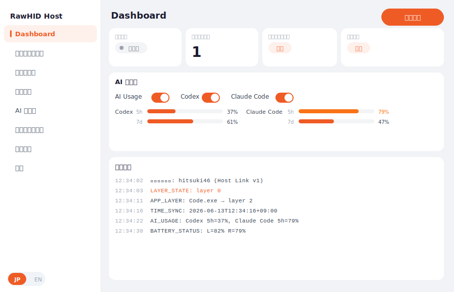
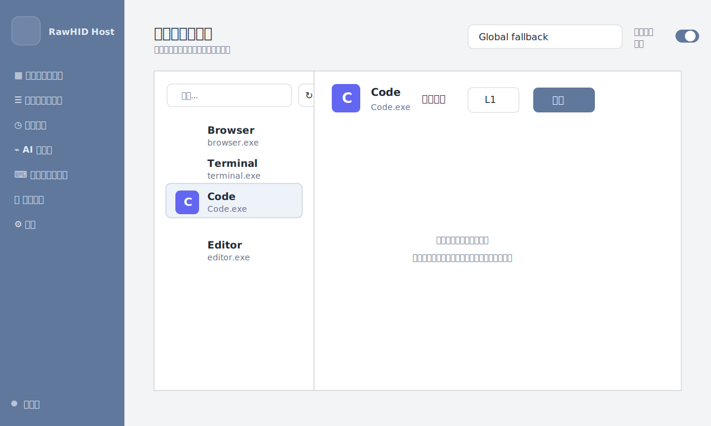
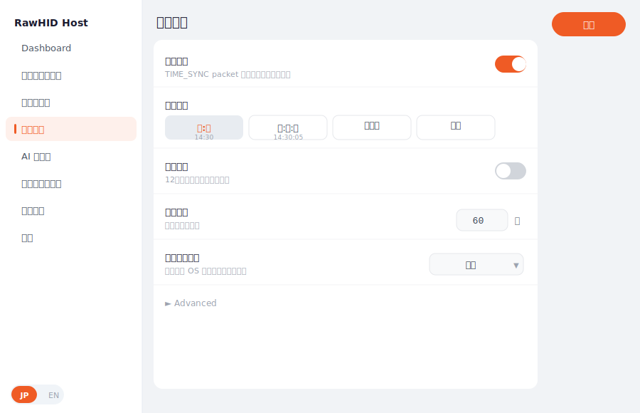
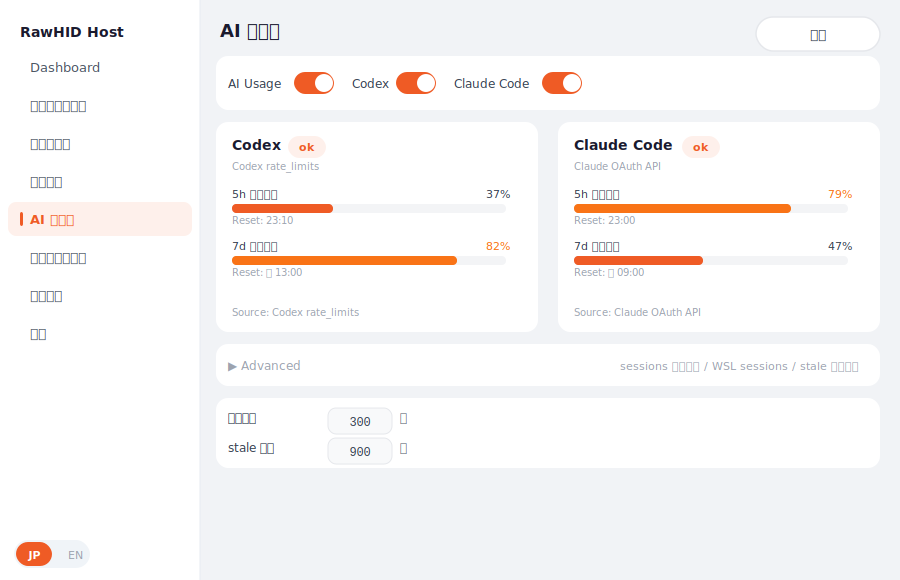
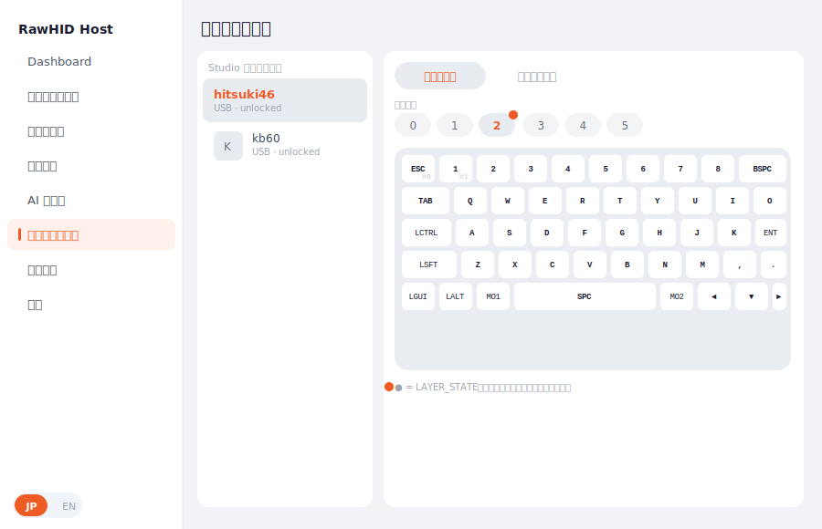
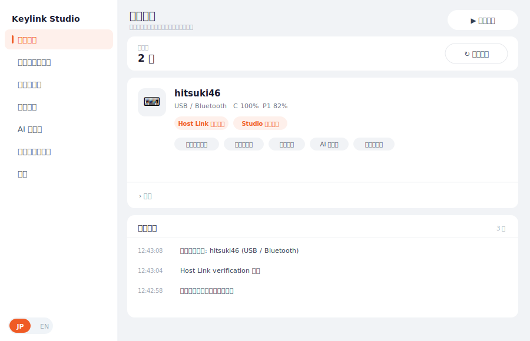
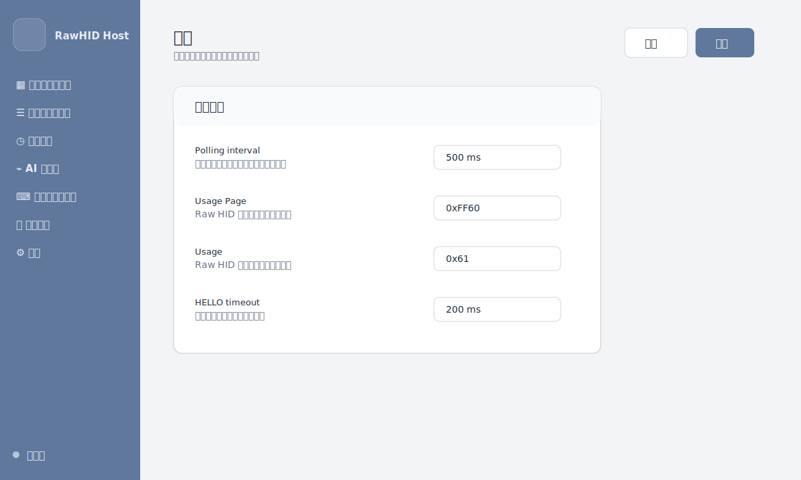

# RawHID Host アプリ操作マニュアル

## 共通操作

左側の Sidebar から画面を切り替えます。Sidebar 下部の `JP / EN` で日本語 / 英語表示を切り替えられます。

`保存` ボタンがある画面では、画面上で変更した内容を保存します。保存に失敗した場合だけエラーを表示します。Dashboard のトグルは即時保存で、成功時に短く保存済み表示を出します。

Layer Rules は自動保存です。ルールの追加、削除、変更を行った時点で保存されます。

## Dashboard

Dashboard は、アプリ全体の状態を確認し、監視を開始 / 停止する画面です。

`監視開始` を押すと、Raw HID 対応キーボードの監視を開始します。監視中は、前面アプリに応じたレイヤー切り替え、時刻同期、AI 使用量送信、キーボードからの uplink 受信が有効になります。

確認できる情報:

- 監視中 / 停止中
- 接続デバイス数
- レイヤールールの有効 / 無効
- 時刻同期の有効 / 無効
- AI Usage の有効 / 無効
- AI Usage の簡易サマリ
- 直近ログ

AI Usage 全体、Codex、Claude Code のトグルも Dashboard から切り替えられます。詳細な状態確認や細かい設定は、Sidebar の `AI 使用量` 画面で行います。

接続デバイス数は、Host Link の transport 数ではなく `device_uid_hash` 単位のキーボード数として表示します。同じキーボードが USB と BLE HOG の両方で見えている場合、Dashboard では 1 台にまとめ、デバイス名の左に USB / Bluetooth の両方のアイコンを表示します。`device_uid_hash` が取得できないデバイスは誤結合を避けるため個別に扱います。

## レイヤールール

レイヤールールでは、前面にあるアプリに応じてキーボード側のレイヤーを切り替えるルールを作成できます。

左側には現在起動中のアプリ一覧が表示されます。各アプリには、実行ファイルから取得したアプリアイコンが表示されます。アイコンを取得できないアプリは、アプリ名の頭文字で表示されます。

レイヤールールは**キーボードごと**に設定します。全キーボード共通のルールはありません。キーボードによってレイヤー構成が異なるためです。

基本操作:

1. 画面右上のデバイス選択で、ルールを編集するキーボードを選びます。
2. 対象アプリを選びます。
3. 切り替えたいレイヤーを選びます。
4. `追加` を押します。

一覧には、接続中のキーボードと、過去にルールを設定したキーボードが表示されます。未接続のキーボードには `(未接続)` が付きます。切断中でもルールの編集は可能です。

デバイス選択の隣のゴミ箱ボタンで、選択中キーボードの設定一式を削除できます。削除したキーボードはレイヤー切り替えの対象外に戻ります。

アプリがどのルールにも一致しなくなった場合は、未一致時の動作に従います。通常はキーボード側のアプリレイヤーを解除します。デバイス専用設定に未一致時の動作が指定されている場合は、既定値よりもデバイス側の指定が優先されます。

監視中は、前面アプリの切り替わりを即時に検知してレイヤーを切り替えます。ポーリング間隔を待つ必要はありません。

## アクション

アクション画面では、キーボードのキーから PC 側の操作を実行するバインディングを設定します。キーボード側で `&host_action <ID> <値>` を割り当てたキーを押すと、`HOST_ACTION` packet が PC に届き、対応する動作が実行されます。

この機能は HOST_ACTION capability を持つキーボードでのみ使えます。アクション実行はセキュリティのため**既定で無効**です。有効にするまでは、キーボードから `HOST_ACTION` が届いてもログに記録されるだけで実行されません。

設定できる動作:

- このアプリの画面を開く
- 監視を開始
- 監視を停止
- AI 使用量を更新
- アプリを起動
- フォルダを開く

`アプリを起動` は、指定したアプリがすでに起動していれば前面に表示し、起動していなければ起動します。`.lnk` ショートカットや関連付けでの起動にも対応します。起動済みかどうかは実行ファイル名で判定します。ランチャー経由で起動するアプリなど、起動に使うファイルとウィンドウを持つ実行ファイル名が違う場合は、詳細設定で前面化に使う exe 名を指定できます。

`フォルダを開く` は、指定したフォルダを Windows Explorer で開きます。すでにそのフォルダを開いている Explorer ウィンドウがあれば前面化します。`既存ウィンドウのタブで開く` はベストエフォートです。

アクションは**監視中のみ**実行されます。監視を停止している間に届いた `HOST_ACTION` は実行されません。

## 時刻同期

時刻同期では、PC の時刻情報をキーボードへ送信できます。キーボード側が `TIME_SYNC` 表示に対応している場合、キーボードの画面や表示部に時刻を出せます。

設定できる項目:

- 時刻同期の有効 / 無効
- 表示形式
- 12 時間 / 24 時間表示
- 同期間隔
- タイムゾーン

`TIME_SYNC` は毎秒送りません。初回、デバイス変化、表示に必要な値の変化、定期補正タイミングで送信します。キーボード側は受信時の uptime を使って表示秒を進める想定です。

## AI 使用量

AI 使用量では、Codex と Claude Code の 5h / 7d 使用率を取得し、対応キーボードへ送信できます。

設定できる項目:

- AI Usage 全体の有効 / 無効
- Codex の有効 / 無効
- Claude Code の有効 / 無効
- 取得間隔
- stale 判定秒数
- 手動更新
- Advanced での詳細設定

Codex は local session history を読みます。`sessions 自動検出` を有効にすると、明示パスに加えて Windows の既定パス、各 WSL ディストロの `~/.codex/sessions`、追加 sessions paths を読み込み、合算した使用量を表示します。

Claude Code は OAuth usage API を experimental / best-effort source として使います。認証情報は Windows 既定、WSL 既定、追加 credentials paths から検出できます。

access token、credentials JSON、API response、raw error は画面に表示しません。

## キーマップ表示・編集

キーマップ表示では、ZMK Studio 対応キーボードの現在のキーマップを確認できます。左側には Studio 対応デバイスだけが表示されます。デバイスを選択すると、そのキーボードのキーマップを自動で読み取ります。

通常表示でできること:

- Studio 対応デバイスの選択
- レイヤー一覧の確認
- レイヤーごとのキー割り当て確認
- physical layout に近いキー配置での表示
- physical layout が取れない場合のグリッド表示
- タイピング統計ヒートマップ
- キーテスター

Studio が locked の場合は、キーマップを読み取らず、キーボード側で unlock が必要であることを表示します。Host 側から unlock は実行しません。キーボード側で `&studio_unlock` を実行してから更新してください。

キー右下の `#0`、`#1` などは key position です。ZMK の keymap 上で、そのキーが何番目の position かを表します。

監視中、キーボード側でレイヤーを手動で切り替えると、対応するレイヤーボタンの右上にオレンジの点が付きます。隠れているレイヤーへ切り替わった場合は、レイヤータブが自動でスクロールします。

### 編集モード

`編集` を押すと編集モードに入ります。編集モードではキーをクリックして割り当てを変更できます。変更は ZMK Studio の未保存状態としてデバイスに反映されます。永続化するには `保存` を押してください。

編集は USB serial / CDC ACM と BLE Studio transport の両方に対応しています。BLE Studio は無線経路のため、USB と比べてキー変更後の反映待ちが長く感じられることがあります。

編集できる内容:

- 通常キー
- 透過
- 無効
- `MO` / `TG` / `TO`
- `MT` / `LT`
- Sticky Key / Sticky Layer
- Bluetooth
- Output
- Mouse Button / Move / Scroll
- Caps Word / Key Repeat / Grave Escape
- Reset / Bootloader / Studio Unlock
- レイヤー追加 / 名前変更 / 削除

編集中の操作:

- キーをクリックするとポップオーバーが開きます。
- キー、レイヤー、タップホールド、BT/OUT、その他のタブから割り当てを選びます。
- キー変更を選ぶと、画面上の表示は先に切り替わり、実機への書き込み応答を待ちます。
- 書き込み待ちがある間は下部バーに `書き込み中 N件` が表示されます。
- 書き込み待ちの間、保存 / 破棄 / 編集終了 / レイヤー追加 / 名前変更 / 削除は一時的に無効になります。別のキー選択は継続できます。
- 変更後は下部バーに未保存状態が表示されます。
- `保存` で firmware 側へ保存します。
- `変更を破棄` で未保存変更を破棄します。
- 未保存のまま編集終了や画面切り替えを行う場合は確認が出ます。

編集中は Studio RPC session を保持します。そのため、Studio device の再スキャンや別 Studio device の読み取りは `port_busy` で拒否されます。編集終了、保存、破棄、復旧用の再読み込み、またはアプリ再起動でセッションは閉じます。

BLE 編集中の注意:

- BLE Studio は USB serial より timeout や切断の影響を受けやすいため、書き込み待ち表示が見える時間が長くなることがあります。
- 複数キーを連続して変更しても、アプリは実機へ 1 件ずつ順番に書き込みます。途中で失敗した場合、未送信の変更は破棄されます。
- 保存前の変更は firmware の未保存状態です。`保存` を押す前に切断や電源 OFF が起きた場合、どこまで実機に反映されたか分からないことがあります。

キー書き込みに失敗した場合:

1. 下部バーに「キー変更に失敗しました。表示内容が実機とずれている可能性があります。」と表示されます。
2. `書き込み中 N件` が消えるまで待ちます。
3. キーボードを再接続、または電源を ON にします。
4. 下部バーの `再読み込み` を押します。
5. アプリは壊れた編集セッションを破棄し、実機からキーマップを読み直します。

`再読み込み` は復旧を優先する操作です。保存前の staged changes は保持しません。復旧後に表示された内容を確認し、必要な変更をやり直してください。キーボードが OFF のままでは読み取りは timeout しますが、アプリは操作不能状態にはならず、再接続後に再度 `再読み込み` または右上の `更新` を実行できます。

### ヒートマップ

`ヒートマップ` タブでは、キーごとの押下回数を物理レイアウト上に色分け表示します。KEY_STATS 対応キーボードのみ利用できます。

- 期間フィルタ: 今日 / 7 日間 / 全期間
- 総打鍵数、TOP 5 キー、左右バランスを表示
- 記録されるのはキー位置ごとの回数だけです。入力した文字やキー内容は記録しません。

ヒートマップの統計は Host Link の `device_uid_hash` 単位で保存されます。ZMK Studio 側の `get_device_info().serial_number` が同じ UID を 16 桁小文字 hex 文字列で返す firmware では、USB / BLE Studio のどちらで開いても同じ統計へ紐付けます。古い firmware では従来の serial number 照合を fallback として使います。

### キーテスター

`テスター` タブでは、KEY_PRESS uplink による押下 / 離しイベントをリアルタイム表示します。押しているキーをハイライトし、直近イベントを確認できます。累積カウントは保持しません。

同じキーの押下 packet が連続して届いた場合は、離しイベントが来るまで 1 回の押下として扱います。`リセット` は押下済みハイライト、テスト済み状態、直近イベント表示をまとめてクリアします。キーボードを切り替えた場合も、別デバイスのイベントが残らないように直近イベント表示をクリアします。

## デバイス

デバイス画面では、Host Link と ZMK Studio の対応状態を確認できます。

Host Link は、RawHID Host 独自の packet protocol に対応しているかを表します。`OK` のデバイスは、capability に応じて `APP_LAYER`、`TIME_SYNC`、`AI_USAGE`、uplink などの対象になります。Host Link デバイスの左側アイコンは接続種別を表し、USB 接続は USB アイコン、BLE HOG 接続は Bluetooth アイコンで表示されます。判定できない場合は汎用キーボードアイコンになります。

Devices 画面の Host Link 一覧は `device_uid_hash` 単位で集約します。同じキーボードが USB と BLE HOG の両方で見えている場合は 1 カードにまとめ、USB / Bluetooth の両方のアイコンと、それぞれの HID path を表示します。`device_uid_hash` が取得できないデバイスは誤結合を避けるため path 単位で個別に扱います。

ZMK Studio は、ZMK Studio RPC に対応しているかを表します。Keymap Viewer では、この Studio 対応デバイスを使ってキーマップを読み取り・編集します。

Host Link 対応デバイスと Studio 対応デバイスは、必ずしも同じとは限りません。同じキーボードが両方に対応する場合もあります。現在の ZMK Studio 一覧は Studio RPC transport の検出結果をそのまま表示します。USB Host Link が HID として見えていても、USB serial / CDC ACM の Studio endpoint が見えていない場合は Studio 側に 2 件表示されません。

BATTERY 対応キーボードを監視中は、デバイスカードに本体 / 左 / 右 / AUX のバッテリー残量が表示されます。左右分割キーボードでペリフェラル側の電源が入っていない、または firmware 側の battery cache がまだ未取得の場合は、source 名だけが表示され残量は `--%` になります。

## 設定

設定画面では、アプリ全体の基本設定を変更できます。

### 外観

- アクセント色を選べます。
- プリセット色に加えてカスタム色を追加できます。
- 外観設定はこの PC の UI にのみ保存され、`rawhid-host.toml` やキーボードには影響しません。

### アプリの起動

- `起動時に監視を開始`: アプリ起動時に自動で監視を開始します。
- `Windows ログイン時に起動`: Windows ログイン時に RawHID Host を自動起動します。HKCU Run レジストリキーを使うため管理者権限は不要です。

### 基本設定

Polling、HID Usage Page / Usage、HELLO timeout などを編集できます。HELLO timeout の既定値は 750ms です。設定画面の数値入力では 50ms 単位で調整できます。通常の操作では細かい設定ファイルの場所や中身を意識する必要はありません。トラブルシュートや詳細調整が必要な場合だけ、設定ファイルを直接確認します。

## システムトレイ

ウィンドウを閉じても、アプリは完全終了せずシステムトレイに残ります。

トレイメニュー:

- `Start monitoring` / `Stop monitoring`
- `Show window`
- `Quit`

トレイアイコンを左クリックすると、ウィンドウの表示 / 非表示を切り替えられます。BATTERY 対応キーボードを監視中は、トレイアイコンのツールチップにバッテリー残量が表示されます。
