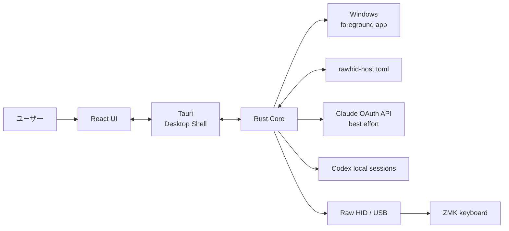
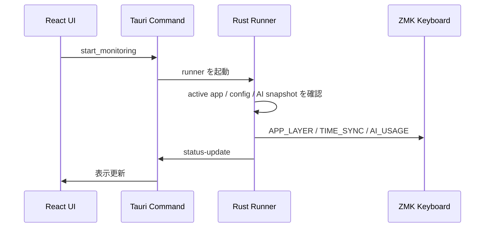
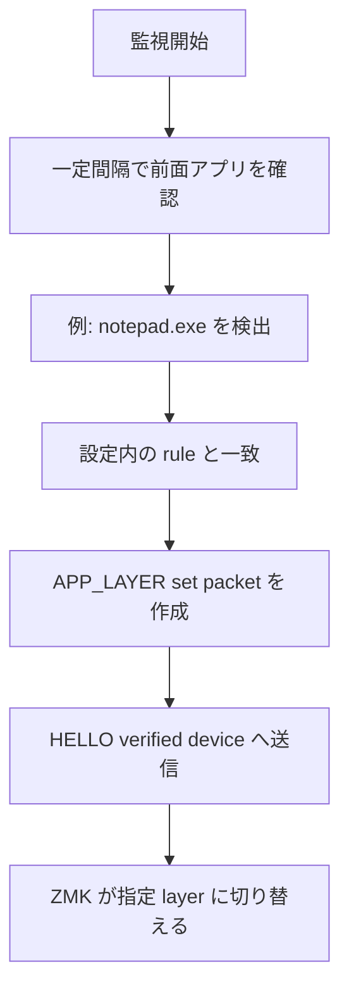

# RawHID Host の仕組みと技術スタック

このドキュメントは、Rust / React / Tauri などを知らない人でも、RawHID Host が何をしていて、どこに何があるかを掴めるようにした概要です。

## このアプリは何をするものか

RawHID Host は、Windows で常駐し、USB 接続された対応キーボードへ命令を送るアプリです。

主な使い方:

- 前面アプリに応じて ZMK キーボードの layer を切り替える
- どのルールにも一致しない場合、自動 layer 指定を解除する
- PC の現在時刻をキーボードの表示用に送る
- Codex / Claude Code の 5h / 7d 使用量 snapshot をキーボードへ送る

このリポジトリに含まれるのは PC 側のアプリです。命令を受け取って layer や表示に反映する ZMK 側ファームウェアは、別途同じ packet protocol に対応している必要があります。

## 全体像



画面で行った操作は Tauri を通じて Rust の処理に渡ります。Rust は設定を読み、Windows の状態を調べ、必要な packet をキーボードへ送ります。

## 技術スタック

| Technology | Role | Image |
| --- | --- | --- |
| Rust | Windows / USB / 設定 / 監視ロジック | エンジン |
| React | 画面、ボタン、状態表示 | 操作パネル |
| TypeScript | UI の型付きコード | 画面側の設計図 |
| Tauri | React と Rust を一つの Windows アプリにまとめる | 外箱と連絡役 |
| Vite | React の開発起動と production build | UI のビルド道具 |
| Tailwind CSS | 画面の余白、色、ボタン、カード | 見た目の部品集 |
| TOML | 設定ファイル形式 | 人が読める設定メモ |
| Raw HID | PC からキーボードへ独自 packet を送る USB 経路 | 専用通信路 |
| ZMK | キーボード側ファームウェア | 受信して実際に動く側 |

## Rust: 実際の処理を担当する部分

Rust は、画面の裏側で実際に仕事をする部分です。

- Windows に問い合わせて、現在前面にあるアプリを確認する
- USB の HID device を探す
- 対応キーボードかどうかを `HOST_HELLO` / `DEVICE_HELLO` で確認する
- layer、time sync、AI usage の packet を作る
- 設定ファイルを読み書きする
- 監視処理を一定間隔で繰り返す

Rust コードは `crates/` 配下にあります。

```text
crates/
├─ rawhid-host-core/     # UI に依存しない中核処理
├─ rawhid-host-cli/      # コマンドライン入口
└─ rawhid-host-tauri/    # GUI アプリとして動かすための Rust 側
```

### `rawhid-host-core`

アプリの中心です。

| File | Role |
| --- | --- |
| `src/config.rs` | TOML 設定の読み込み、default、設定例 |
| `src/active_app.rs` | 前面アプリの実行ファイル名や title の取得 |
| `src/app_match.rs` | アプリと layer rule の照合 |
| `src/packet.rs` | キーボードへ送る packet の encode / decode |
| `src/hid.rs` | USB device 探索、HELLO 検証、packet 送信 |
| `src/time.rs` | `TIME_SYNC` packet と送信タイミング |
| `src/ai_usage.rs` | Codex / Claude Code 使用量 snapshot の取得 |
| `src/runner.rs` | 監視処理をまとめて実行 |

core は GUI に依存しないため、CLI からも同じ仕組みを使えます。

### `rawhid-host-cli`

GUI なしで確認するための入口です。

```powershell
cargo run -p rawhid-host-cli -- list-devices
cargo run -p rawhid-host-cli -- run
```

`list-devices` は接続候補と `DEVICE_HELLO` 応答を確認し、`run` は GUI なしで監視を開始します。

## React / TypeScript: ユーザーが操作する画面

React はアプリの画面を作るために使っています。TypeScript は、UI が扱う設定や状態の形を分かりやすくするための言語です。

画面は `ui/src/pages/` に分かれています。

| Page | What it does |
| --- | --- |
| `Dashboard.tsx` | 監視開始 / 停止、状態、ログ、AI Usage 簡易サマリ |
| `Rules.tsx` | アプリごとの layer rule 設定 |
| `TimeSync.tsx` | 時刻同期設定 |
| `AiUsage.tsx` | Codex / Claude Code 使用量設定と状態表示 |
| `Devices.tsx` | Raw HID device scan と HELLO 結果 |
| `Settings.tsx` | polling / HID 基本設定 |

`ui/src/i18n.tsx` に日本語 / 英語の表示文言があります。新しい UI 文言を追加する場合は、ここに両言語分を追加します。

## Tauri: UI と Rust をつなぐ部分

React だけでは、Windows の前面アプリ取得や USB device 制御は扱いにくいです。Tauri は React の画面をデスクトップアプリとして表示し、Rust の処理を UI から呼び出せるようにします。



UI から Rust への呼び出しは `ui/src/api.ts`、Rust 側の command は `crates/rawhid-host-tauri/src/commands.rs` にあります。

## TOML: 設定を保存する形式

設定は `rawhid-host.toml` に保存されます。UI から保存しても、最終的にはこの TOML 形式に書き込まれます。

```toml
[polling]
interval_ms = 500

[layer_switch]
enabled = true

[[layer_switch.rules]]
name = "Notepad"
exe = "notepad.exe"
layer = 1

[time]
enabled = false
format_hint = "time_hm"

[ai_usage]
enabled = false
```

TOML は人が直接編集しやすいため、UI にまだ細かい項目がない場合でも設定できます。

## Raw HID と packet

HID はキーボードやマウスで使われる USB の仕組みです。Raw HID を使うと、PC からキーボードへ独自の 32 byte payload を送れます。

このアプリでは `HL` protocol と呼ぶ packet を使います。

| Packet | Meaning |
| --- | --- |
| `HOST_HELLO` | host が対応キーボードか確認する |
| `DEVICE_HELLO` | keyboard が同じ `seq` で応答する |
| `APP_LAYER set` | 指定した layer を選ぶ |
| `APP_LAYER clear` | 自動 layer 指定を解除する |
| `TIME_SYNC` | 日時情報を送る |
| `AI_USAGE` | Codex / Claude Code 使用量 snapshot を送る |

byte layout は [Packet Specification](packet-spec.md) にあります。

## Layer が切り替わる流れ



どの rule にも一致しなくなった場合は `APP_LAYER clear` を送り、自動的に指定した layer を解除します。前面アプリが変わらず同じ layer でよい場合は、同じ命令を毎回送り続けないように抑制します。

## Time Sync の流れ

Time Sync を有効にすると、PC からキーボードへ次の情報を送ります。

- Unix time
- timezone offset
- weekday
- display format hint
- 12h / 24h mode

毎秒送るのではなく、初回、device 変化、表示に必要な値の変化、定期補正タイミングで送ります。キーボード側は受信時の uptime を使って表示秒を進めます。

## AI Usage の流れ

AI Usage は background worker が取得します。`Runner::tick()` は重い取得処理をせず、最新 snapshot に変化があれば packet を送るだけです。UI の `更新` ボタンは取得完了を待たず、worker に更新要求を投げます。AI 使用量の状態が変わると `status-update` 経由で画面が更新されます。

### Codex

Codex は local session history を読みます。

- `rate_limits` があれば quota source として使う
- `rate_limits` がなければ、設定により local history fallback を使う
- fallback は activity estimate であり、実 quota ではない
- fallback の割合表示に使う `activity_*_token_baseline` は仮分母であり、実 quota limit ではない

### Claude Code

Claude Code は OAuth usage API を experimental / best-effort source として使います。

- `.credentials.json` が存在しない環境があります
- schema 変更、認証失敗、token 期限切れがあり得ます
- refresh token 更新は v1 では行いません
- access token、credentials JSON、API response、raw parse error は UI / log / packet に出しません

## 初めて読むときのおすすめ順

1. `README.md`: アプリの目的と起動方法
2. `docs/manual-app-usage.md`: GUI で何ができるか
3. `examples/rawhid-host.toml`: 設定の具体例
4. `docs/packet-spec.md`: ZMK 側実装に必要な byte layout
5. `ui/src/pages/`: 画面実装
6. `crates/rawhid-host-tauri/src/commands.rs`: UI と Rust の接続
7. `crates/rawhid-host-core/src/runner.rs`: 監視処理の中心
8. `crates/rawhid-host-core/src/ai_usage.rs`: AI Usage provider / worker

## English Summary

RawHID Host is a resident Windows app. React and TypeScript build the UI, Tauri connects that UI to Rust, and Rust handles Windows integration, TOML configuration, Raw HID, packet encoding, monitoring, time sync, and AI usage snapshots.

The ZMK firmware side is not included in this repository. It must implement the compatible Raw HID receiver described in [Packet Specification](packet-spec.md).

## Current implementation notes

- `ui/src/components/Ui.tsx` contains shared UI primitives such as page headers, primary/secondary buttons, setting rows, section cards, and error notices.
- Settings pages show errors only on save failure. Save success does not show a success message.
- Dashboard quick toggles save immediately and roll back UI state if saving fails.
- AI Usage has an app-level worker owned outside the monitoring loop, so the UI can refresh usage even when monitoring is stopped.
- ZMK Studio support lives in `crates/rawhid-host-core/src/studio.rs`. It is separate from Host Link HID packet handling.
- Keymap Viewer caches keymap snapshots by Studio device id and renders the selected physical layout when available, with grid fallback otherwise.
