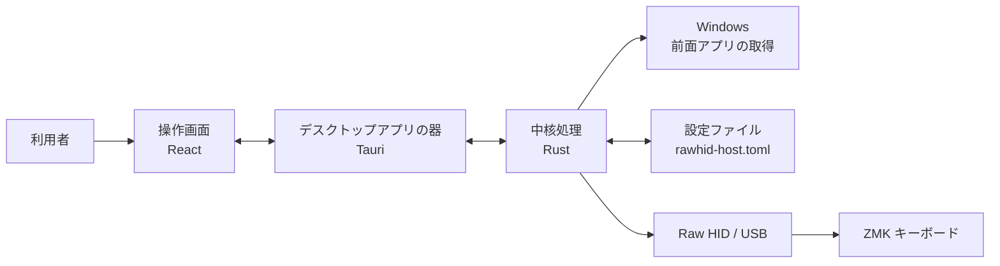
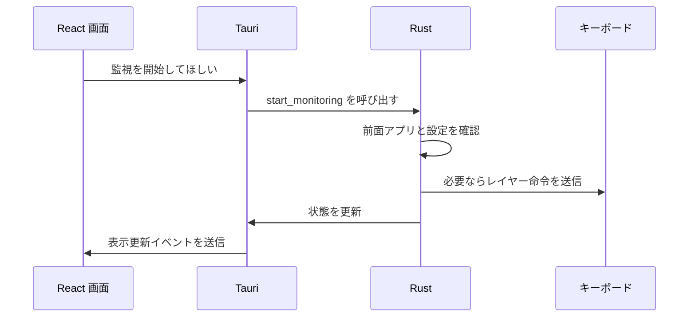
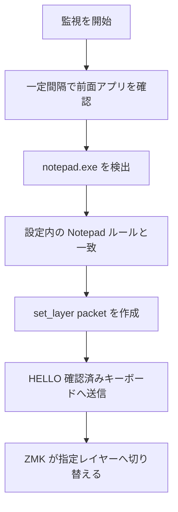

# RawHID Host の仕組みと技術スタック / Technology Overview

## 日本語

### このアプリは何をするものか

RawHID Host は、Windows で現在使っているアプリを確認し、USB 接続された対応キーボードへ命令を送る常駐アプリです。

例えば次のような使い方ができます。

- メモ帳を前面に出したら、キーボードを指定レイヤーへ切り替える
- アプリに対応するルールがなければ、自動レイヤー指定を解除する
- PC の現在時刻を、ディスプレイ付きキーボードへ送る

このリポジトリに含まれるのは PC 側のアプリです。命令を受け取ってレイヤーや表示を変更するキーボード側の ZMK ファームウェアは、別途対応実装が必要です。

### 全体の見取り図



画面で行った操作は Tauri を通じて Rust の処理に渡ります。Rust は設定を読み、Windows の状態を調べ、必要な命令をキーボードへ送ります。

### 使われている技術

| 技術 | このアプリでの役割 | イメージ |
| --- | --- | --- |
| Rust | Windows や USB との通信、設定処理、監視ループ | エンジン |
| React | ボタン、設定画面、状態表示 | 操作パネル |
| TypeScript | React 画面のプログラムを書く言語 | 間違いを見つけやすい画面用設計図 |
| Tauri | React と Rust を Windows アプリとしてまとめる | 外箱と連絡係 |
| Vite | React の開発起動と製品用ビルド | UI の組み立て道具 |
| Tailwind CSS | 画面の色、余白、レイアウト | 見た目の部品集 |
| TOML | 設定ファイルの形式 | 人が読める設定メモ |
| Raw HID | USB 経由で独自の命令を送る通信方式 | PC とキーボードの専用伝送路 |
| ZMK | キーボード側で動くファームウェア | キーボード内部の制御ソフト |

### Rust: 実際の処理を担当する部分

Rust は、画面の裏で実際に仕事をする部分に使われています。

- Windows に問い合わせて、現在前面にあるアプリを確認する
- USB の HID デバイスを探す
- 対応キーボードかどうかを HELLO 通信で確認する
- キーボードへレイヤー変更や時刻同期の命令を送る
- 設定ファイルを読み書きする
- 一定間隔で監視処理を繰り返す

Rust のコードは `crates/` 配下で三つに分かれています。

```text
crates/
├── rawhid-host-core/     # 画面に依存しない中核処理
├── rawhid-host-cli/      # PowerShell などから使う文字ベースの入口
└── rawhid-host-tauri/    # GUI アプリとして動かすための Rust 側
```

#### `rawhid-host-core`

アプリの頭脳にあたります。

| ファイル | 担当 |
| --- | --- |
| `src/config.rs` | TOML 設定の読込、既定値、設定例 |
| `src/active_app.rs` | 前面アプリの実行ファイル名やタイトルの取得 |
| `src/app_match.rs` | アプリとレイヤールールの照合 |
| `src/packet.rs` | キーボードへ送る命令形式の作成と検証 |
| `src/hid.rs` | USB デバイス探索、HELLO 確認、送信 |
| `src/time.rs` | 時刻同期 packet の作成と送信時期の判断 |
| `src/runner.rs` | 上記を一回の監視処理として実行 |

中核処理を GUI から分離しているため、画面を使わない CLI からも同じ仕組みを利用できます。

#### `rawhid-host-cli`

CLI は Command Line Interface の略で、画面ではなくコマンドで操作する入口です。

```powershell
cargo run -p rawhid-host-cli -- list-devices
cargo run -p rawhid-host-cli -- run
```

`list-devices` は接続候補と HELLO 応答を確認し、`run` は GUI なしで監視処理を開始します。開発時の確認やトラブル調査に便利です。

### React と TypeScript: 人が操作する画面

React はアプリの画面を構成するために使われています。画面上の状態が変わると、表示もその状態に合わせて更新されます。

| 画面 | できること |
| --- | --- |
| Dashboard | 監視開始と停止、接続状態、ログの確認 |
| Layer Rules | アプリごとのレイヤールール設定 |
| Time Sync | 時刻同期の有効化と表示形式の設定 |
| Devices | Raw HID デバイスと HELLO 結果の確認 |
| Settings | ポーリング間隔と HID 設定の編集 |

React のコードは `ui/src/` にあります。`ui/src/App.tsx` が画面全体の入口で、`ui/src/pages/` に各画面が分かれています。

TypeScript は React のコードを書く言語です。「接続台数は数字」「エラーは文字列または空」のように、扱うデータの形を明確にできます。このアプリでは `ui/src/types.ts` が、画面と Rust 側が共有する設定や状態の形を定義しています。

### Tauri: 画面と中核処理をつなぐ部分

React は見た目のよい画面を作るのが得意ですが、React の画面だけで Windows の前面アプリを調べたり、USB 機器を制御したりする構成には向いていません。

Tauri は、React の画面をデスクトップアプリとして表示し、Rust の機能を画面から呼び出せるようにします。



UI から Rust への呼び出しは `ui/src/api.ts`、受け取る Rust 側の処理は `crates/rawhid-host-tauri/src/commands.rs` にあります。

また、GUI のウィンドウを閉じてもアプリは完全終了せず、システムトレイに残ります。設定画面を閉じた後も監視を続ける、常駐アプリとしての動作です。

### なぜ React、Tauri、Rust を組み合わせるのか

それぞれ得意な役割が異なるからです。

| やりたいこと | 担当技術 |
| --- | --- |
| 分かりやすい設定画面を作る | React / TypeScript |
| Windows や USB 機器と安全に通信する | Rust |
| UI と Rust を一つのデスクトップアプリにする | Tauri |

つまり、このアプリは「Web 技術で作った操作しやすい画面」と「Rust で作った機器制御エンジン」を Tauri で一つにまとめたものです。

### Vite と Tailwind CSS: UI を作りやすくする道具

Vite は React の開発とビルドを支えるツールです。

- 開発中は画面の修正をすばやく確認する
- 配布用には React のファイルを `ui/dist/` にまとめる

Tailwind CSS は、色、余白、ボタン、カード、文字サイズなどの見た目を作るために使われています。これらは画面を作るための道具であり、キーボード通信そのものは担当しません。

### TOML: 設定を保存する形式

設定は `rawhid-host.toml` に保存されます。TOML は、人が読んだり直接編集したりしやすい設定形式です。

```toml
[polling]
interval_ms = 500

[layer_switch]
enabled = true

[[layer_switch.rules]]
name = "Notepad"
exe = "notepad.exe"
layer = 1

[time]
enabled = true
format_hint = "weekday_hm"
```

この例は、0.5 秒ごとに前面アプリを確認し、メモ帳が前面にあればレイヤー 1 を指定し、時刻同期も有効にする設定です。GUI で設定を保存した場合も、この形式で設定ファイルに書き込まれます。

### Raw HID: PC からキーボードへ命令を送る方法

HID は Human Interface Device の略で、キーボードやマウスなどの USB 機器に使われる仕組みです。

通常のキーボード利用では、キー入力がキーボードから PC へ送られます。

```text
キーボード -> PC: A キーが押された
```

Raw HID を使うこのアプリでは、PC からキーボードへ独自の命令も送ります。

```text
PC -> キーボード: レイヤー 2 に切り替える
PC -> キーボード: 現在時刻を表示に使う
```

このアプリでは `HL` という packet protocol を使い、次の命令を扱います。

| 命令 | 意味 |
| --- | --- |
| `hello` | 対応キーボードか確認する |
| `hello_response` | 対応しているとキーボードが応答する |
| `set_layer` | 指定したレイヤーを選ぶ |
| `clear` | 自動レイヤー指定を解除する |
| `time_sync` | 日時情報をキーボードへ送る |

詳細な byte 配置は [Packet 仕様](packet-spec.md) に記載されています。

### ZMK: キーボード側で命令を実行する部分

ZMK は、カスタムキーボード内部で動作するファームウェアです。

```text
PC 側:          RawHID Host が命令を送る
キーボード側:  ZMK が命令を受け取り、レイヤーや表示へ反映する
```

PC 側のアプリだけではレイヤー変更や時刻表示は成立しません。キーボード側にも、同じ packet protocol を受け取って処理する実装が必要です。

### レイヤーが切り替わるまで

例えばメモ帳を前面にした場合、処理は次の順で進みます。



どのルールにも一致しなくなった場合は `clear` を送り、自動的に指定したレイヤーを解除します。前面アプリが変わらず同じレイヤーでよい場合は、同じ命令を毎回送り続けないように抑制します。

### 時刻同期の仕組み

時刻同期を有効にすると、PC からキーボードへ次の情報を送れます。

- 現在の Unix 時刻
- タイムゾーンのオフセット
- 曜日
- 表示形式のヒント
- 12 時間表示または 24 時間表示

時刻情報は毎秒送信されません。主に次のタイミングで送ります。

- 監視開始後の最初の同期
- キーボードの接続状態が変わったとき
- 表示に必要な分や日付が変化したとき
- 定期的な補正時刻になったとき

キーボード側は、受け取った時刻と内部の経過時間を使って表示を進める設計です。通信量を抑えながら表示を維持できます。

### 理解するときに読む順番

初めてソースを見る場合は、次の順で読むと全体を掴みやすくなります。

1. `README.md`: アプリの目的と起動方法
2. `docs/manual-app-usage.md`: GUI で何ができるか
3. `examples/rawhid-host.toml`: 設定の具体例
4. `ui/src/pages/`: 表示される画面
5. `crates/rawhid-host-tauri/src/commands.rs`: 画面操作と Rust の接続
6. `crates/rawhid-host-core/src/runner.rs`: 監視処理の中心
7. `docs/packet-spec.md`: キーボードと交わす命令形式

### まとめ

RawHID Host は次の三層で構成されています。

```text
React:
利用者が操作する画面

Tauri:
画面を Windows アプリとして動かし、Rust とつなぐ部分

Rust:
前面アプリ確認、設定管理、Raw HID 通信、レイヤー切替、時刻同期を行う本体
```

そして、USB の向こう側では ZMK ファームウェアが命令を受け取り、実際のキーボード動作へ反映します。

---

## English

### What This App Does

RawHID Host is a resident Windows application that observes the foreground application and sends commands to a compatible USB keyboard. It can select a keyboard layer for a specific desktop application and send time information for a keyboard display.

This repository contains the host application only. The keyboard-side ZMK firmware must separately implement the compatible Raw HID packet receiver.

### Technology Stack At A Glance

| Technology | Role in this app |
| --- | --- |
| Rust | Windows integration, USB Raw HID communication, configuration, monitoring logic |
| React | User-facing screens and controls |
| TypeScript | Typed UI code and data models |
| Tauri | Desktop application shell connecting React to Rust |
| Vite | UI development server and production build tool |
| Tailwind CSS | UI styling |
| TOML | Human-readable configuration file format |
| Raw HID | USB transport for custom host-to-keyboard commands |
| ZMK | Keyboard-side firmware that performs received actions |

### How The Parts Work Together

The React UI lets the user start monitoring, configure layer rules, scan devices, and edit time sync settings. Through Tauri commands, those requests reach the Rust implementation. Rust reads configuration, inspects the active Windows application, verifies compatible Raw HID devices using HELLO, and sends layer or time synchronization packets when necessary.

The core implementation is separated from the UI:

```text
crates/
├── rawhid-host-core/     # reusable configuration, device, packet, and monitoring logic
├── rawhid-host-cli/      # command-line entry point
└── rawhid-host-tauri/    # desktop app integration and monitor thread
ui/                       # React + TypeScript screens
```

### Layer Switching

While monitoring is running, the app periodically reads the current foreground application. It compares the application to configured rules and sends `set_layer` when a rule matches, or `clear` when no rule matches. It avoids sending the same unchanged layer command repeatedly.

### Time Synchronization

When enabled, time sync sends current time information to the keyboard on initial synchronization, verified-device changes, display-relevant changes, and periodic correction. It does not send a new packet every second; the keyboard firmware advances displayed time locally.

### Raw HID And ZMK

Raw HID is the USB channel used for custom commands such as:

- `hello` / `hello_response` to verify compatible devices
- `set_layer` to select a keyboard layer
- `clear` to release an automatically selected layer
- `time_sync` to send time data for display use

The corresponding ZMK firmware on the keyboard receives these packets and applies the actual keyboard behavior. For packet field details, see [Packet Specification](packet-spec.md).

### Recommended Reading Order

1. `README.md`
2. `docs/manual-app-usage.md`
3. `examples/rawhid-host.toml`
4. `ui/src/pages/`
5. `crates/rawhid-host-tauri/src/commands.rs`
6. `crates/rawhid-host-core/src/runner.rs`
7. `docs/packet-spec.md`
