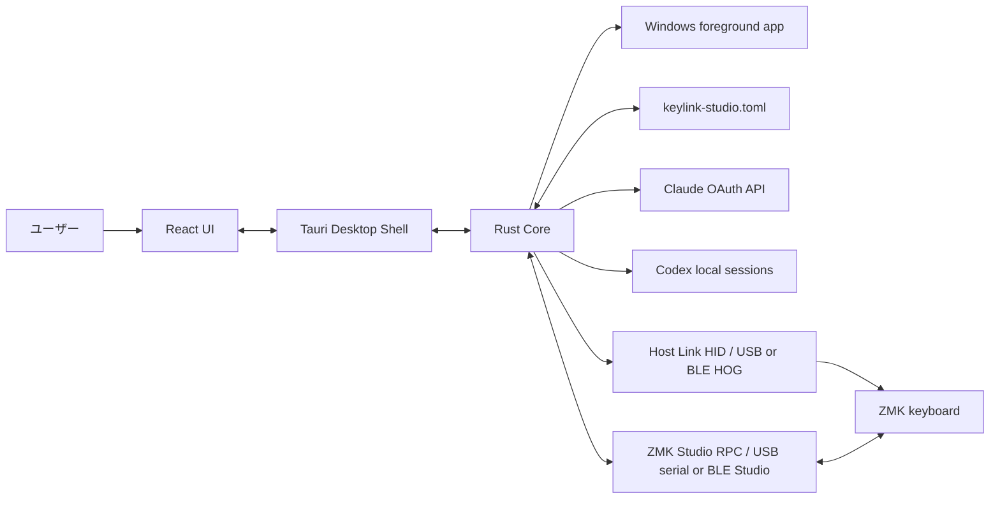
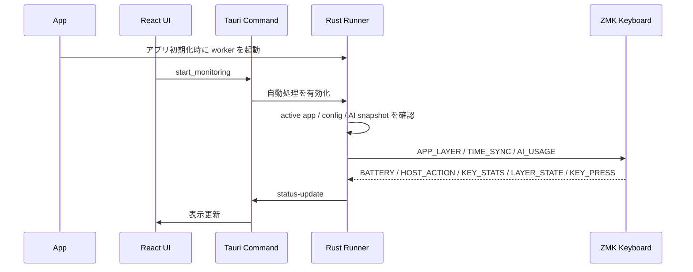
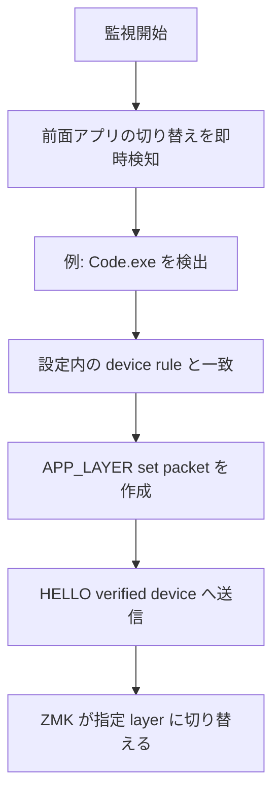
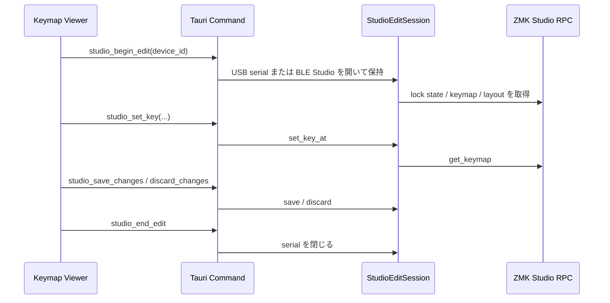

# Keylink Studio の仕組みと技術スタック

このドキュメントは、Rust / React / Tauri などを知らない人でも、Keylink Studio が何をしていて、どこに何があるかを掴めるようにした概要です。

## このアプリは何をするものか

Keylink Studio は、Windows で常駐し、USB または BLE HOG で HID device として見える対応キーボードと通信するアプリです。

主な用途:

- 前面アプリに応じて ZMK キーボードの layer を切り替える
- どのルールにも一致しない場合、自動 layer 指定を解除する
- PC の現在時刻をキーボードの表示用に送る
- Codex / Claude Code の 5h / 7d 使用量 snapshot をキーボードへ送る
- キーボードから PC 側アクションを実行する
- キーボードから届くキー統計・レイヤー状態・キー押下イベントを UI に表示する
- ZMK Studio RPC でキーマップを表示・編集する
- Host Link Config RPC でエンコーダの CW / CCW override を編集する
- Host Link Config RPC でCombo tableを表示・編集・保存する

このリポジトリに含まれるのは PC 側のアプリです。Host Link の命令を受け取って layer や表示に反映する ZMK 側 firmware は、別途同じ packet protocol に対応している必要があります。Host Link は USB HID と BLE HOG のどちらでも同じ packet を使います。ZMK Studio キーマップ機能は Host Link とは別経路で、ZMK Studio 対応 firmware を使います。

## 全体像



画面で行った操作は Tauri を通じて Rust の処理に渡ります。Rust は設定を読み、Windows の状態を調べ、必要な packet をキーボードへ送ります。ZMK Studio キーマップ機能では、Raw HID ではなく Studio RPC client を使います。USB serial / CDC ACM と BLE Studio のどちらでも表示と編集に対応します。

## 技術スタック

| Technology | Role |
| --- | --- |
| Rust | Windows / USB / 設定 / 監視ロジック |
| React | 画面、ボタン、状態表示 |
| TypeScript | UI 側の型付きコード |
| Tauri | React と Rust を 1 つの Windows アプリにまとめる |
| Vite | React の開発起動と production build |
| Tailwind CSS | UI の配置、色、ボタン、カード |
| TOML | 設定ファイル形式 |
| Host Link HID | PC とキーボードの間で独自 packet を送受信する HID 経路。USB HID または BLE HOG を使う |
| ZMK Studio RPC | キーマップ表示・編集用の Studio 経路 |
| Host Link Config RPC | エンコーダ overrideとCombo tableの取得、編集、保存、破棄、初期値復元用の Host Link 経路 |
| ZMK | キーボード側 firmware |

## Rust: 実際の処理を担当する部分

Rust は、画面の裏側で実際に仕事をする部分です。

- Windows に問い合わせて、現在前面にあるアプリを確認する
- HID device を探し、USB / Bluetooth の接続種別を判定する
- 対応キーボードかどうかを `HOST_HELLO` / `DEVICE_HELLO` で確認する
- layer、time sync、AI usage の packet を作る
- キーボードからの uplink packet を受け取る
- ZMK Studio RPC でキーマップを読み書きする
- 設定ファイルを読み書きする
- 監視処理を一定間隔で繰り返す

Rust コードは `crates/` 配下にあります。

```text
crates/
├─ rawhid-host-core/     # UI に依存しない中核処理
├─ rawhid-host-cli/      # コマンドライン入口
└─ rawhid-host-tauri/    # GUI アプリとして動かすための Rust 側
```

### `rawhid-host-core`

アプリの中心です。

| File | Role |
| --- | --- |
| `src/config.rs` | TOML 設定の読み込み、default、設定例 |
| `src/active_app.rs` | 前面アプリの実行ファイル名や title の取得 |
| `src/app_match.rs` | アプリと layer rule の照合 |
| `src/packet.rs` | キーボードへ送る packet と uplink packet の encode / decode |
| `src/hid.rs` | Host Link HID device 探索、USB / Bluetooth 接続種別判定、HELLO 検証、packet 送受信 |
| `src/time.rs` | `TIME_SYNC` packet と送信タイミング |
| `src/ai_usage.rs` | Codex / Claude Code 使用量 snapshot の取得 |
| `src/runner.rs` | 監視処理をまとめて実行 |
| `src/studio.rs` | ZMK Studio device 探索、キーマップ表示・編集、キー catalog |
| `src/stats.rs` | キー統計のローカル保存と集計 |

core は GUI に依存しないため、CLI からも同じ仕組みを使えます。

### `rawhid-host-tauri`

GUI アプリとして動かすための Rust 側です。Windows 固有の処理もここにあります。

| File | Role |
| --- | --- |
| `src/commands.rs` | UI から呼ばれる Tauri command と監視 thread |
| `src/foreground.rs` | 前面アプリ切り替えの即時検知 |
| `src/icon.rs` | 実行ファイルからのアプリアイコン抽出 |
| `src/startup.rs` | Windows ログイン時起動のレジストリ管理 |
| `src/explorer.rs` | フォルダを開く / Explorer 前面化 |
| `src/app_launch.rs` | アプリ起動 / 既存ウィンドウ前面化 |
| `src/state.rs` | アプリ全体の共有状態 |
| `src/lib.rs` | アプリ起動、システムトレイ、シングルインスタンス |

### `rawhid-host-cli`

GUI なしで確認するための入口です。

```powershell
cargo run -p rawhid-host-cli -- list-devices
cargo run -p rawhid-host-cli -- run
```

`list-devices` は接続候補と `DEVICE_HELLO` 応答を確認し、`run` は GUI なしで監視を開始します。

## React / TypeScript: ユーザーが操作する画面

画面は `ui/src/pages/` に分かれています。

| Page | What it does |
| --- | --- |
| `Devices.tsx` | 監視開始 / 停止、Raw HID / ZMK Studio device scan、接続状態、ログ。Host Link は `device_uid_hash` 単位で USB / BLE endpoint を集約表示 |
| `Rules.tsx` | アプリごとの layer rule 設定 |
| `Actions.tsx` | `HOST_ACTION` バインディング設定 |
| `TimeSync.tsx` | 時刻同期設定 |
| `AiUsage.tsx` | Codex / Claude Code 使用量設定と状態表示 |
| `KeymapViewer.tsx` | ZMK Studio キーマップ、エンコーダ、Combo編集、ヒートマップ、テスター |
| `Settings.tsx` | 外観、起動、polling、HID 基本設定 |

`ui/src/i18n.tsx` に日本語 / 英語の表示文言があります。新しい UI 文言を追加する場合は、両言語へ追加します。

共通 UI や helper:

- `ui/src/components/Ui.tsx`: ボタン、カード、通知など
- `ui/src/components/KeymapCanvas.tsx`: ZMK Studio physical layout のキー描画
- `ui/src/lib/format.ts`: 表示フォーマット関数
- `ui/src/hooks/useConfigSection.ts`: 設定ページ共通の draft / 保存 hook
- `ui/src/api.ts`: Tauri command wrapper
- `ui/src/types.ts`: UI 側の型定義

## Tauri: UI と Rust をつなぐ部分

React だけでは、Windows の前面アプリ取得や HID device 制御は扱いにくいです。Tauri は React の画面をデスクトップアプリとして表示し、Rust の処理を UI から呼び出せるようにします。



UI から Rust への呼び出しは `ui/src/api.ts`、Rust 側の command は `crates/rawhid-host-tauri/src/commands.rs` にあります。

## TOML: 設定を保存する形式

設定は `keylink-studio.toml` に保存されます。UI から保存しても、最終的にはこの TOML 形式に書き込まれます。

```toml
[polling]
interval_ms = 500
uplink_interval_ms = 20

[hid]
usage_page = 65376
usage = 97
rescan_interval_sec = 5

[studio]
probe_timeout_ms = 1000
keymap_read_timeout_ms = 8000

[layer_switch]
enabled = true
unmatched_action = "clear_managed"

[time]
enabled = false
format_hint = "time_hm"

[stats]
enabled = true
flush_interval_sec = 60

[actions]
enabled = false

[ai_usage]
enabled = false
```

TOML は人が直接編集しやすい形式です。UI にまだ細かい項目がない場合でも設定できます。

## Host Link HID と packet

Host Link HID は PC とキーボードの間で独自の 64 byte Host Link packet を送受信する HID 経路です。USB HID でも BLE HOG でも、アプリ上は同じ Host Link v2 / `HL` protocol として扱います。

| Packet | Meaning |
| --- | --- |
| `HOST_HELLO` | host が対応キーボードか確認する |
| `DEVICE_HELLO` | keyboard が同じ `seq` で応答する |
| `APP_LAYER set` | 指定した layer を選ぶ |
| `APP_LAYER clear` | 自動 layer 指定を解除する |
| `TIME_SYNC` | 日時情報を送る |
| `AI_USAGE` | Codex / Claude Code 使用量 snapshot を送る |
| `BATTERY_STATUS` | キーボードからバッテリー状態を送る |
| `HOST_ACTION` | キーボードから PC 側アクションを要求する |
| `KEY_STATS` | キー位置ごとの押下回数差分を送る |
| `LAYER_STATE` | アクティブレイヤーを送る |
| `KEY_PRESS` | 押下 / 離しイベントを送る |

byte layout は [Packet Specification](packet-spec.md) にあります。

Host Link の UID は `DEVICE_HELLO` の `device_uid_hash` から `uid:<16桁hex>` として扱います。ZMK Studio `get_device_info().serial_number` が同じ UID を 16 桁小文字 hex 文字列で返す firmware では、Keymap Viewer のヒートマップやキーテスターも USB / BLE Studio のどちらから開いても同じ Host Link デバイスへ紐付けます。

## Layer が切り替わる流れ



どの rule にも一致しなくなった場合は `APP_LAYER clear` を送り、自動的に指定した layer を解除します。前面アプリが変わらず同じ layer でよい場合は、同じ命令を毎回送り続けないように抑制します。

## ZMK Studio キーマップ編集の流れ



エンコーダ編集はこの Studio RPC の流れに Host Link Config RPC を追加する形です。Studio の `serial_number` と Host Link の `device_uid_hash` が同じ UID のときだけ組み合わせます。キー変更とエンコーダ override は別々に保存されるため、保存・破棄・`.keymap に戻す` は両方を実行し、結果も別々に表示します。

Combo編集も同じHost Link Config RPCを使い、`COMBO GET_INFO`でfeature対応を確認します。通常キー、Encoder、Comboは独立した変更面として扱い、共通編集バーから保存・破棄・`.keymapに戻す`を実行して結果をfeature別に返します。`-keymap.json`のExportにはComboを含め、Restoreは同名Comboの更新または空きslotへの追加として安全に適用します。

編集中は Studio transport を保持するため、同じ device を別 command が二重に開かないように backend 側で `port_busy` を返します。同じ device の読み取りは保持中の session 経由で snapshot を返します。BLE Studio 編集では UI 側でキー書き込みを 1 件ずつ順番に処理し、pending 件数を下部バーに表示します。未保存変更があるまま他画面へ移動しようとした場合、UI は遷移前に止めて保存して移動 / 破棄して移動 / キャンセルを提示します。書き込み失敗時は未送信キューを破棄し、復旧用の再読み込みで編集セッションを破棄してから実機状態を読み直します。

キー候補 catalog は Rust 側でカテゴリ順を持ち、UI はその順序でカテゴリを表示します。キータブでは修飾子（任意）のトグル行の下に、英字、数字、修飾キー、コントロール・スペース、記号、ナビゲーション、そのほかのカテゴリが続きます。

## AI Usage の流れ

AI Usage は background worker が取得します。`Runner::tick()` は重い取得処理をせず、最新 snapshot に変化があれば packet を送るだけです。UI の `更新` ボタンは worker に更新要求を投げます。

### Codex

- local session history を読みます。
- `rate_limits` があれば quota source として使います。
- `rate_limits` がなければ、設定により local history fallback を使います。
- fallback は activity estimate であり、実 quota ではありません。

### Claude Code

- OAuth usage API を experimental / best-effort source として使います。
- credentials は Windows 既定、WSL 既定、追加パスから検出できます。
- access token、credentials JSON、API response、raw parse error は UI / log / packet に出しません。

## 初めて読むときのおすすめ順

1. `README.md`: アプリの目的と起動方法
2. `docs/manual-app-usage.md`: GUI で何ができるか
3. `examples/keylink-studio.toml`: 設定の具体例
4. `docs/packet-spec.md`: ZMK 側実装に必要な byte layout
5. `ui/src/pages/`: 画面実装
6. `crates/rawhid-host-tauri/src/commands.rs`: UI と Rust の接続
7. `crates/rawhid-host-core/src/runner.rs`: 監視処理の中心
8. `crates/rawhid-host-core/src/studio.rs`: ZMK Studio 処理
9. `crates/rawhid-host-core/src/ai_usage.rs`: AI Usage provider / worker

## English Summary

Keylink Studio is a resident Windows app. React and TypeScript build the UI, Tauri connects that UI to Rust, and Rust handles Windows integration, TOML configuration, Raw HID, packet encoding, monitoring, time sync, AI usage snapshots, uplink packets, and ZMK Studio keymap editing.

The ZMK firmware side is not included in this repository. Host Link features require the compatible HID receiver described in [Packet Specification](packet-spec.md), over either USB HID or BLE HOG when exposed through Windows HID APIs. ZMK Studio keymap features use ZMK Studio RPC over USB serial / CDC ACM or BLE Studio.
